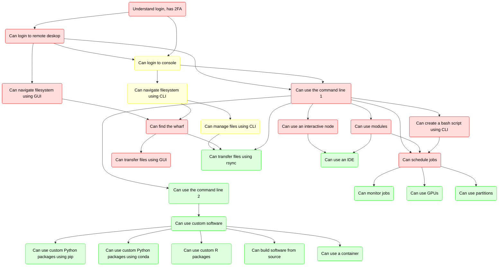

---
tags:
  - lesson
  - session
---

# Introduction to Bianca: Handling Sensitive Research Data


> Bianca Castafiore, the Tintin character the cluster is named after.

???- question "Prefer a video?"

    In case you prefer a video over reading,
    [watch this YouTube video (6 minutes long)](https://youtu.be/o0fRHoa8C5U)

???- info "Notes for teachers"

    Teaching goals:

    - The learners have heard the topics of this course

    Schedule:

    ```mermaid
    gantt
      title Lesson plan Introduction and Logging in
      dateFormat X
      axisFormat %s
      section Introduction
      Prior knowledge: prior_1, 0, 5s
      Theory : theory_1, after prior_1, 5s
      section Logging In
      Prior knowledge: prior_2, after theory_1, 5s
      Theory: theory, after prior_2, 5s
      Exercises: crit, exercise, after theory, 30s
      Feedback: feedback, after exercise, 10s
    ```

## Introduction

Are you starting to work with your sensitive data in your research?

If yes, welcome to a full day introduction to
handling sensitive data on the UPPMAX cluster, Bianca!

You will learn how to login to Bianca, upload and download files,
using pre-installed software and how to run your code.

## Useful pages

- [The course schedule](schedule.md)
- [The course dates](course_dates.md)
- [The project name](../misc/project.md)
- [The shared document](../misc/shared_document.md)

## Overview of courses



> Overview of the courses.
> Red nodes: Intro to Bianca.
> Yellow node: Intro to Bianca extra material.
> Green node: Intermediate Bianca.
