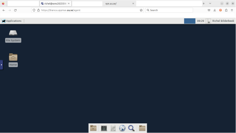
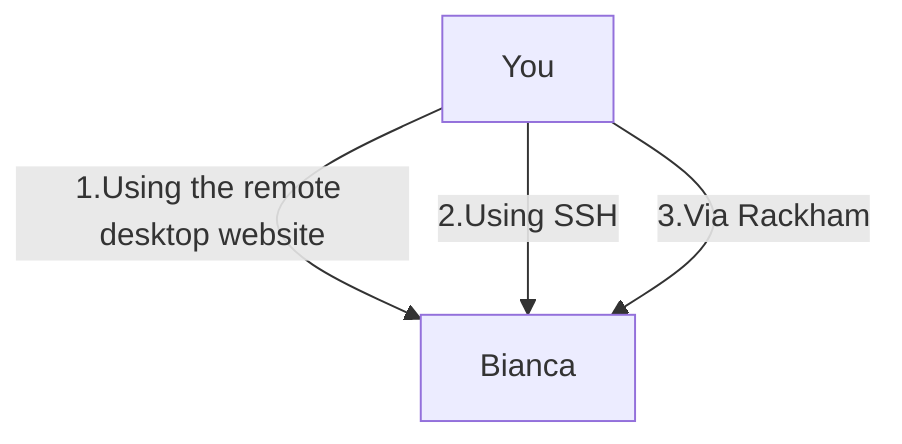
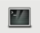

---
tags:
  - lesson
  - session
---

# Log in to the Bianca remote desktop environment



> The Bianca remote desktop environment

!!! info "Learning objectives"

    - Use the UPPMAX documentation
    - Observe the most common problems when accessing Bianca
    - Log in into Bianca's remote desktop environment using a website

???- info "Notes for teachers"

    Teaching goals:

    - The learners have used the UPPMAX documentation
    - The learners have observed the most common problems when accessing Bianca
    - The learners have logged in into Bianca's remote desktop environment using a website

    Schedule:

    ```mermaid
    gantt
      title Lesson plan Introduction and Logging in
      dateFormat X
      axisFormat %s
      section Introduction
      Prior knowledge: prior_1, 0, 5s
      Theory : theory_1, after prior_1, 5s
      section Logging In
      Prior knowledge: prior_2, after theory_1, 5s
      Theory: theory, after prior_2, 5s
      Exercises: crit, exercise, after theory, 30s
      Feedback: feedback, after exercise, 10s
    ```

    Prior questions:

    - How many different environment are available on Bianca?
    - How many ways are there to access Bianca?
    - What kind of problems would you expect when accessing Bianca?
    - What is a desktop environment?
    - What is a remote desktop environment?

## Why?

There are multiple ways to log in to Bianca, each having its own features:



Way                                                  |Features
-----------------------------------------------------|--------------------------------------------------------------------------------------------------
Using the remote desktop website                     |Must be within SUNET, requires no setup, visual, clunky to work with
Using the console environment                        |Must be within SUNET, requires an SSH client, terminal, powerful to work with (if you know how)
Using the console environment from Rackham           |Can be done everywhere, requires an SSH client, terminal, powerful to work with (if you know how)

Here we focus on the environment that most of us are familiar with:
a (remote) desktop environment.

## Exercises

???- question "Prefer a video?"

    [This 17 minutes long YouTube video](https://youtu.be/74f9AyKkOjg)
    shows how to do these exercises, so you can check your answers.

    A goal of these exercises is to practice to use the UPPMAX documentation.
    Such active learning is more effective than watching a video passively.
    Please try to do the exercises first!

    Specialized videos:

    - You can see [a YouTube video here](https://youtu.be/UpNI5OUlIo8)

### Exercise 1: Find the documentation

Search the UPPMAX documentation at
[https://docs.uppmax.uu.se/](https://docs.uppmax.uu.se/)
for how to log in to the Bianca remote desktop environment website.

???- info "Answer"

    In the search box, type 'Bianca log in remote desktop website' or something
    similar. This will take you to
    [https://docs.uppmax.uu.se/getting_started/login_bianca_remote_desktop_website/](https://docs.uppmax.uu.se/getting_started/login_bianca_remote_desktop_website/)

### Exercise 2: A user sees nothing


> A colleague visiting [https://bianca.uppmax.uu.se/](https://bianca.uppmax.uu.se/) and sees nothing...

Your colleague visits [https://bianca.uppmax.uu.se/](https://bianca.uppmax.uu.se/)
and sees nothing appear on the website (see also image above).
What is likely the problem?

???- question "Answer"

    He/she is not inside of SUNET.

    Show him/her the section above on how to get into SUNET.

### Exercise 3: Log in to the Bianca remote desktop

Log in to the Bianca remote desktop.

???- question "Answer"

    The UPPMAX documentation can be found
    [here](https://docs.uppmax.uu.se/getting_started/login_bianca_remote_desktop_website/).

    You can see [a YouTube video here](https://youtu.be/UpNI5OUlIo8).

### Exercise 4: start a terminal in the Bianca remote desktop environment

Start a terminal in the Bianca remote desktop environment.

???- question "Answer"

    Click on the terminal icon at the bottom of the screen.

    

    > The terminal icon at the bottom of the screen

### Exercise 5: A user enjoys the login node

Your colleague finds out that one can run scripts with calculations directly
on the login node.
This saves him/her much time waiting for a calculation to start.
Is this OK and why?

???- question "Answer"

    For that colleague, there seems to be no problem.
    However, for everyone else this is a problem,
    as the login node is a *shared* node.

    The colleague will be asked to *schedule* his/her jobs instead.
    This is usually done by an email from the UPPMAX staff.

    Requesting a calculation to run is part of this course
    and is described [here](slurm_intro.md).
    This is done by using the SLURM scheduler.

### Exercise 6: A user develops code

Your colleague is developing code on Bianca.
She writes the code line-by-line and
schedules a job to test the new code after each addition.
However, each job takes some minutes to start
and hence it takes a couple of minutes
before she knows if her code worked yes/no.

How could your colleague develop her code quicker?

???- question "Answer"

    This is the typical use-case to use an interactive node.
    One could also consider to develop code on a local computer
    instead (which uses nonsensitive/simulated/fake testing data)
    and upload the final code instead.

    Requesting an interactive node is part of this course
    and is described [in the session on Slurm](slurm_intro.md).

### Exercise 7: A user develops code on his own

Your colleague is developing code on Bianca.
He writes the code line-by-line and
works directly on the login node.

You colleague argues correctly that he is the only user of
login node of his project, hence nobody else is hindered by this.

Is this a good practice?

???- question "Answer"

    Yes, this is fine, if indeed the user works alone on the login node.

    The login node, however, does have limited computing power,
    so some programs will not work smoothly on it. In that case,
    an interactive node with more resources can be booked.

    But if the login node has enough computing power for a user
    that is indeed the only user, then this is fine.

???- question "How do I find out that I am the only user?"

    You can do so by running the command-line tool `top`:
    this will display how many users there are.
