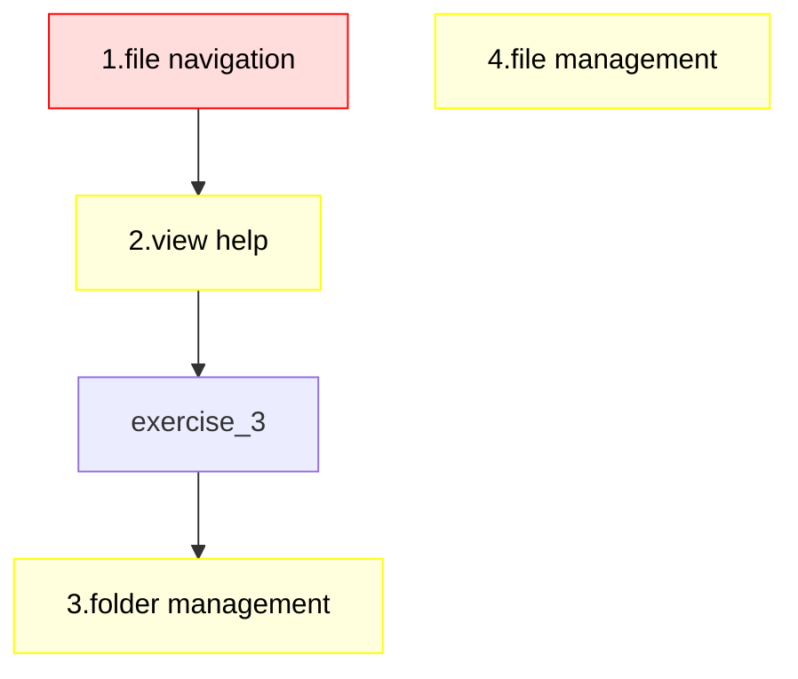

# The command-line on Bianca

!!! info "Objectives"

    - Optional: Being able to navigate in/out folders
    - Optional: Being able to view/create/move/delete files

???- info "Notes for teachers"

    Teaching goals:

    - The learners demonstrate they can use a text editor
    - The learners demonstrate they can create an executable script
    - Optional: The learners demonstrate they can create, move and delete files
    - Optional: The learners demonstrate they can create and delete folders

    Schedule:

    ```mermaid
    gantt
      title Lesson plan Command line
      dateFormat X
      axisFormat %s
      Prior knowledge: prior, 0, 5s
      Theory: theory, after prior, 5s
      Exercises: crit, exercise, after theory, 25s
      Feedback: feedback, after exercise, 10s
    ```

## Why?

You need the command-line to start calculations.

## Overview

Bianca is a cluster with the Linux operating system.
We must use a Linux terminal to work with Bianca,
therefore we must learn some Linux commands.

We will learn to:

- (optional) navigate through the file system
- (optional) read the manual
- (optional) work with directories
- (optional) work with files

### (optional) Read the manual

Use `man` to see the help pages about a command:

```bash
man man
man cd
man ls
```

These command give the help pages about the programs `man`, `cd` and `ls` respectively.

Press `q` (short for 'quit') to exit `man`

### Navigate through the file system

Like any operating system, Linux has directories (also called 'folders').

Use `cd` to change directory:

Where to                           |Example command
-----------------------------------|---------------------
The root folder                    |`cd /`
The project folder                 |`cd /proj/sens2023598`
Your home folder, using full path  |`cd /home/richel`
Your home folder, using tilde      |`cd ~`
The wharf                          |`cd /proj/sens2023598/nobackup/wharf`
Up one folder                      |`cd ..`
Into a folder, using relative path |`cd myfolder`
The previous location              |`cd -`

!!! tip "See the content of a folder"

    Use `ls` to see the content of a folder

!!! tip "See the current location"

    Use `pwd` to see your current location

!!! info "The Silence Is Golden Rule"
    When your command 'just works' there is no output
    (try, for example `cd ~`).
    This is due to [The Silence Is Golden Rule](https://www.linfo.org/rule_of_silence.html)

### (optional) Work with directories

Linux can create, move and delete folders.

Do what                            |Example command
-----------------------------------|---------------------
Create a folder                    |`mkdir myfolder`
Move a folder                      |`mv from_folder to_folder`
Delete an empty folder             |`rmdir myfolder`
Delete a folder                    |`rm -r myfolder`

!!! tip "See the content of a folder"

    Use `ls` to see the content of a folder

!!! tip "See the current location"

    Use `pwd` to see your current location

!!!- tip "See the current real location (advanced)"

    For sysadmins: use `pwd -P` to see your real current location on the hardware

### (optional) Work with files

Linux can create, view, rename, move and delete files.
Additionally, there are some text editors that
allow one to edit files.

Do what                            |Example command
-----------------------------------|---------------------
Create an empty file               |`touch myfile.txt`
View a file using `cat`            |`cat myfile.txt`
Edit a file using `nano`           |`nano myfile.txt`
Delete a file                      |`rm myfile.txt`
Copy a file                        |`cp myfile.txt mycopy.txt`
Rename a file                      |`mv myfile.txt mycopy.txt`
Move a file to one folder up       |`mv myfile.txt ../`
Move a file to the home folder     |`mv myfile.txt ~`

- Note: `nano` is one of many text editors.
   It is the one recommended to beginners,
   as its interface is closest to what one expects

## Exercises

Use the materials shown above to answer the questions below.

???- tip "Video with solutions"

    There is a video that shows the solution of all these exercises:
    [YouTube](https://youtu.be/7_LPeQbcmAo).

    The video, however, follows the order 2-3-4-5-1.



> Exercises for this session.
> Red nodes: minimal, needed in other sessions.
> Yellow nodes: extra, useful in general.

### Exercise 1: file navigation

- Navigate to your home folder"

???- question "Answer"

    The syntax to move to your home folder is:

    ```bash
    cd /home/[username]
    ```

    where `[username]` is your UPPMAX username, for example:

    ```bash
    cd /home/richel
    ```

    The squiggle/tilde (`~`) is a shorter notation,
    that does exactly the same:

    ```bash
    cd ~
    ```

- Navigate to the project folder of this course

???- question "Don't know the project code?"

    In our case, the project code is `sens2023598`,
    hence the project folder is `/proj/sens2023598`.

    To go there:

    ```bash
    cd /proj/sens2023598
    ```

The `wharf` is an important folder: it is the only folder where files
can be transferred to/from.

- Navigate to the wharf folder of the project of this course

???- question "Cannot find it?"

    Go to [the UPPMAX documentation about the wharf folder](https://docs.uppmax.uu.se/cluster_guides/wharf/)

???- question "Still cannot find it?"

    It is at `/proj/nobackup/[project_id]/wharf/[user_name]/[user_name]-[project_id]`,
    hence, `/proj/nobackup/sens2023598/wharf/[user_name]/[user_name]-sens2023598`,
    or, for a user with username `sven`, at
    `/proj/nobackup/sens2023598/wharf/sven/sven-sens2023598`

    To go there:

    ```bash
    cd /proj/nobackup/sens2023598/wharf/sven/sven-sens2023598
    ```

### Exercise 2: view help

View the help of the command `cd`

???- question "Answer"

    Use `man` to view the help of any command, in this case `cd`:

    ```bash
    man cd
    ```

    This will fail, because Bianca has (close to) no internet access.

## Exercise 3: folder management

- Create a folder `/proj/sens2023598/workshop/[your_login_name]`,
  for example, `/proj/sens2023598/workshop/richel`"

???- question "Answer"

    ```bash
    mkdir /proj/sens2023598/workshop/richel
    ```

    Or navigate there first:

    ```bash
    cd /proj/sens2023598/workshop/
    mkdir richel
    ```

### Exercise 4: file management

- Create a file, e.g. `richel.txt`

???- question "Answer"

    ```bash
    nano richel.txt
    ```

    or alternatively:

    ```bash
    touch richel.txt
    ```


- Copy the file (e.g. to `richel_again.txt`)

???- question "Answer"

    ```bash
    cp richel.txt richel_again.txt
    ```

- Move the copied file (e.g. move it one folder up to `../richel_again.txt`)

???- question "Answer"

    ```bash
    mv richel_again.txt ../
    ```

- Delete the copied file

???- question "Answer"

    ```bash
    rm ../richel_again.txt
    ```

    or:

    ```bash
    cd ..
    rm richel_again.txt
    ```

## Extra material

### Other useful commands

These are some commands that we enjoy,
but are not part of the learning objectives.

Command name|Purpose
------------|---------------------------------------------
`cat`       |Show the content of a file
`less`      |Navigate through the content of a file
`head`      |Show the first lines of a file
`tail`      |Show the last lines of a file
`less`      |Show the content of a file
`wc`        |Count words, lines and/or characters
`>`         |Write to file (removes existing content if any)
`>>`        |Append to file

A command that cannot be put in a Markdown table:

- `|`: [pipe](https://en.wikipedia.org/wiki/Pipeline_(Unix)),
  the output of one command to serve as input for the next

With `ls /usr/bin | wc --lines` one can see that there are more than 1700
commands on Bianca.

### The terminal and the GUI are friends

If you are using the Bianca remote desktop environment,
you can see that its file browser and terminal are friends.

On a clean terminal, try typing `cd`
and then drag a folder from the GUI to the terminal.

It types the absolute path for you!

### Commonly used symbolic links

These are some commonly used symbolic links,
that will simplify navigation:

```bash
cd Desktop
ln -s /proj/sens2023598/ proj
ln -s /proj/sens2023598/nobackup nobackup
ln -s /proj/sens2023598/nobackup/wharf/richel/richel-sens2023598 wharf`
```

- Replace `sens2023598` by your project
- Replace `richel` by your username
