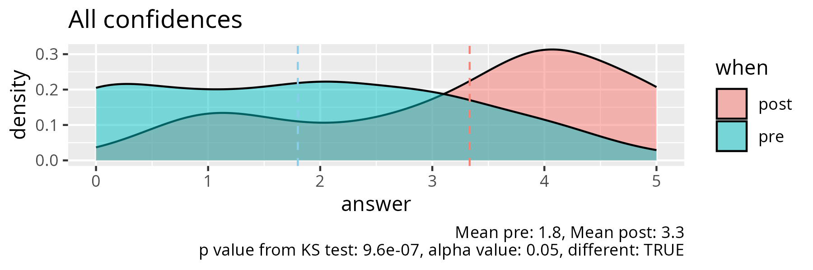
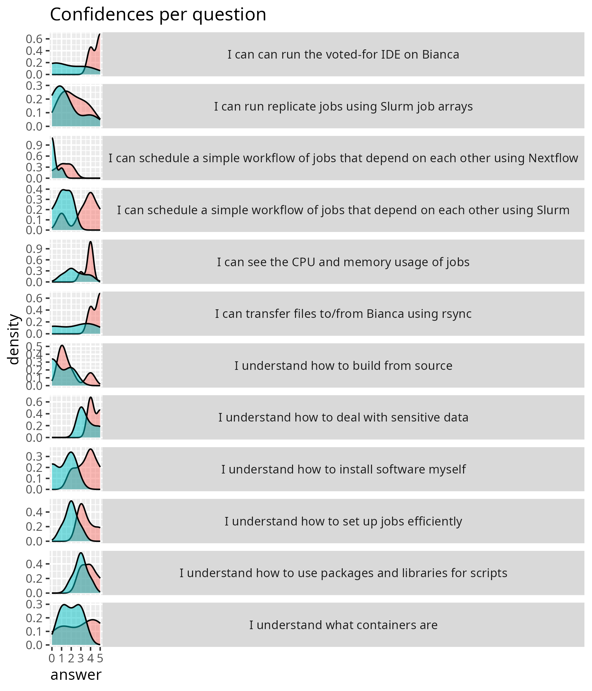

---
tags:
  - evaluation
---

# Evaluation Bianca Intermediate

- [results.csv](results.csv)
- [results.ods](results.ods)

## Missing before

From the [prevaluation](../../prevaluations/20241111/README.md):

> Installation of packages on Bianca (without internet connection)

## Missing after

> Perhaps an explanation of Nextflow or snakemake would be useful.
> Since it was a bit difficult to follow if we have not run these workflow
> managers. But I believe it is out of scope!
> Maybe it will be interesting to follow a practical installation
> (demonstration) of Github repo/packages to Bianca.
> Just as it was performed from the file transfers.
> I don´t know if other users will be interested on this,
> but more practical example could be useful.
> Anyhow the course was interesting and
> I learned a lot and feel more confident in working with Bianca.
> Thanks!

## Analysis

These confidences were compared to the
[prevaluation](../../prevaluations/20241111/README.md).
which has most of the same questions.
The analysis code can be found at [analyse.R](analyse.R).
Here are the results:

> All confidences, where blue is the prevaluation
> and red is the post/evaluation. KS is shorthand
> for Kolmogorov-Smirnoff test, a test to determine if two distribitions
> may come from the same underlying distribution, without any assumptions on
> the shape of the distrition. A two-sided KS test was used.
> If the p value is low, it can rejected that
> the two distributions come from the same underlying distribution.

Or, in English, these course made a significant difference in confidence.

Now per learning objective:

> All confidences per question, where blue is the prevaliation
> and red is the post/evaluation

Copied from [stats.md](stats.md):

|question                                                                          | mean_pre| mean_post|   p_value|different |
|:---------------------------------------------------------------------------------|--------:|---------:|---------:|:---------|
|I can transfer files to/from Bianca using rsync                                   |      2.2|       4.6| 0.2857143|FALSE     |
|I can see the CPU and memory usage of jobs                                        |      2.4|       3.8| 0.2857143|FALSE     |
|I understand how to set up jobs efficiently                                       |      2.0|       3.6| 0.0476190|TRUE      |
|I can schedule a simple workflow of jobs that depend on each other using Slurm    |      1.2|       3.4| 0.0793651|FALSE     |
|I can schedule a simple workflow of jobs that depend on each other using Nextflow |      0.2|       1.2| 0.2063492|FALSE     |
|I can run replicate jobs using Slurm job arrays                                   |      1.4|       2.2| 0.6825397|FALSE     |
|I understand how to install software myself                                       |      1.2|       3.6| 0.0476190|TRUE      |
|I understand how to use packages and libraries for scripts                        |      3.0|       3.8| 0.5238095|FALSE     |
|I understand what containers are                                                  |      2.0|       3.0| 0.2857143|FALSE     |
|I understand how to build from source                                             |      0.8|       1.8| 0.1904762|FALSE     |
|I can can run the voted-for IDE on Bianca                                         |      1.6|       4.6| 0.0476190|TRUE      |
|I understand how to deal with sensitive data                                      |      3.6|       4.4| 0.2857143|FALSE     |

> The p values are calculated from a two-sided Kolmogorov-Smirnoff test,
> a test to determine if two distribitions
> may come from the same underlying distribution, without any assumptions on
> the shape of the distrition. If the p value is low, it can rejected that
> the two distributions come from the same underlying distribution.

Or, in English, these sessions made a significant differce:

- I understand how to set up jobs efficiently
- I understand how to install software myself
- I can can run the voted-for IDE on Bianca
