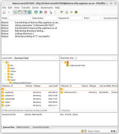
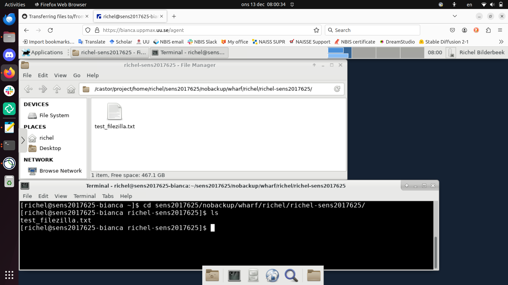

# File transfer using a graphical tool

> FileZilla connected to Bianca

## Exercises

Read the UPPMAX page on
[file transfer using a graphical tool](https://docs.uppmax.uu.se/software/bianca_file_transfer_using_gui/),
then do these exercises.

???- question "1. Your colleague uses an SCP tool for secure file transfer. It does not work on Bianca. What is the problem?"

    The assumptions of your colleague are already wrong:
    SCP is considered an **outdated** secure (`outdated + secure = insecure`)
    file transfer protocol.

    Bianca does not support this outdated file transfer protocol.
    Instead, use a tool that allows the SFTP secure file transfer protocol.

???- question "2. Your colleague used a very user-friendly SFTP tool. However, only on Bianca, it fails after the first use. What is the problem?"

    This user-friendly program stores the password of the user.
    However, the password of Bianca changes, due to the need
    of adding a two-factor authentication number at the end
    of a password (e.g. `VerySecret123456`).

    Your colleague can either reset the password every time he/she
    uses the program, or use another tool (such as FileZilla) instead.

???- question "3a. Exercise: upload a file to Bianca"

    This is described in the text above.

    There is also a video [here](https://youtu.be/V-iPQLjvByc).

???- question "3b. Locate that file on Bianca using the graphical file explorer"

    Its location is at `/home/[user_name]/[project_name]/nobackup/wharf/[user_name]/[user_name]-[project_name]`,
    for example, at `/home/sven/sens123456/nobackup/wharf/sven/sven-sens123456`.

    Start the file explorer and navigate there.

    

???- question "3c. Locate that file on Bianca using the terminal"

    Its location is at `/home/[user_name]/[project_name]/nobackup/wharf/[user_name]/[user_name]-[project_name]`,
    for example, at `/home/sven/sens123456/nobackup/wharf/sven/sven-sens123456`.

    Start a terminal and use `cd` to change to that directory, e.g.,
    from your home folder, run
    `cd sens123456/nobackup/wharf/sven/sven-sens123456`.

    In that folder, type `ls` to list the files present in that folder.

    
