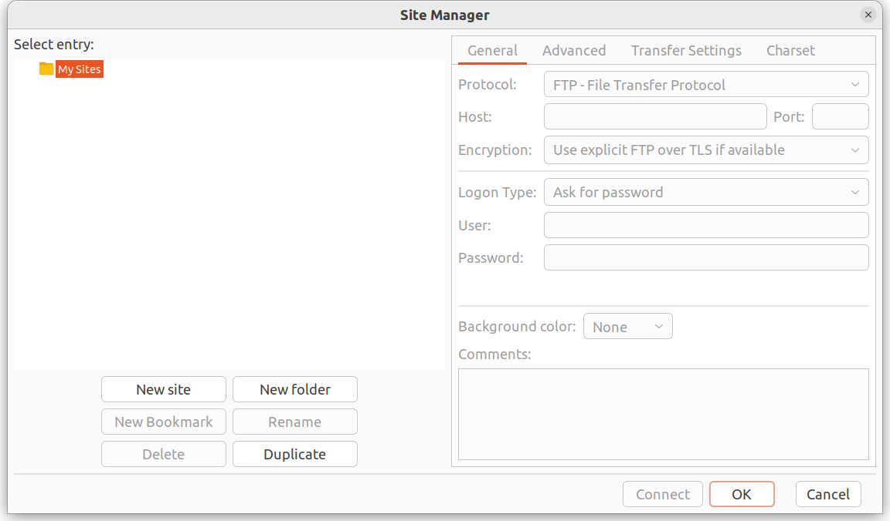
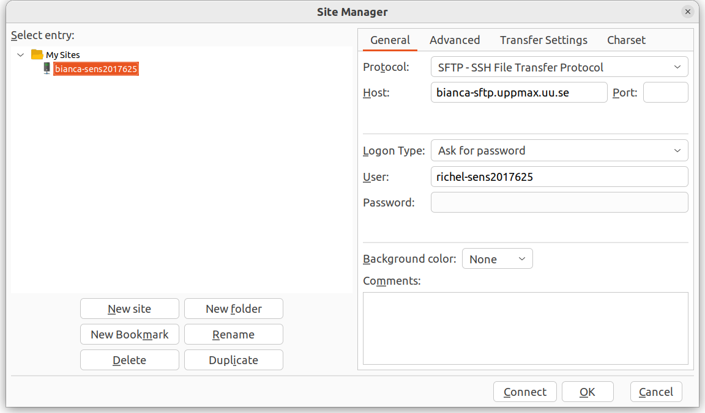

# File transfer using graphical tools

!!! warning
 
    It is important to keep the entire chain of transferring the data secure

## Introduction

Bianca is an HPC cluster for sensitive data.
To protect that sensitive data,
Bianca has no direct internet connection.
This means that files cannot be downloaded directly.

???- tip "What is an HPC cluster again?"

    What an HPC cluster is, is described in general terms [here](overview.md).

Instead, one needs to learn one of the many ways to do **secure** file transfer.

Here, we show how to transfer files using a graphical tool called FileZilla.

In general, one can pick any graphical tools with these constraints:

- the tool must support SFTP
- the tool must not store a password

Whatever tool one picks, it must do secure file transfer.
For secure file transfer, Bianca supports the SFTP protocol.
So, for secure file transfer to Bianca, one needs a tool
that supports SFTP.

???- warning "Use SFTP: why SCP will never work"

    You must use SFTP. 

    However, some users find tools that support
    another protocol called 'SCP'. 
    We understand the confusion, due
    to the many technical and abbreviated terms. 

    Only SFTP will work.

Whatever tool one picks, additionally, the tool must **not** store a password.
Due to security reasons, one needs to connect to Bianca using a password
**and** a two-factor authentication number (e.g. `VerySecret123456`).
If a tool stores a password, that password will be valid for only one session.

One tool that can be used for file transfer to Bianca
is FileZilla, which is described in detail below.

## Get inside SUNET

The first step is to be inside of SUNET in one of the
multiple ways described [at the 'login to Bianca' page](login_bianca.md).

## Use the right tool

There are multiple tools to do secure file transfer.

### FileZilla (Linux/MacOS/Windows)

FileZilla is a secure file transfer tool that works under Linux, Mac and Windows.

Do:

- From the menu, select 'File | Site manager'

???- tip "Where is that?"

    It is here:

    

- Click 'New site'

???- tip "Where is that?"

    It is here:

    

- Create a name for the site, e.g. `bianca-sens123456`.
- For that site, use all standards, except:
    - Set protocol to 'SFTP - SSH File Transfer Protocol'
    - Set host to `bianca-sftp.uppmax.uu.se`
    - Set user to `[username]-[project]`, e.g. `richel-sens123456`

???- tip "How does that look like?"

    It looks similar to these:

    

    

!!! tip "Storing a password is useless"

    Because Bianca holds sensitive data, 
    there is need to use the UPPMAX two-factor authentication
    code every time you login.
    Due to this, storing a password is hence useless

- Click 'Connect'
- You will be asked for your password with two-factor identification, hence
  type `[your password][2FA code]`, e.g. `VerySecret123456`

Now you can transfer files between your local computer and Bianca.

???- tip "How does that look like?"

    It looks like this

    

### WinSCP (Windows)

- Connect from local computer

## Where do my files end up?

They end up in your personal `wharf` folder.

Its location is at `/home/[user_name]/[project_name]/nobackup/wharf/[user_name]/[user_name]-[project_name]`,
for example, at `/home/sven/sens123456/nobackup/wharf/sven/sven-sens123456`.

