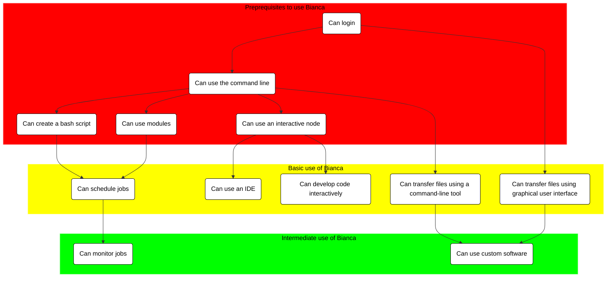

  

  

# Welcome to the Bianca workshop!
    

!!! info "Introduction to Bianca: Handling Sensitive Research Data"
    
    - Are you *starting to* work with your sensitive data in your research? 
    - If yes, welcome to [a full day introduction to handling sensitive data on the UPPMAX cluster, Bianca](intro.md). 

    - Do you want to *deepen your existing knowledge* to work 
      with your sensitive data in new, more flexible ways? 
    - If yes, welcome to [a full day intermediate-level workshop/hackathon to handling sensitive data on the UPPMAX cluster, Bianca](intermediate/intro.md). 

    - You will learn about 
    
        - NAISS-SENS, i.e. the legal and administrative aspects
        - how to login to Bianca
        - transferring files
        - the job scheduler system
        - using pre-installed software
        - installing your own software

## Overview of courses

 
    
  

[Practicalities](practicalities.md){ .md-button .md-button--primary }
[Bianca intro ](intro.md){ .md-button .md-button--primary }
[Intermediate workshop](intermediate/intro.md){ .md-button .md-button--primary }

  

