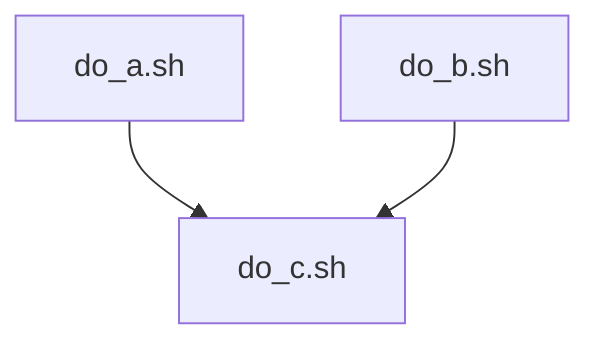

# Complex jobs

!!!- info "Learning objectives"

    - Practice using the UPPMAX documentation
    - Practice using the Slurm documentation
    - I can manually schedule a minimal workflow of jobs
      that depend on each other using Slurm
    - (optional) I can write a script to schedule a minimal workflow of jobs
      that depend on each other using Slurm
    - (optional) I can schedule a minimal workflow of jobs
      that depend on each other using Nextflow
    - (optional) I can schedule a minimal workflow of jobs
      that depend on each other using Snakemake
    - (optional) I can schedule a minimal workflow of jobs
      that depend on each other using GNU make

???- question "For teachers"

    Teaching goals are:

    - Learners have practiced using the UPPMAX documentation
    - Learners have practiced using the Slurm documentation
    - Learners have manually scheduled a minimal workflow of jobs that depend
      on each other using Slurm
    - (optional) Learners have written a script to schedule a minimal workflow
      of jobs that depend on each other using Slurm
    - Learners have scheduled a minimal workflow of jobs
      that depend on each other using Nextflow
    - (optional) Learners have scheduled a minimal workflow of jobs
      that depend on each other using Snakemake
    - (optional) Learners have scheduled a minimal workflow of jobs
      that depend on each other using GNU make

    Lesson plan:

    ```mermaid
    gantt
      title Complex jobs
      dateFormat X
      axisFormat %s
      section First hour
      Course introduction: done, course_intro, 0, 10s
      Prior : intro, after course_intro, 5s
      Present: theory_1, after intro, 5s
      Challenge: crit, exercise_1, after theory_1, 40s
      Break: crit, milestone, after exercise_1
      section Second hour
      Challenge: crit, exercise_2, 0, 10s
      Feedback: feedback_2, after exercise_2, 10s
      SLURM: done, slurm, after feedback_2, 25s
      Break: done, milestone, after slurm
    ```

    Prior questions:

    - You do a computational experiment that has multiple steps.
      How do you do it?

## Why?

- To reduce checking on jobs to finish
- To reduce to manually start jobs

## Use case

Imagine a computational experiment that takes three steps:



> Example setup of a computational experiment.
> [`do_a.sh`](scripts/do_a.sh) and [`do_b.sh`](scripts/do_a.sh) 
> can run in parallel.
> [`do_c.sh`](scripts/do_a.sh) can only run when
> [`do_a.sh`](scripts/do_a.sh) and [`do_b.sh`](scripts/do_a.sh) have finished.

The first two can be run in parallel:

```bash
sbatch do_a.sh
sbatch do_b.sh
```

After this, you wait. You check regularly
if the jobs have finished.
When both jobs have finished, you do:

```bash
sbatch do_c.sh
```

You wonder: can this be set up in such a way that does not require your
attention anymore when running?

## Scripts for this use case

### `do_a.sh`

```bash
#!/bin/bash
echo "42" > a.txt
```

### `do_b.sh`

```bash
#!/bin/bash
echo "314" > b.txt
```

### `do_c.sh`

```bash
#!/bin/bash
cat a.txt > c.txt
cat b.txt >> c.txt
```


## Complex jobs

There are multiple ways to run complex jobs:

Tool      |Features
----------|----------------------------------------------------------------------------
Slurm     |Can be done on the command line or bash scripts, no help
Nextflow  |Workflow manager, newest, uses the Groovy language, recognizes Slurm systems
Snakemake |Workflow manager, use the Python language, recognizes Slurm systems
GNU make  |Workflow manager, oldest, uses GNU make syntax, need to manually call Slurm


## Complex jobs in Slurm from the command-line

You can tell Slurm to start a job after a job has finished with an OK:

```bash
$ sbatch do_a.sh
Submitted job with id: 5000000

$ sbatch do_b.sh
Submitted job with id: 5000001

$ sbatch do_c.sh --dependency=afterok:5000000:5000001
Submitted job with id: 5000002
```

[The Slurm documentation on sbatch](https://slurm.schedmd.com/sbatch.html)
shows 


## Complex jobs in Slurm from a script

You can do the same in a script like this:

```bash
#!/bin/bash
job_id_a=$(sbatch -A staff do_a.sh | cut -d " " -f 4)
job_id_b=$(sbatch -A staff do_b.sh | cut -d " " -f 4)
sbatch -A staff --dependency=afterok:${job_id_a},${job_id_b} do_c.sh
```

This script uses two variables (`job_id_a` and `job_id_b`),
which are the job IDs of the first two jobs and uses their values
to specify which jobs to depend on.

A job ID was extracted from the text `Submitted job with id: 5000000` by
using a pipe (`|`) to send it to `cut`. `cut` the takes the fourth field,
where fields are separated by spaces, to obtain the job ID.

## Workflow manager

For such complex jobs, workflow managers have been created:

Year|Tool                   |Features
----|-----------------------|------------------------------------------
1976|`make`, e.g. GNU `make`|Must use tabs for indentation, HPC unaware
2021|Snakemake              |Python-like syntax, HPC friendly
2013|Nextflow               |HPC friendly, has peer-review pipelines

### Complex jobs using `make`

[make](https://en.wikipedia.org/wiki/Make_(software))
is a tool that has been around since 1976 to do complex jobs.

???- question "How does the make script of this pipeline looks like?"

	Here is a file (called `Makefile`) that does that same workflow:

	```make
	c.txt: a.txt b.txt
		./do_c.sh

	a.txt:
		./do_a.sh

	b.txt:
		./do_b.sh
	```

	The indentation must be done with tabs, not with spaces.

	In English, this script is read as:

	- `c.txt` can be created when `a.txt` and `b.txt` are present,
	  by doing `do_c.sh`
	- `a.txt` can (always) be created by doing `do_a.sh`
	- `b.txt` can (always) be created by doing `do_b.sh`

???- question "How to run this make script?"

	Running this (assuming `make` is installed, which it usually is)
	for a bash script:

	```bash
	#!/bin/bash
	make -j
	```

	You can submit this job to the job scheduler as usual.

### Snakemake

Snakemake features a Python-like syntax.
It's power and complexity is between `make` (above) and Nextflow (below).

### Nextflow

Nextflow is around since 2013 and started with HPC cluster usage in mind.

???- question "How does the Nextflow script of this pipeline looks like?"

	Here is a Nextflow to achieve the same pipeline:

	```nextflow
	#!/usr/bin/env nextflow

	nextflow.enable.dsl = 2

	params.scripts_dir = "$projectDir"

	process DO_A {
		publishDir params.scripts_dir, mode: 'copy', pattern: '*.txt'
		
		input:
		path script

		output:
		path '*.txt', emit: a_output

		script:
		"""
		bash $script
		"""
	}

	process DO_B {
		publishDir params.scripts_dir, mode: 'copy', pattern: '*.txt'
		
		input:
		path script

		output:
		path '*.txt', emit: b_output

		script:
		"""
		bash $script
		"""
	}

	process DO_C {
		publishDir params.scripts_dir, mode: 'copy', pattern: '*.txt'

		input:
		path script
		val a_done
		val b_done

		output:
		path '*.txt', optional: true, emit: c_output

		script:
		"""
		cd ${params.scripts_dir}
		echo "Current directory: \$(pwd)"
		echo "Contents of current directory:"
		ls -la *.txt
		echo "Executing: bash $script"
		bash $script
		echo "After execution, contents of current directory:"
		ls -la *.txt
		
		# Copy any new .txt files back to the work directory
		find . -type f -name "*.txt" -newer $script -exec cp {} . \\;
		"""
	}

	workflow {
		do_a_script = file("${params.scripts_dir}/do_a.sh")
		do_b_script = file("${params.scripts_dir}/do_b.sh")
		do_c_script = file("${params.scripts_dir}/do_c.sh")

		a_result = DO_A(do_a_script)
		b_result = DO_B(do_b_script)
		DO_C(do_c_script, a_result.a_output, b_result.b_output)
	}
	```

	This Nextflow script is complex mostly because of
	the architecture of the workflow and can be made more elegant
	when following a workflow suitable for Nextflow.

???- question "How to start that pipeline?"

	To run the pipeline (and when Nextflow is installed), do:

	```bash
	#!/bin/bash
	nextflow run main.nf --scripts_dir $PWD
	```

Nextflow is very powerful and can submit jobs for you
using Slurm and has
[an UPPMAX configuration file](https://github.com/nf-core/configs/blob/master/conf/uppmax.config).
nextflow can optimize your resource allocation by trial-and-error
and has peer-reviewed pipelines maintained by `nf-core`.

## Exercise 1: run a job with a dependency from the command-line

Here we do the procedure 'by hand':

- Collect the scripts [`do_a.sh`](scripts/do_a.sh), 
  [`do_b.sh`](scripts/do_b.sh)  and [`do_c.sh`](scripts/do_c.sh) 

???- question "Answer"

    There are many ways to transfer these files.
    One easy way is to copy-paste the scripts' contents
    to `nano`.

- Submit `do_a.sh` and `do_b.sh` to the job scheduler

???- question "Answer"

    ```bash
    sbatch -A staff do_a.sh
    sbatch -A staff do_b.sh
    ```

- Submit `do_c.sh` to the job scheduler, with the dependency that
  it runs after `do_a.sh` and `do_b.sh` have finished successfully

???- question "Answer"

    ```bash
    sbatch -A staff --dependency=afterok:51383809,51383810 do_c.sh
    ```

## (optional) Exercise 2: run a job with a dependency from a script

- Copy-paste or write a script `do_all.sh` that does this manual setup.
  Hint: `sbatch` returns 4 words if the job was submitted
  successfully (`Submitted batch job 12345678`). One can use
  `cut -d " " -f 4` to select the 4th field when the delimiter is a space.

???- question "Answer"

    ```bash
    #!/bin/bash
    job_id_a=$(sbatch -A staff do_a.sh | cut -d " " -f 4)
    job_id_b=$(sbatch -A staff do_b.sh | cut -d " " -f 4)
    sbatch -A staff --dependency=afterok:${job_id_a},${job_id_b} do_c.sh
    ```

- Must the script `do_all.sh` be submitted using `sbatch` or can it be run
  directly? Why?

???- question "Answer"

    The script `do_all.sh` can be run directly, as all it does
    is schedule jobs. Scheduling jobs is a light operation.

## (optional) Exercise 3: run a job with a dependency using Nextflow

## (optional) Exercise 4: run a job with a dependency using Snakemake

## (optional) Exercise 5: run a job with a dependency using GNU make

