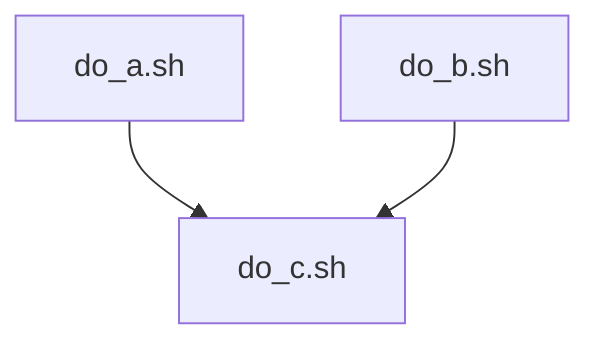

# Complex jobs

!!!- info "Learning objectives"

    - I can schedule a minimal workflow of jobs that depend on each other using Slurm
    - (optional) I can schedule a minimal workflow of jobs that depend on each other using Nextflow
    - (optional) I can schedule a minimal workflow of jobs that depend on each other using Snakemake
    - (optional) I can schedule a minimal workflow of jobs that depend on each other using GNU make

???- question "For teachers"

    Teaching goals are:

    - Learners have scheduled a minimal workflow of jobs
      that depend on each other using Slurm
    - Learners have scheduled a minimal workflow of jobs
      that depend on each other using Nextflow
    - (optional) Learners have scheduled a minimal workflow of jobs
      that depend on each other using Snakemake
    - (optional) Learners have scheduled a minimal workflow of jobs
      that depend on each other using GNU make

    Lesson plan:

    ```mermaid
    gantt
      title Complex jobs
      dateFormat X
      axisFormat %s
      section First hour
      Course introduction: done, course_intro, 0, 10s
      Prior : intro, after course_intro, 5s
      Present: theory_1, after intro, 5s
      Challenge: crit, exercise_1, after theory_1, 40s
      Break: crit, milestone, after exercise_1
      section Second hour
      Challenge: crit, exercise_2, 0, 10s
      Feedback: feedback_2, after exercise_2, 10s
      SLURM: done, slurm, after feedback_2, 25s
      Break: done, milestone, after slurm
    ```

    Prior questions:

    - You do a computational experiment that has multiple steps.
      How do you do it?


    
## Why?

- To reduce checking on jobs to finish
- To reduce to manually start jobs

## Use case

Imagine a computational experiment that takes three steps:



> Example setup of a computational experiment.
> [`do_a.sh`](scripts/do_a.sh) and [`do_b.sh`](scripts/do_a.sh) 
> can run in parallel.
> [`do_c.sh`](scripts/do_a.sh) can only run when
> [`do_a.sh`](scripts/do_a.sh) and [`do_b.sh`](scripts/do_a.sh) have finished.

The first two can be run in parallel:

```bash
sbatch do_a.sh
sbatch do_b.sh
```

After this, you wait. You check regularily
if the jobs have finished.
When both jobs have finished, you do:

```bash
sbatch do_c.sh
```

You wonder: can this be set up in such a way that does not require your
attention anymore when running?

## Scripts for this use case

### `do_a.sh`

```bash
#!/bin/bash
echo "42" > a.txt
```

### `do_b.sh`

```bash
#!/bin/bash
echo "314" > b.txt
```

### `do_c.sh`

```bash
#!/bin/bash
cat a.txt > c.txt
cat b.txt >> c.txt
```


## Complex jobs

There are multiple ways to run complex jobs:

Tool      |Features
----------|----------------------------------------------------------------------------
Slurm     |Can be done on the command line or bash scripts, no help
Nextflow  |Workflow manager, newest, uses the Groovy language, recognizes Slurm systems
Snakemake |Workflow manager, use the Python language, recognizes Slurm systems
GNU make  |Workflow manager, oldest, uses GNU make syntax, need to manually call Slurm


## Complex jobs in Slurm from the command-line

You can tell Slurm to start a job after a job has finished with an OK:

```bash
$ sbatch do_a.sh
Submitted job with id: 12345678
[TODO: correct output]

$ sbatch do_b.sh
Submitted job with id: 23456789

$ sbatch do_c.sh --dependency=afterok:12345678:23456789
[TODO: correct output]
```

## Complex jobs in Slurm from a script

```bash
TODO: Add script
```

## Nextflow

```nextflow
[TODO] add script
```

## Snakemake

```snakemake
[TODO] add script
```

## GNU Make


```make
[TODO] add script
```

## Exercise 1: run a job with a dependency from the command-line


## Exercise 2: run a job with a dependency from a script

## Exercise 3: run a job with a dependency using Nextflow

## (optional) Exercise 4: run a job with a dependency using Snakemake

## (optional) Exercise 5: run a job with a dependency using GNU make

