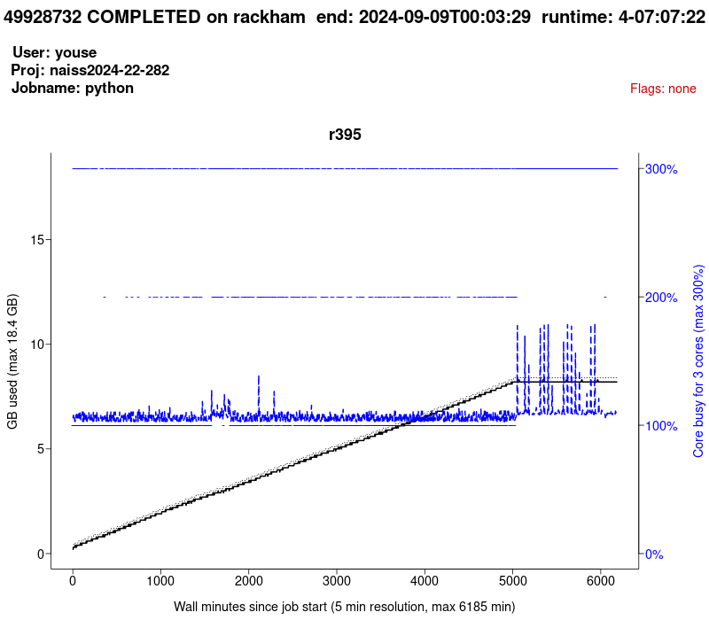

# Efficient jobs

!!!- info "Learning objectives"

    - Practice using the UPPMAX documentation
    - I can see the CPU and memory usage of jobs
    - I understand how to set up jobs efficiently

???- question "For teachers"

    Teaching goals are:

    - Learners have practiced using the UPPMAX documentation
    - Learners have seen the CPU and memory usage of jobs
    - Learners have discussed how to set up jobs efficiently

    Lesson plan:

    ```mermaid
    gantt
      title Efficient jobs
      dateFormat X
      axisFormat %s
      section First hour
      Course introduction: done, course_intro, 0, 10s
      Prior : intro, after course_intro, 5s
      Present: theory_1, after intro, 5s
      Challenge: crit, exercise_1, after theory_1, 40s
      Break: crit, milestone, after exercise_1
      section Second hour
      Challenge: crit, exercise_2, 0, 10s
      Feedback: feedback_2, after exercise_2, 10s
      SLURM: done, slurm, after feedback_2, 25s
      Break: done, milestone, after slurm
    ```

    Prior questions:

    - How to schedule jobs efficiently?
    - What is the `jobstats` tool?

## Why?

> If everyone would use our computational resources effectively,
> there would be no queue.
>
> From the UPPMAX documentation, original source unknown

Running efficient jobs allows you to run more jobs that start running faster.

## Exercises

### Exercise 1: view a `jobstats`

- Read [the UPPMAX `jobstats` documentation](https://docs.uppmax.uu.se/software/jobstats/)
  especially [the 'effective use' section](https://docs.uppmax.uu.se/software/jobstats/#efficient-use)

### Exercise 2: determining the algorithm

- Read [the UPPMAX `jobstats` documentation](https://docs.uppmax.uu.se/software/jobstats/)
  especially [the 'effective use' section](https://docs.uppmax.uu.se/software/jobstats/#efficient-use)

- How much cores should this user book? Why?



- How much cores should this user book? Why?


