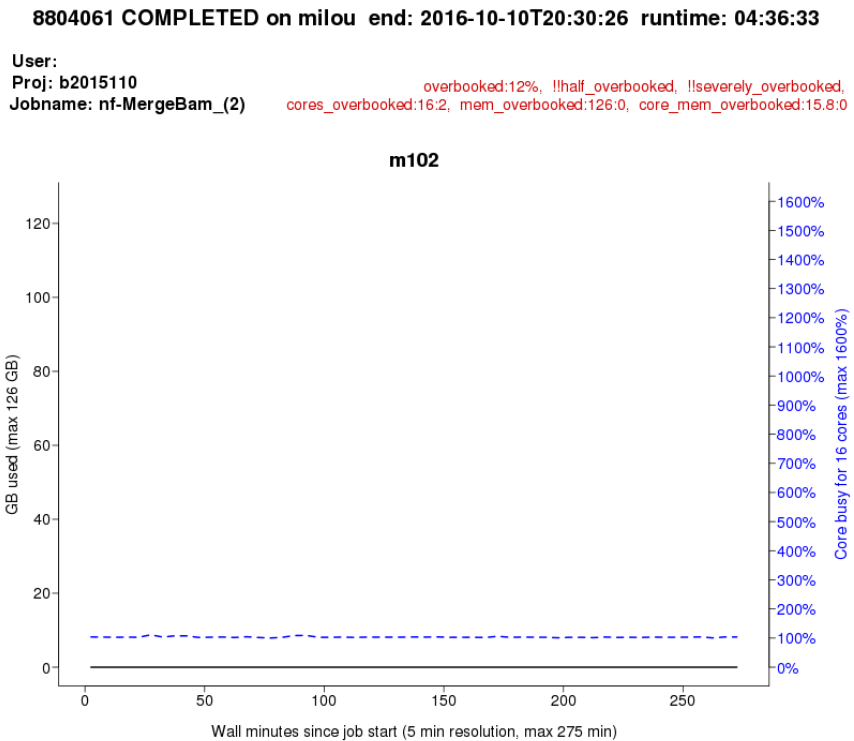
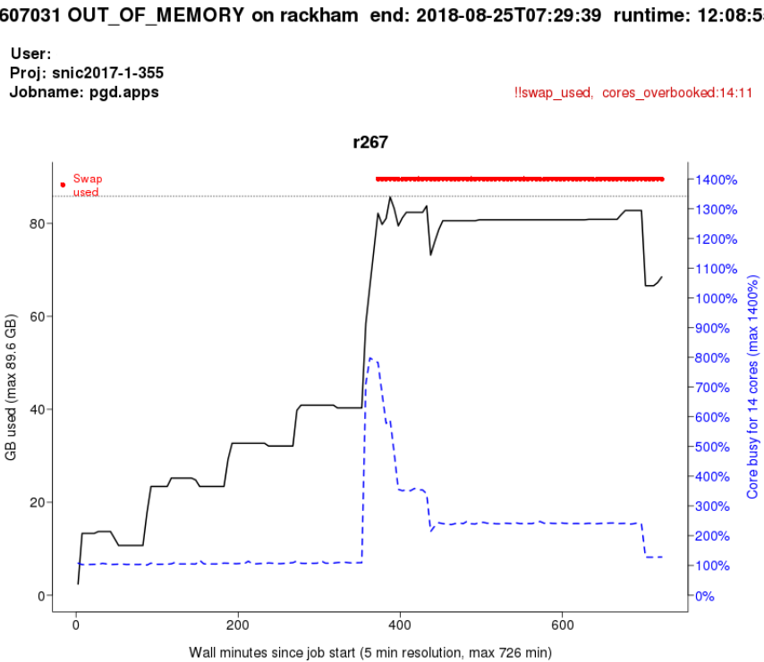
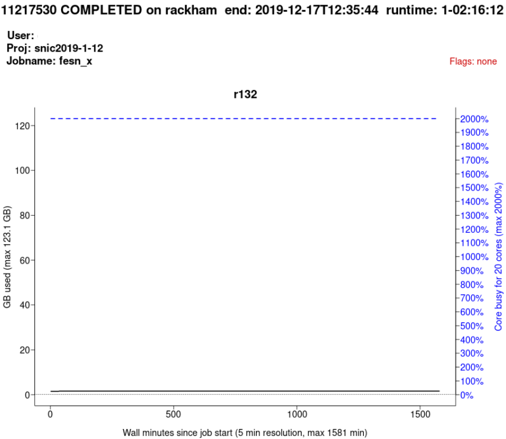
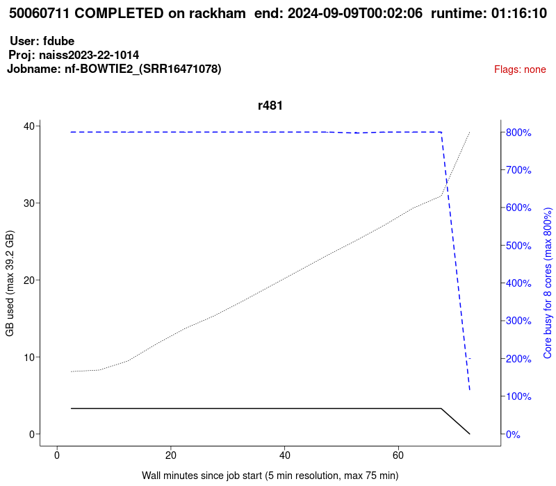

---
tags:
  - lesson
  - session
---

# Efficient jobs

!!!- info "Learning outcomes"

    - Practice using the UPPMAX documentation
    - I can see the CPU and memory usage of jobs
    - I can read a `jobstats` plot
    - I can create a `jobstats` plot
    - I understand how to set up jobs efficiently

???- question "Want to see this session as a video?"

    Watch it on YouTube [here](https://youtu.be/0FcREXUcOHc).

???- question "For teachers"

    Teaching goals are:

    - Learners have practiced using the UPPMAX documentation
    - Learners have seen the CPU and memory usage of jobs
    - Learners have read a `jobstats` plot
    - Learners have created a `jobstats` plot
    - Learners have discussed how to set up jobs efficiently

    Lesson plan:

    ```mermaid
    gantt
      title Efficient jobs
      dateFormat X
      axisFormat %s
      section First hour
      Course introduction: done, course_intro, 0, 10s
      Prior : intro, after course_intro, 5s
      Present: theory_1, after intro, 5s
      Challenge: crit, exercise_1, after theory_1, 40s
      Break: crit, milestone, after exercise_1
      section Second hour
      Challenge: crit, exercise_2, 0, 10s
      Feedback: feedback_2, after exercise_2, 10s
      SLURM: done, slurm, after feedback_2, 25s
      Break: done, milestone, after slurm
    ```

    Prior questions:

    - How to schedule jobs efficiently?
    - What is the `jobstats` tool?

    Present:

    - ?Show documentation

## Why?

> If everyone would use our computational resources effectively,
> there would be no queue.
>
> From the UPPMAX documentation, original source unknown

Running efficient jobs allows you to run more jobs that start running faster.

## Exercises

### Exercise 1: reading a `jobstats` plot

- Read [the UPPMAX `jobstats` documentation](https://docs.uppmax.uu.se/software/jobstats/)
  especially [the 'effective use' section](https://docs.uppmax.uu.se/software/jobstats/#efficient-use)

#### Exercise 1.1: `jobstats plot 1`

See `jobstats plot 1` below and answer these questions:

- How much cores should this user book?
- Why?



> jobstats plot 1

???- question "Answer"

    The user should have booked 1 core: the memory use will work fine with
    1 core and this matches the CPU usage exactly.

    It may be that the program is set up incorrectly
    and that it can use multiple cores if set up correctly.

#### Exercise 1.2: `jobstats plot 2`

See `jobstats plot 2` below and answer these questions:

- Did the job finish successfully?
- How much cores should this user book?
- Why?



> jobstats plot 2

???- question "Answer"

    The job did not finish successfully, the `OUT_OF_MEMORY` error
    indicites that.

    How much cores the user should book is uncertain, we only know that it is
    more then currently used. One strategy is to double to amount of cores
    and finetune after a successful run.

#### Exercise 1.3: `jobstats plot 3`

- See `jobstats plot 3` below and answer these questions:
- How much cores should this user book?
- Why?



> jobstats plot 3

???- question "Answer"

    We don't know. The user uses all CPU power perfectly and
    there is enough memory available.

    The user may benefit from more CPUs, as the program may be
    CPU limited.

    It may be that the program used is designed to use
    20 CPUs maximally, hence scheduling 20 cores is perfect!

    It may be that using 20 cores is a strategy of the user:
    using multiple cores always brings computational overhead
    and hence wasted CPU resources.

#### Exercise 1.4: `jobstats plot 4`

See `jobstats plot 4` below and answer these questions:

- How much cores should this user book?
- Why?



> jobstats plot 4

???- question "Answer"

    This seems to be the cleanest example of using the algorithm to
    use computational resources efficiently: the user needs 2 cores
    for memory and adds 1 for safely. The job is not clearly
    CPU limited.

### Exercise 2: creating a `jobstats` plot

We are going to create a `jobstats` plot. For that, we need a job
to plot. Here we first look for a job, after which we plot it.

- Scan [the UPPMAX `finishedjobinfo` documentation](https://docs.uppmax.uu.se/software/finishedjobinfo/)
- Log in to **Rackham**.
- Why do we need to log in to Rackham to find jobs?

???- question "Answer"

    On Bianca, all projects are part of an independent, isolated virtual
    cluster, for security reasons. When working in a Bianca project,
    one cannot see anything of other projects.

    Rackham does not have this: we can see all jobs submitted by all users.
    Hence, there are more visible jobs for us to look at.

- Find a job that has finished successfully that took longer than one hour.

???- question "Answer"

    Use any of the code snippets, for example
    [How do I find jobs that have finished and took longer than an hour?](https://docs.uppmax.uu.se/software/finishedjobinfo/#how-do-i-find-jobs-that-have-finished-and-took-longer-than-an-hour):

    ```bash
    finishedjobinfo | grep -E "runtime.([0-9]-)?[0-9][1-9]"
    ```

    Press `CTRL-C` to stop the process: it will take very long to finish.

- Read [the UPPMAX `jobstats` documentation](https://docs.uppmax.uu.se/software/jobstats/),
  create a `jobstats` plot of that job

???- question "Answer"

    ```bash
    jobstats --plot 12345678
    ```


- View the `jobstats` plot. Use [the UPPMAX documentation on 'eog'](https://docs.uppmax.uu.se/software/eog/)
  if you want to be fast :-)

???- question "Answer"

    ```bash
    eog bianca-sens1234-sens1234-12345678.png
    ```

- Was that a job that was set up well? If not, how should it be setup? Why?
- Does the quote at the start of this sessions ('If everyone would use our
  computational resources effectively, there would be no queue') apply to
  your job?
