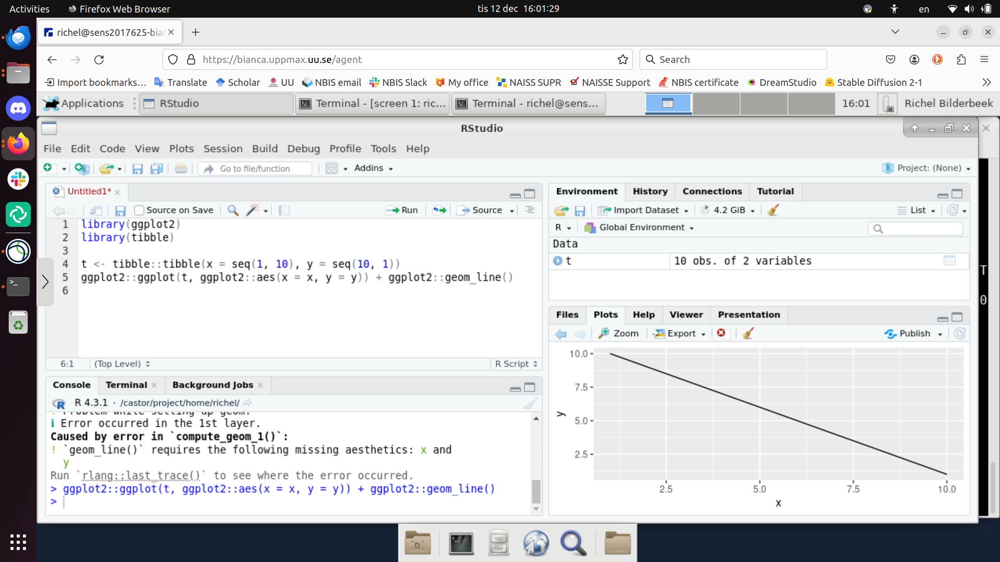
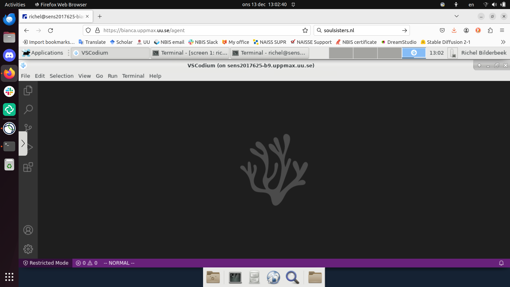

# IDE:s

> RStudio is one of the IDEs that can be used on Bianca.

!!! info "Objectives" 

    - Observe different IDEs running on Bianca
    - Start your favorite IDE on Bianca

???- info "Notes for teachers"

    Teaching goals:

    - Show the three IDEs in action
    - The learners demonstrate to have started at least on IDE on Bianca

    Schedule (45 minutes):

    - 5 mins: Let the learners start an interactive node: this can take dozens of minutes!
    - 10 mins: discuss this page and its sub-pages
    - 15 mins: do the exercises
    - 15 mins: discuss the exercises

## Introduction

IDE (pronounce `aj-dee-ee`) is short for 'Integrated Development Environment',
or 'a program in which you do programming'.
The goal of an IDE is to help develop code, with features
such as code completion, code hints and interactive debugging.

There are [many different IDEs](https://en.wikipedia.org/wiki/Comparison_of_integrated_development_environments)), 
of which some are tailored to one programming
language (e.g. RStudio) and some allow multiple programming languages.

In this session, we show how to use the most popular IDEs on Bianca.

In all cases, we login to the Bianca remote desktop environment.

???- tip "Forgot how to login to a remote desktop environment?"

    See [the basic Bianca course page 'Logging in'](../login_bianca.md).

    Spoiler: go to [https://bianca.uppmax.uu.se/](https://bianca.uppmax.uu.se/)

In all cases, we use an interactive node: an IDE is a resource-heavy
program, so using it on a login node would slow down other users.

???- tip "Forgot how to start an interactive node?"

    See [the basic Bianca course page 'Starting an interactive node'](../start_interactive_node.md).

???- note "Do you really want to use an IDE on Bianca?"

    Using an IDE on Bianca is cumbersome and
    there are superior ways to develop code on Bianca.

    However, using an IDE may make it easier for a new user to feel
    comfortable using Bianca.

    The [UPPMAX 'Programming Formalisms' course](https://github.com/UPPMAX/programming_formalisms)
    will teach you a superior workflow, 
    where development takes place on your own regular computer
    and testing is done using simulated/fake data.
    When development is done,
    the tested project is uploaded to Bianca and setup to
    use the real data instead.

    This avoids using a clumsy remote desktop environment,
    as well as many added bonuses.

## IDEs

Here we describe some IDEs, in alphabetic order.

### Jupyter

Jupyter is an IDE specialized for the Python programming language.

See [here](jupyter.md) to learn how to run Jupyter on Bianca.

### RStudio

RStudio is an IDE specialized for the R programming language.

See [here](rstudio.md) to learn how to run RStudio on Bianca.

### VSCodium

VSCodium is the community edition of Visual Studio Code
and can be used for software development in many languages.

See [here](vscodium.md) to learn how to run VSCodium on Bianca.

## Exercises

???- question "Exercise: Start your favorite IDE"

    The goal of this exercise is to make sure you can start
    at least 1 IDE.

???- question "Why use an IDE?"

    It makes new Bianca users feel comfortable,
    as an IDE is a recognizable environment.
    Also, the terminal can be daunting to some.

    Additionally, an IDE allows one to do runtime debugging,
    i.e. running through code line-by-line and/or up/down
    the so-called call stack.

???- question "Why not always use an IDE?"

    Using an IDE on Bianca is cumbersome and
    there are superior ways to develop code on Bianca,
    as -for example- taught in the 
    [UPPMAX 'Programming Formalisms' course](https://github.com/UPPMAX/programming_formalisms).

???- question "Why not always use an interactive session?"

    Because it is an inefficient use of your core hours.

    An interactive session means that you use a calculation node with low
    efficiency: only irregularly you will use such a node to its full
    capacity. 
    However, the number of core hours are registered as if the node is used
    at full capacity, as it is *reserved* to be used at that capacity.

???- question "How to find out if you are on a login or interactive node"

    In the terminal, type `hostname`

    - the login node has `[project]-bianca`, where `[project]` is the name of the project, e.g. `sens2023598`
    - the interactive node has `b[number]` in it, where `[number]` is the compute node number

