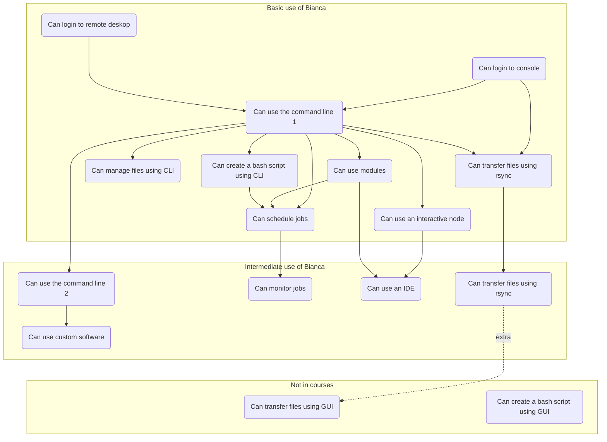

# Bianca In-Depth Hackathon: Improve Your Handling of Sensitive Research Data

!!!- info "Learning objectives"

    - Know where to find an overview of topics discussed today
    - Know where to find the link to the shared document
    - Know where to find the schedule

???- question "For teachers"

    Prerequisites are:

    - Link to shared document

    Preparations are:

    - Shared document must contain:
        - a proper header with specifics: Zoom room, Bianca project, etc.
        - already redirect to evaluation at bottom
        - evaluation at the bottom

    Teaching goals are:

    - Learners know where to find an overview of topics discussed today
    - Learners know where to find the link to the shared document
    - Learners know where to find the schedule

    Lesson plan:

    ```mermaid
    gantt
      title Introduction
      dateFormat X
      axisFormat %s
      Prior: prior, 0, 5s
      Introduction: after prior, 5s
    ```

    Prior questions:

    - What do you think about when you think about Bianca?
    - How would you like to improve your Bianca experience?

Are you already working with sensitive data in your research
and feel your workflow can be improved?
If yes, welcome to a full day of learning of smarter ways
to work on the Bianca UPPMAX cluster.

???- tip "Help! I am new to Bianca, where do I start instead?"

    As a beginner, you are encouraged to start with the
    basic Bianca course, at [here](../intro.md).

???- tip "I may be rusty on how to log in to Bianca, how do I login again?"

    You can refresh your mind at 
    [the Basic Bianca course's session on accessing Bianca](../login_bianca.md).

???- tip "I may be rusty on using Linux commands, is there any documentation?"

    Sure! It is at
    [the Basic Bianca course's session on using the command-line](../commandline.md).

???- tip "How do I copy/paste within a ThinLinc session?" 

     - Windows/MAC: Right-click and choose, or
     - Windows:
         - paste: `shift+insert`
         - copy: `ctrl+insert`

???- tip "How do I copy/paste between ThinLinc and locally?" 

      

      - Like a "wharf" for clipboard

      - Copy in ThinLinc by the ThinLinc command (see above) and it ends up here in the ThinLinc clipboard
          - Mark and copy with Windows/Mac command
          - Paste locally with Windows/Mac command
       
      - Copy from locally 
          - paste in the ThinLinc clipboard with Windows/Mac command
          - paste to ThinLinc place by the ThinLinc command (see above)

!!! info "Course shared document"

    The course shared document can be found at: [https://hackmd.io/@UPPMAX/bianca-workshop-2024/edit](https://hackmd.io/@UPPMAX/bianca-workshop-2024/edit).

    It contains exercises, room for questions and room for feedback.

    To view the shared document in both text and rendered form, 
    click on the button in the top between the pen and eye.

    Regarding questions: 

    - create a new line for new questions
    - take care if others are editing at the same time
    - the more teaching assistants available, the quicker questions are answered
    - some questions may be answered after the workshop

## Schedule

When | Who  | What
-----|------|-------------------------
9:00 | R    | [Introduction](https://uppmax.github.io/bianca_workshop/intermediate/intro/)
9:10 | R    | 50 minutes [transferring files to and from Bianca](https://uppmax.github.io/bianca_workshop/intermediate/transfer/), which includes login
10:00| .    | Break
10:15| R    | 20 minutes [Transferring files p2](https://uppmax.github.io/bianca_workshop/intermediate/transfer/)
10:35| D    | 25 minutes [Slurm jobs p1](https://uppmax.github.io/bianca_workshop/intermediate/slurm_intermed/)
11:00| .    | Break
11:15| D    | 45 minutes [Slurm jobs p2](https://uppmax.github.io/bianca_workshop/intermediate/slurm_intermed/)
12:00| .    | Lunch
13:00| B    | [Software and packages installation](https://uppmax.github.io/bianca_workshop/intermediate/install/)
13:45| .    | Break
14:00| BR   | [IDEs on Bianca](https://uppmax.github.io/bianca_workshop/intermediate/ides/)
14:45| .    | Break
15:00| L    | [NAISS-SENS summary](https://uppmax.github.io/bianca_workshop/sens_project_short/)
15:30| R    | [Summary](https://uppmax.github.io/bianca_workshop/intermediate/summary/)
15:35| R    | [Evaluation](https://uppmax.github.io/bianca_workshop/intermediate/summary/)
15:45| All  | Optional Q/A and [extra material](https://uppmax.github.io/bianca_workshop/extra/slurm/)
16:00| .    | END

* Who: `B`: Björn, `L`: Lars, `R`: Richèl

## Overview of courses


