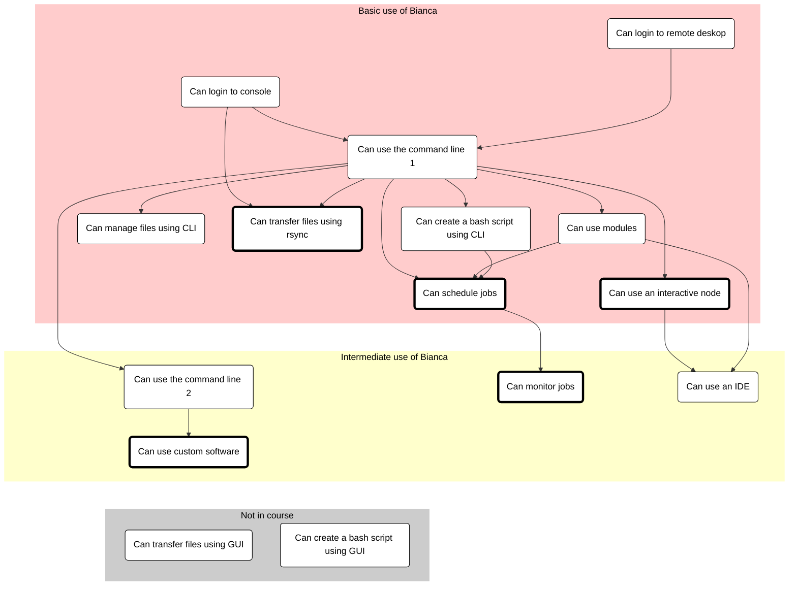

# Bianca In-Depth Hackathon: Improve Your Handling of Sensitive Research Data

Are you already working with sensitive data in your research
and feel your workflow can be improved?
If yes, welcome to a full day of learning of smarter ways
to work on the Bianca UPPMAX cluster.

???- tip "I am new to Bianca, where do I start?"

    As a beginner, you are encouraged to start with the
    basic Bianca course, at [here](../intro.md).

You will learn how to login from a terminal (bypassing ThinLinc),
do file transfer from a terminal (allowing scripts),
advanced SLURM, using IDEs (i.e. RStudio and/or VSCode),
and installing custom software and packages.

Tentative schedule

Time |Topic
-----|--------------------------
9.00 | [Introduction](https://uppmax.github.io/bianca_workshop/intermediate/intro/)
9.10 | [NAISS-SENS summary](https://uppmax.github.io/bianca_workshop/sens_project_short/)
9.20 | [Transferring files to and from Bianca](https://uppmax.github.io/bianca_workshop/intermediate/transfer/)
10.00| Coffee break
10.15| [Transferring files p2](https://uppmax.github.io/bianca_workshop/intermediate/transfer/)
10.35| [Slurm jobs p1](https://uppmax.github.io/bianca_workshop/intermediate/slurm_intermed/)
11.00| Break
11.15| [Slurm jobs p2](https://uppmax.github.io/bianca_workshop/intermediate/slurm_intermed/)
12.00| LUNCH
13.00| [Software and packages installation](https://uppmax.github.io/bianca_workshop/intermediate/install/)
13.50| break
14.05| [IDE:s on Bianca](https://uppmax.github.io/bianca_workshop/intermediate/ides/)
15.00| Coffee break
15.15| [Summary](https://uppmax.github.io/bianca_workshop/intermediate/summary/)
15.20| Q/A and [extra material](https://uppmax.github.io/bianca_workshop/extra/slurm/)
15.55| Closing words
16.00| END

Suggested new schedule:

When | Who  | What
-----|------|-------------------------
9:00 | R   | [Introduction](https://uppmax.github.io/bianca_workshop/intermediate/intro/)
9:15 | R    | 45 minutes [Transferring files to and from Bianca](https://uppmax.github.io/bianca_workshop/intermediate/transfer/)
10:00| .    | Break
10:15| R    | 20 minutes [Transferring files p2](https://uppmax.github.io/bianca_workshop/intermediate/transfer/)
10:35| D    | 25 minutes [Slurm jobs p1](https://uppmax.github.io/bianca_workshop/intermediate/slurm_intermed/)
11:00| .    | Break
11:15| D    | 45 minutes [Slurm jobs p2](https://uppmax.github.io/bianca_workshop/intermediate/slurm_intermed/)
12:00| .    | Lunch
13:00| B    | [Software and packages installation](https://uppmax.github.io/bianca_workshop/intermediate/install/)
13:45| .    | Break
14:00| PR   | [IDEs on Bianca](https://uppmax.github.io/bianca_workshop/intermediate/ides/)
14:45| .    | Break
15:00| L    | [NAISS-SENS summary](https://uppmax.github.io/bianca_workshop/sens_project_short/)
15:30| R    | [Summary](https://uppmax.github.io/bianca_workshop/intermediate/summary/)
15:35| R    | Evaluation
15:45| All  | Optional Q/A and [extra material](https://uppmax.github.io/bianca_workshop/extra/slurm/)
16:00| .    | END

* Who: `B`: Björn, `L`: Lars, `P`: Pavlin, `R`: Richèl

Changes:

* IDEs changed from 55 -> 45 minutes, as there is a new setup: (1) let learners vote on one IDE, (2) discuss that IDE in detail, (3) mention the others more briefly. If teachers think it would be better to discuss 2 in detail, they may do so
* NAISS-SENS to back, so that (1) learners can dive in immediately, (2) it is a nice easy way to round off the day
* NAISS-SENS duration changed from 10 -> 30 minutes, as this is more realistic
* Introduction duration changed from 5 -> 15 minutes
* Transferring files part 1 duration changed from 40 -> 45 minutes

!!! info "Q/A collaboration document"

    - Use the Q/A page for the workshop with your questions.

          - [https://hackmd.io/@bclaremar/bianca_hack_dec_2023?both](https://hackmd.io/@bclaremar/bianca_dec_2023?both)

    - Depending on how many helpers there are we’ll see how fast there are answers.

        - Some answers may come after the workshop.

    - Create a new line for new questions. Take care if others are editing at the same time.

## Overview of courses

