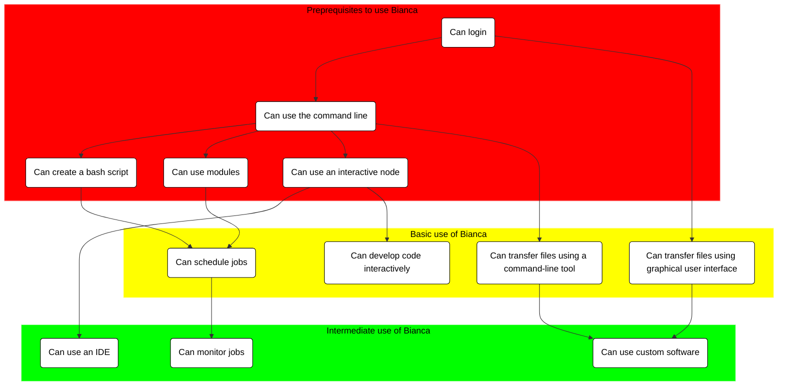

# Bianca In-Depth Hackathon: Improve Your Handling of Sensitive Research Data

Are you already working with sensitive data in your research 
and feel your workflow can be improved? 
If yes, welcome to a full day of learning of smarter ways 
to work on the Bianca UPPMAX cluster. 

???- tip "I am new to Bianca, where do I start?"

    As a beginner, you are encouraged to start with the
    basic Bianca course, at [here](../intro.md).

You will learn how to login from a terminal (bypassing ThinLinc), 
do file transfer from a terminal (allowing scripts), 
advanced SLURM, using IDEs (i.e. RStudio and/or VSCode), 
and installing custom software and packages.

Tentative schedule

    9.00 Introduction
    9.10 NAISS-SENS summary
    9.20 Transferring files to and from Bianca
    10.00 Coffee break
    10.15 Transferring files p2
    10.35 Slurm jobs p1
    11.00 Break
    11.15 Slurm jobs p2 
    12.00 LUNCH
    13.00 Software and packages installation on Bianca
    13.50 break
    14.05 IDE:s on Bianca
    15.00 Coffee break
    15.15 Summary
    15.20 Q/A and extra material
    15.55 Closing words
    16.00 END

!!! info "Q/A collaboration document"

    - Use the Q/A page for the workshop with your questions.

          - [https://hackmd.io/@bclaremar/bianca_hack_dec_2023?both](https://hackmd.io/@bclaremar/bianca_dec_2023?both)

    - Depending on how many helpers there are we’ll see how fast there are answers.

        - Some answers may come after the workshop.

    - Create a new line for new questions. Take care if others are editing at the same time.

## Overview of courses

    
