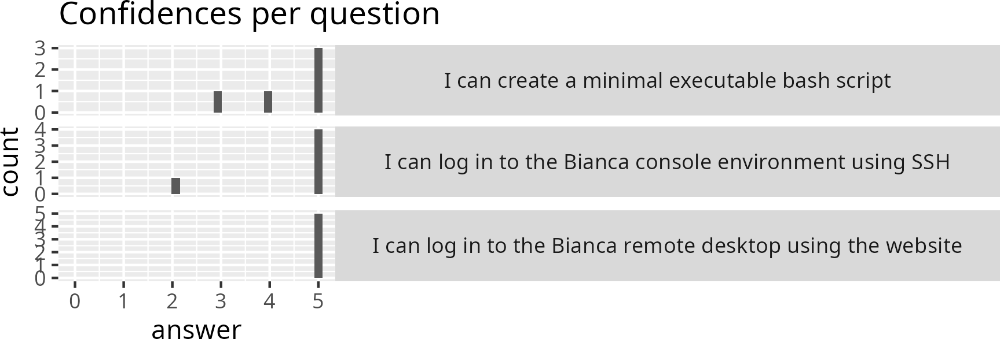

# Prevaluation

A prevaluation is an evaluation done before the course has started.

The goals of the prevaluation are:

- For the learners: to get an introduction of what will be taught
- For the teachers: to measure how much knowledge is gained

The prevaluation form can be found `[not here anymore]`.

???- question "What do you mean with 'to measure how much knowledge is gained'?"

    Here is [part of an evaluation](https://github.com/UPPMAX/bianca_workshops/blob/main/reflections/20240925/20240925_richel.md):

    

    All learners stated 'I can absolutely do this!' for
    'I can log in to Bianca using the remote desktop'.
    Us teachers did a good job there!

    Did we? That depends on how much the learners already knew. Maybe
    everyone already knew how to do this.

    If all learners already knew about this, we could
    consider removing this.

    If all learners did not knew about this, then, indeed,
    us teachers did a good job :-)

???- question "What are the prevaluation questions?"

    These are the prevaluation questions.
    The goals of these questions is to introduce what is taught
    today, as well as measuring how much knowledge is gained at the end
    of the day.

    Give you confidence levels of the following statements,
    using this scale:

    - 0: I don't know even what this is about ...?
    - 1: I have no confidence I can do this
    - 2: I have low confidence I can do this
    - 3: I have some confidence I can do this
    - 4: I have good confidence I can do this
    - 5: I absolutely can do this!

    Give you confidence levels of the following statements below:

    ```code
    [Learning objectives from the evaluation here]
    ```

    Is there a learning objective you think is missing? What is it?

