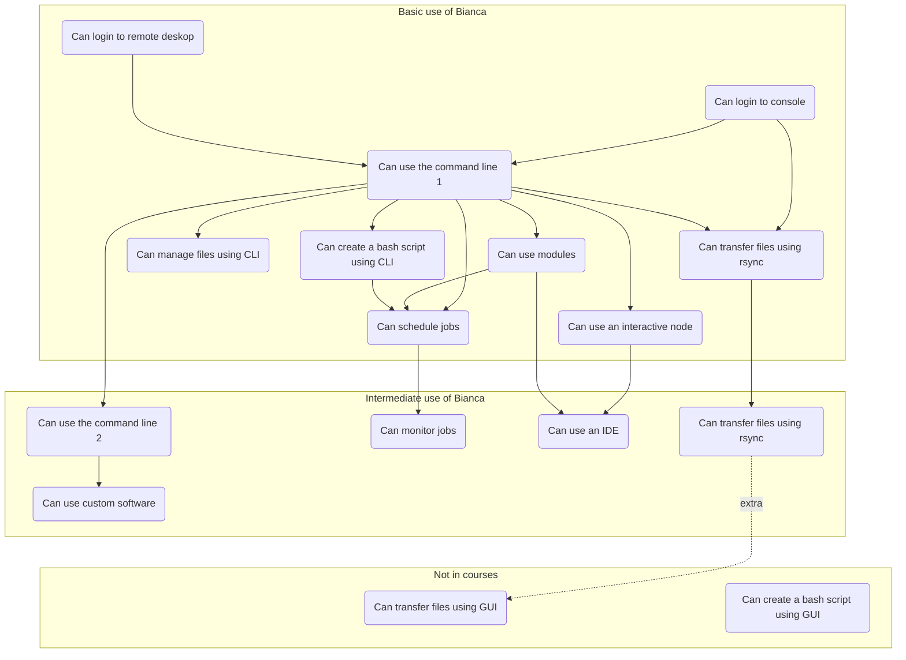
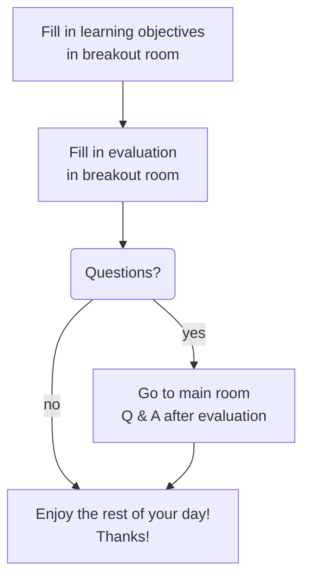

# Summary

!!!- info "Learning objectives"

    - Repeat seeing the overview of topics discussed today
    - Share confidence on having learned the topics discussed today

???- question "For teachers"

    Teacher goals are:

    - Learners give feedback on how well topics were taught today
    - Learners give feedback on the course anonymously

    Teaching goals are:

    - Learners have again seen an overview of topics discussed today

    Lesson plan:

    ```mermaid
    gantt
      title Summary
      dateFormat X
      axisFormat %s
      Monologue: 0, 5s
    ```

## Overview of today

Copied from [Introduction](intro.md):



## Final steps



## Learning objectives

Most are copied from their respective pages:

- [Introduction](https://uppmax.github.io/bianca_workshop/intermediate/intro/)
    - [ ] See an overview of topics discussed today
    - [ ] See the link to the shared document
    - [ ] See the schedule
- [Transferring files to and from Bianca](https://uppmax.github.io/bianca_workshop/intermediate/transfer/)
	- [ ] Explore the UPPMAX documentation
	- [ ] Understand what the wharf is
	- [ ] Understand what the Transit server allows
	- [ ] Mount the wharf on Transit
	- [ ] Transfer files to/from Bianca using rsync
	- [ ] Transfer files to/from Bianca using FileZilla
- [Slurm jobs](https://uppmax.github.io/bianca_workshop/intermediate/slurm_intermed/)
    - [ ] Understand what Slurm is
    - [ ] Understand some Slurm parameters
    - [ ] Understand what sbatch is
    - [ ] Understand what the job queue is
    - [ ] Start jobs
    - [ ] See job CPU and memory usage
    - [ ] Can start an interactive job
    - [ ] Understand how compute nodes are moved between project clusters
    - [ ] Have used other Slurm tools
- [Software and packages installation](https://uppmax.github.io/bianca_workshop/intermediate/install/)
    - [ ] Understand how to install software yourself
    - Understand how to use Packages and libraries for scripts
        - [ ] ... using Conda
        - [ ] ... using Python packages with pip
        - [ ] ... using R packages
        - [ ] ... using Julia packages
    - [ ] Understand what containers are
    - [ ] Understand what Singularity is
    - [ ] Understand what Docker is
    - [ ] Understand how to build from source
- [IDEs on Bianca](https://uppmax.github.io/bianca_workshop/intermediate/ides/)
    - [ ] Understand what an IDE is
    - [ ] Have heard that RStudio, Jupyter, VSCodium are IDEs
    - [ ] Understand that there are IDEs that can run on Bianca
    - [ ] Have run the voted-for IDE on Bianca
- [NAISS-SENS](https://uppmax.github.io/bianca_workshop/sens_project_short/)
    - [ ] Understand what sensitive personal data is
    - [ ] Understand the difference between pseudonymisation and anonymisation
    - [ ] Know where to apply for project


### Exercise

Share your confidence on having learned the topics discussed today,
by going thought the list on the shared document.

Although it will be messy, between `[ ]`, add a number for confidence:

Grade|Description
-----|------------------------------------
`0`  |I have no idea what this is about
`1`  |I have no confidence I can do this
`2`  |I have low confidence I can do this
`3`  |I have some confidence I can do this
`4`  |I have good confidence I can do this
`5`  |I absolutely can do this!

This may result in a measurement like this:

- `[00101000111201]`: most learners have low confidence
- `[44345454545454]`: most learners have high confidence
