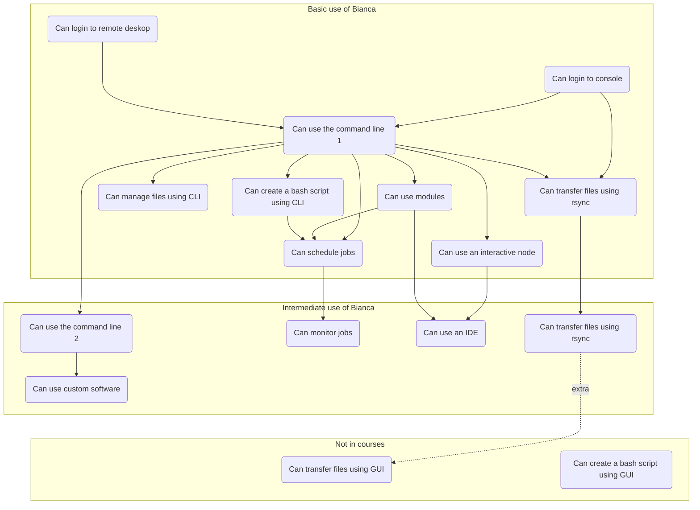
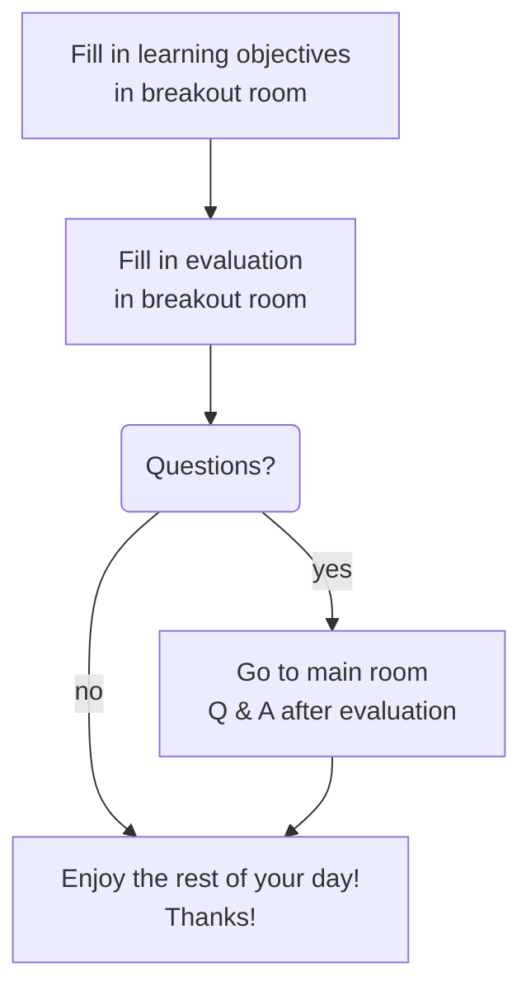

# Summary and evaluation

!!!- info "Learning objectives"

    - Repeat seeing the overview of topics discussed today
    - Share confidence on having learned the topics discussed today

???- question "For teachers"

    Teacher goals are:

    - Learners give feedback on how well topics were taught today
    - Learners give feedback on the course anonymously

    Teaching goals are:

    - Learners have again seen an overview of topics discussed today

    Lesson plan:

    ```mermaid
    gantt
      title Summary
      dateFormat X
      axisFormat %s
      Monologue: 0, 5s
    ```

## Overview of today

Copied from [Introduction](intro.md):



## Final steps



## Exercises

Goal of these exercises are:

- You reflect on today
- We learn from your feedback

This is an anonymous evaluation
and will ideally be published in raw form at 
[https://github.com/UPPMAX/bianca_workshop/tree/main/evaluations/20240524](https://github.com/UPPMAX/bianca_workshop/tree/main/evaluations/20240524).
To do so, please do not share sensitive data here!

This evaluation uses a shared document, 
because its advantages outweigh the disadvantages.

The drawbacks of using a shared document are:

- one needs to be careful when multiple people are editing at the same time. This may result in minor data loss possible while editing

The advantages that outweigh these are: 

- it is already there, hence there is no new link needed
- you already have worked with it, hence there will be no new technical problems
- it guarantees integrity: a literal copy-paste of the data will perfectly preserve the data
- there is no owner of this data: all learners and teachers can access, verify and upload the data

You will work on these exercises in a shared Breakout room,
as having teachers present gives a bias in your feedback.

### Exercise 1: what did I learn today?

The goal of this exercise is for you to reflect on what you learned today:

- how many things?
- how confident are you now?

To do so, the learning objectives are collected in the shared document.

There, you can share your confidence on having learned the topics discussed today,
by going thought the list on the shared document.

Although it will be messy, between `[ ]`, add a number for confidence:

Grade|Description
-----|------------------------------------
`0`  |I have no idea what this is about
`1`  |I have no confidence I can do this
`2`  |I have low confidence I can do this
`3`  |I have some confidence I can do this
`4`  |I have good confidence I can do this
`5`  |I absolutely can do this!

This may result in a measurement like this:

- `[00101000111201]`: most learners have low confidence
- `[44345454545454]`: most learners have high confidence

Thanks for your time in helping us understand where we can improve
our teaching of these topics! 

### Exercise 2: evaluation

The goal of this exercise is for you to reflect on the course.
How did you enjoy the course and how would you improve it?

To do so, the evaluation questions are at the bottom of the share document.

Thanks for your time  in helping us improve our course as a whole!
