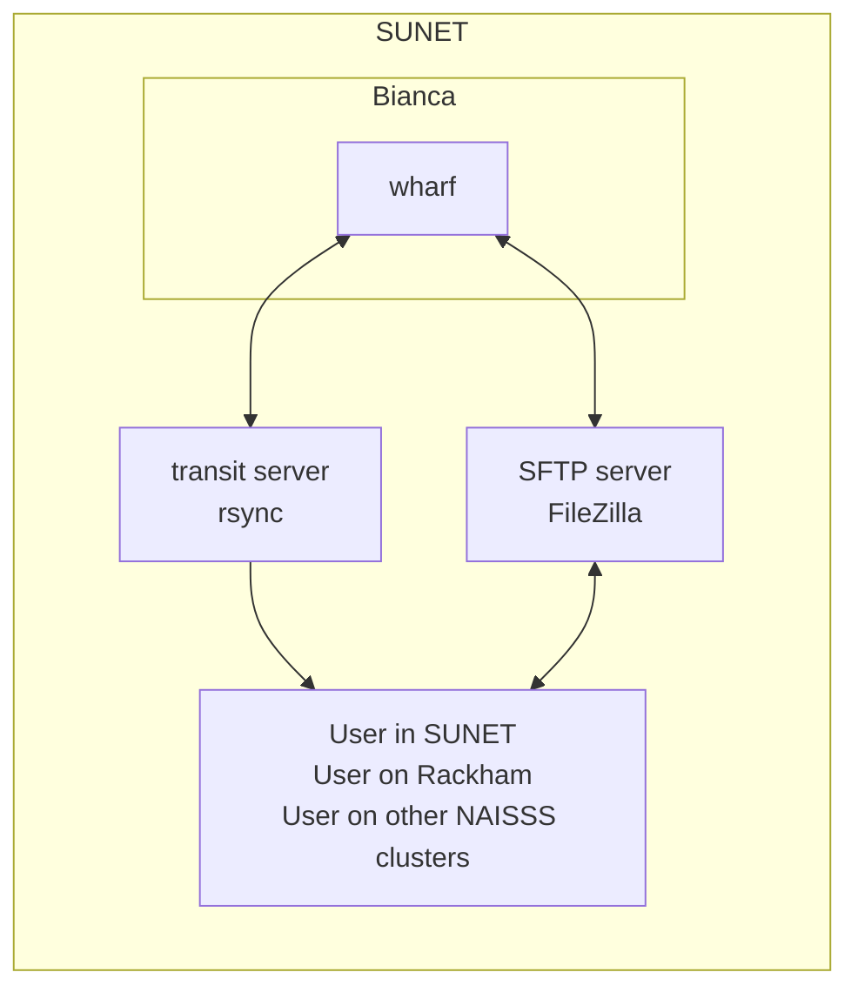

# File transfer to/from Bianca

!!!- info "Learning objectives"

    - Understand what the wharf is
    - Understand what the Transit server allows
    - Mount the wharf on Transit
    - Transfer files to/from Bianca using rsync
    - Transfer files to/from Bianca using FileZilla

???- question "For teachers"

    Prerequisites are:

    - None

    Teaching goals are:

    - Learners understand what the wharf is
    - Learners understand that the Transit server serves
      like a bridge between locations
    - Learners have mounted the wharf on Transit
    - Learners have transferred files to/from Bianca using rsync
    - Learners have transferred files to/from Bianca using FileZilla


    Lesson plan:

    ```mermaid
    gantt
      title File tranfer to/from Bianca
      dateFormat X
      axisFormat %s
      section First hour
      Course introduction: done, course_intro, 0, 15s
      Introduction : intro, after course_intro, 5s
      Theory 1: theory_1, after intro, 10s
      Exercise 1: crit, exercise_1, after theory_1, 20s
      Feedback 1: feedback_1, after exercise_1, 10s
      Break: milestone, after feedback_1
      section Second hour
      Exercise 2: crit, exercise_2, 0, 10s
      Feedback 2: feedback_2, after exercise_2, 10s
      SLURM: done, slurm, after feedback_2, 25s
      Break: done, milestone, after slurm
    ```

    As the video is 11 minutes, I assume around 3x as much time.

## Why?

Most users need to transfer files to/from Bianca,
for example, their scripts to analyse their (sensitive) data.

In this session, we will transfer (non-sensitive) files to/from Bianca.

## Terms



As Bianca is a sensitive data cluster, we need to know:

- [wharf](http://docs.uppmax.uu.se/cluster_guides/wharf/): a folder
  on Bianca that is the only folder one can transfer data to/from
- [Transit](http://docs.uppmax.uu.se/cluster_guides/transit/):
  a service that allows one to transfer files between Bianca
  and other places, such as your local computer, 
  but also other sensitive data clusters

## Software

There are many ways to [tranfer files to/from Bianca](http://docs.uppmax.uu.se/cluster_guides/transfer_bianca/).

In this session, we use:

- [File transfer to/from Bianca using rsync](http://docs.uppmax.uu.se/cluster_guides/bianca_file_transfer_using_rsync/): 
  the recommended way to do so
- [File transfer to/from Bianca using FileZilla](http://docs.uppmax.uu.se/cluster_guides/bianca_file_transfer_using_filezilla/):
  the user-friendly way to do so

We will use `rsync` first, as this is the UPPMAX-recommended way,
as it is capable of transferring files of any size efficiently.

FileZilla is easier to use and its guide is easier to go through 
without an UPPMAX expert.

## Exercises

Exercise 1 is most important, as:

- `rsync` is the recommended tool
- it is harder, so do it with an UPPMAX expert around!


### Exercise 1: using rsync

???- info "Learning objectives"

    - Understand what the wharf is
    - Understand what the Transit server allows
    - Transfer files to/from Bianca using rsync

- Individually, read:

- Together, set a timer for 10 minutes
- Individually, answer the questions within the time limit
- Together, write down a shared answer on the GitHub project repository
  with path `learners/[a teammember's name]/pair_programming.md`
- Upload the file to the GitHub repo. 
  Use the GitHub web interface if pushing is a problem!

## Summary

!!! info "Summary"

    - The wharf is the only Bianca folder that has a connection with the outside worlds
    - The Transit server allows to transfer sensitive data between many places
    - One needs to mount a wharf on Transit
    - rsync is the (recommended) command-line tool that can be used to transfer data
    - FileZilla is a graphical tool that can be used to transfer data


