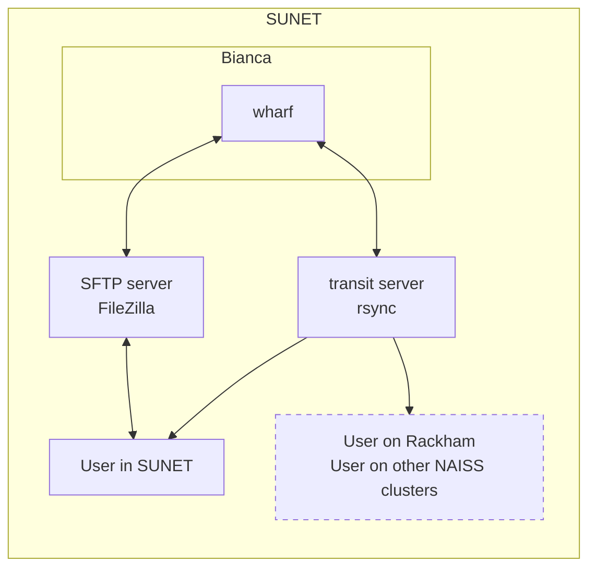

# File transfer to/from Bianca

!!!- info "Learning objectives"

    - Find information in the UPPMAX documentation about file transfer on Bianca
    - Give a reasonable definition of what the wharf is
    - Explain well enough why the wharf exists
    - Give a reasonable definition of what the Transit server is
    - Explain well enough what the Transit server allows one to do
    - Mount the wharf on Transit
    - Transfer files to/from Bianca using rsync
    - Transfer files to/from Bianca using FileZilla

???- question "For teachers"

    Prerequisites are:

    - None

    Preparations are:

    - Prepare the three questions for a public polling website such as Menti

    Teaching goals are:

    - Learners have explored the UPPMAX documentation
    - Learners understand what the wharf is
    - Learners understand that the Transit server serves
      like a bridge between locations
    - Learners have mounted the wharf on Transit
    - Learners have transferred files to/from Bianca using rsync
    - Learners have transferred files to/from Bianca using FileZilla


    Lesson plan:

    ```mermaid
    gantt
      title File tranfer to/from Bianca
      dateFormat X
      axisFormat %s
      section First hour
      Course introduction: done, course_intro, 0, 10s
      Introduction : intro, after course_intro, 5s
      Theory 1: theory_1, after intro, 5s
      Exercise 1: crit, exercise_1, after theory_1, 30s
      Feedback 1: feedback_1, after exercise_1, 10s
      Break: milestone, after feedback_1
      section Second hour
      Exercise 2: crit, exercise_2, 0, 10s
      Feedback 2: feedback_2, after exercise_2, 10s
      SLURM: done, slurm, after feedback_2, 25s
      Break: done, milestone, after slurm
    ```

    As the video is 11 minutes, I assume around 3x as much time.

    Prior questions:

    - What is file transfer?
    - Could you give an example of a file transfer you do in daily life?
    - Does it have consequences that Bianca is a sensitive data cluster?
    - How does one do file transfer on Bianca?

    Polls (goal: part of prior and measure actual usage):

    My favorite way to transfer files to/from Bianca now is using:

    - FileZilla
    - fuse-sshfs and mounting the wharf
    - lftp
    - rsync
    - scp
    - sftp
    - sshfs and mounting the wharf
    - Rclone
    - WinSCP
    - other

    About rsync:

    - I have never followed a lecture on rsync, I don't know what it is
    - I have never heard a lecture on rsync, but I've never gotten it to work
    - I have never heard a lecture on rsync, I have gotten it to work, but don't use it in practice
    - I have never heard a lecture on rsync, I have gotten it to work, and use it
    - I have heard a lecture on rsync, but I've never gotten it to work
    - I have heard a lecture on rsync, I have gotten it to work, but don't use it in practice
    - I have heard a lecture on rsync, I have gotten it to work, and use it

    About FileZilla:

    - I have never followed a lecture on FileZilla, I don't know what it is
    - I have never heard a lecture on FileZilla, but I've never gotten it to work
    - I have never heard a lecture on FileZilla, I have gotten it to work, but don't use it in practice
    - I have never heard a lecture on FileZilla, I have gotten it to work, and use it
    - I have heard a lecture on FileZilla, but I've never gotten it to work
    - I have heard a lecture on FileZilla, I have gotten it to work, but don't use it in practice
    - I have heard a lecture on FileZilla, I have gotten it to work, and use it

## Why?

Most users need to transfer files to/from Bianca,
for example, their scripts to analyse their (sensitive) data.

In this session, we will transfer (non-sensitive) files to/from Bianca.

## Terms



As Bianca is a sensitive data cluster, we need to know:

- [wharf](http://docs.uppmax.uu.se/cluster_guides/wharf/): a folder
  on Bianca that is the only folder one can transfer data to/from
- [Transit](http://docs.uppmax.uu.se/cluster_guides/transit/):
  a service that allows one to transfer files between Bianca
  and other places, such as your local computer,
  but also other sensitive data clusters.
- `rsync`: a tool to transfer files via Transit
- FileZilla: a tool to transfer files via an SFTP server (whatever that is)

## Software

There are many ways to [tranfer files to/from Bianca](http://docs.uppmax.uu.se/cluster_guides/transfer_bianca/).

In this session, we use:

- [File transfer to/from Bianca using rsync](http://docs.uppmax.uu.se/cluster_guides/bianca_file_transfer_using_rsync/):
  the recommended way to do so
- [File transfer to/from Bianca using FileZilla](http://docs.uppmax.uu.se/cluster_guides/bianca_file_transfer_using_filezilla/):
  the user-friendly way to do so

We will use `rsync` first, as this is the UPPMAX-recommended way,
as it is capable of transferring files of any size efficiently.

FileZilla is easier to use and its guide is easier to go through
without an UPPMAX expert.

## Exercises

Exercise 1 and 2 are the most important, as:

- `rsync` is the recommended tool
- it is harder, so do it with an UPPMAX expert around!

### Working form

You'll be assigned to Zoom breakout rooms with at least 3 learners in total.
The Zoom rooms will be closed automatically after the first session
and re-opened later with same groups.

???- question "Why put us in groups?"

    Because group work is effective for learning,
    especially for online courses [Bigatel & Edel-Malizia, 2018][Means, 1993].

???- question "Why disturb us after 20 minutes?"

    I agree that it disturbs, but it is an important enough reason to do so,
    as feedback is one of the most effective interventions for learning
    [Bell, 2020][Hattie, 2012][Hattie, 2023].

???- question "Why have a break in between?"

    Because breaks are important for learning [Newport, 2016].


### Exercise 1: first understanding of how to use `rsync`

???- info "Learning objectives"

    - Explore the UPPMAX documentation
    - Understand what the wharf is
    - Understand what the Transit server allows

- Scan the content of [the UPPMAX documentation on how to use rsync to transfer data to/from Bianca](http://docs.uppmax.uu.se/cluster_guides/bianca_file_transfer_using_rsync/)
- Answer the following questions to yourself in your own words (answers are below).
  Be generous in accepting your own answer.
  You may share your answer in the course shared document for feedback,
  but do not wait for feedback.
  If you have no idea at all, read the linked UPPMAX documentation:

    - What is [SUNET](http://docs.uppmax.uu.se/getting_started/get_inside_sunet/)?
    - What is [`ssh`](http://docs.uppmax.uu.se/software/ssh/)? What does it allow us to do?
    - What is [`wharf`](http://docs.uppmax.uu.se/cluster_guides/wharf/)? What does it allow us to do?
    - What is [`rsync`](http://docs.uppmax.uu.se/software/rsync/)?
    - What is [`transit`](http://docs.uppmax.uu.se/cluster_guides/transit/)?

???- question "Answers"

    > - What is SUNET?

    [SUNET](docs.uppmax.uu.se/getting_started/get_inside_sunet) is the university networks (yes, plural!).

    > - What is `ssh`? What does it allow us to do?

    [`ssh`](http://docs.uppmax.uu.se/software/ssh/) is an SSH client
    that allows us to log in to Bianca and Transit

    > - What is `wharf`? What does it allow us to do?

    [`wharf`](http://docs.uppmax.uu.se/cluster_guides/wharf/) is a folder 
    on Bianca used for file transfer to/from Bianca.

    > - What is `rsync`?

    [`rsync`](http://docs.uppmax.uu.se/software/rsync/) is a command-line tool
    to transfer files to/from Bianca.

    > - What is `transit`?

    [`transit`](http://docs.uppmax.uu.se/cluster_guides/transit/) 
    is an UPPMAX service that can be used to securely transfer files.

### Exercise 2: using `rsync`

???- info "Learning objectives"

    - Explore the UPPMAX documentation
    - Mount the wharf on Transit
    - Transfer files to/from Bianca using rsync

This exercise is quite practical.
Therefore, one interruption is scheduled for those that are stuck.

Here is what to do when you get stuck:

1. Take a look at the YouTube video that can be found at that page
   **until the point where you are stuck**, then go back to using
   the UPPMAX documentation again
1. Ask your question in the shared document.
   Raise your hand or contact the teachers in any way.
   You will be put in a Zoom room and the question in the document will be answered together

Here is the exercise:

- Follow the step-by-step guide of
  [the UPPMAX documentation on how to use rsync to transfer data to/from Bianca](http://docs.uppmax.uu.se/cluster_guides/bianca_file_transfer_using_rsync/).
  There are 4 transfers described (file versus folder, upload versus download),
  do at least 1 upload and 1 download
- Signal in Zoom that you are done using the Yes (a green checkmark) Reaction
  (Zoom Reactions are in the lower menu bar of your Zoom session).
  This helps us assess the optimal length of this session
- Move to the next optional exercises

### (optional) Exercise 3: using FileZilla

???- info "Learning objectives"

    - Explore the UPPMAX documentation
    - Transfer files to/from Bianca using FileZilla

- Scan the content of [the UPPMAX documentation on how to use FileZilla to transfer data to/from Bianca](http://docs.uppmax.uu.se/cluster_guides/bianca_file_transfer_using_filezilla/)
- Follow the step-by-step guide of
  [the UPPMAX documentation on how to use FileZilla to transfer data to/from Bianca](http://docs.uppmax.uu.se/cluster_guides/bianca_file_transfer_using_filezilla/).
  There are 2 transfers described (upload versus download),
  do both
- Signal in Zoom that you have nothing left to do using the No (a red cross) Reaction.
  (Zoom Reactions are in the lower menu bar of your Zoom session).
  From now on, you may be asked to help other learners
  and its helps us assess the optimal length of this session
- Read the material for the next session. Well done!

## Summary

!!! info "Summary"

    - The UPPMAX documentation is quite complete
    - The wharf is the only Bianca folder that has a connection with the outside worlds
    - The Transit server allows to transfer sensitive data between many places
    - One needs to mount a wharf on Transit
    - rsync is the (recommended) command-line tool that can be used to transfer data
    - FileZilla is a graphical tool that can be used to transfer data

???- question "What are the full references?"

    - [Bell, 2020] Bell, Mike. The fundamentals of teaching: A five-step model to put the research evidence into practice. Routledge, 2020.
    - [Bigatel & Edel-Malizia, 2018] Bigatel, Paula M., and Stephanie Edel-Malizia. "Using the “indicators of engaged learning online” framework to evaluate online course quality." TechTrends 62.1 (2018): 58-70.
    - [Hattie, 2012] Hattie, John. Visible learning for teachers: Maximizing impact on learning. Routledge, 2012.
    - [Hattie, 2023] Hattie, John. Visible learning: The sequel: A synthesis of over 2,100 meta-analyses relating to achievement. Routledge, 2023.
    - [Means, 1993] Means, Barbara. "Using technology to support education reform." (1993).
    - [Newport, 2016] Newport, Cal. Deep work: Rules for focused success in a distracted world. Hachette UK, 2016.
