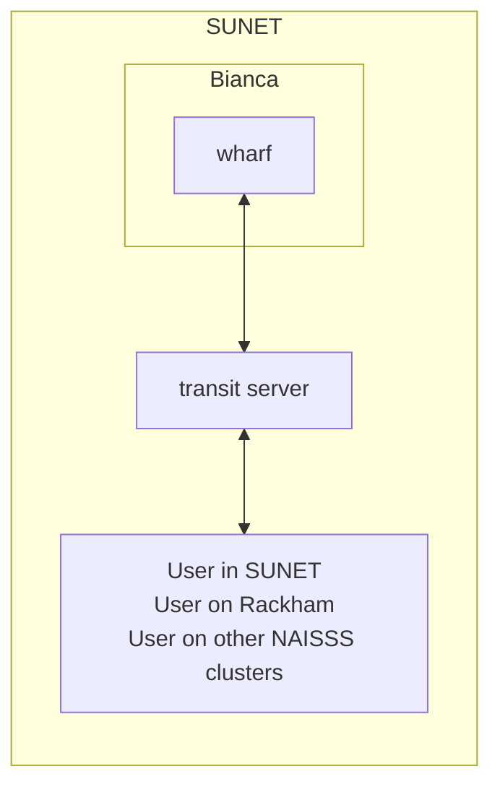

# File transfer to/from Bianca

!!!- info "Learning objectives"

    - Understand what the wharf is
    - Understand what the Transit server allows
    - Transfer files to/from Bianca using rsync
    - Transfer files to/from Bianca using FileZilla

???- question "For teachers"

    Prerequisites are:

    - None

    Teaching goals are:

    - Learners understand what the wharf is
    - Learners understand that the Transit server serves
      like a bridge between locations
    - Learners have transferred files to/from Bianca using rsync
    - Learners have transferred files to/from Bianca using FileZilla


    Lesson plan:

    ```mermaid
    gantt
      title File tranfer to/from Bianca
      dateFormat X
      axisFormat %s
      section First hour
      Course introduction: done, course_intro, 0, 15s
      Introduction : intro, after course_intro, 5s
      Theory 1: theory_1, after intro, 10s
      Exercise 1: crit, exercise_1, after theory_1, 20s
      Feedback 1: feedback_1, after exercise_1, 10s
      Break: milestone, after feedback_1
      section Second hour
      Exercise 2: crit, exercise_2, 0, 10s
      Feedback 2: feedback_2, after exercise_2, 10s
      SLURM: done, slurm, after feedback_2, 25s
      Break: done, milestone, after slurm
    ```

    As the video is 11 minutes, I assume around 3x as much time.

## Why?

Most users need to transfer files to/from Bianca,
for example, their scripts to analyse their (sensitive) data.

In this session, we will transfer (non-sensitive) files to/from Bianca.

## Terms



As Bianca is a sensitive data cluster, we need to know:

- [wharf](http://docs.uppmax.uu.se/cluster_guides/wharf/): a folder
  on Bianca that is the only folder one can transfer data to/from
- [Transit](http://docs.uppmax.uu.se/cluster_guides/transit/):
  a service that allows one to transfer files between Bianca
  and other places, such as your local computer, 
  but also other sensitive data clusters

## Software

There are many ways to [tranfer files to/from Bianca](http://docs.uppmax.uu.se/cluster_guides/transfer_bianca/).

In this session, we use:

- [File transfer to/from Bianca using rsync](http://docs.uppmax.uu.se/cluster_guides/bianca_file_transfer_using_rsync/): 
  the recommended way to do so
- [File transfer to/from Bianca using FileZilla](http://docs.uppmax.uu.se/cluster_guides/bianca_file_transfer_using_filezilla/):
  the user-friendly way to do so

We will use `rsync` first, as this is the UPPMAX-recommended way,
as it is capable of transferring files of any size efficiently.

FileZilla is easier to use and its guide is easier to go through 
without an UPPMAX expert.
 

## Exercises

### Exercise 1: using rsync

???- info "Learning objectives"

    - Understand what the wharf is
    - Understand what the Transit server allows
    - Transfer files to/from Bianca using rsync

- Individually, read:

- Together, set a timer for 10 minutes
- Individually, answer the questions within the time limit
- Together, write down a shared answer on the GitHub project repository
  with path `learners/[a teammember's name]/pair_programming.md`
- Upload the file to the GitHub repo. 
  Use the GitHub web interface if pushing is a problem!

Questions:

- What is pair programming?
- How does a good pair behave? Describe what can be observed when pairing online
- When to switch roles? Give a procedure 
- What effects does pair programming have?

???- question "Answers"

    > - What is pair programming?

    Pair programming is a software development practice
    in which two developers work on the same computer.
    The person with the keyboard ('the driver') develops new code.
    The person without the keyboard ('the navigator') reviews the code.

    > - How does a good pair behave? Describe what can be observed when pairing online

    In an online course:

    - A good pair has the driver sharing his/her screen
    - In a good pair, both people talk a lot
    - A good pair switches roles regularly
    - A good pair has a lot of commits

    > - When to switch roles? Give a procedure

    Any procedure to achieve the goal of regularly switching roles:

    - after enough work has been done to put in a `git commit`
      such as 'Add documentation', 'Add test', 'Pass test'
    - each time a timer goes off, e.g. after 5 minutes

    The first procedure sometimes fails when a driver (thinks he/she) 
    has much more knowledge than the navigator on the subject
    and is (apparently) inexperienced in good pair programming.
    In such cases, the second procedure work better.

    > - What effects does pair programming have?

    All material for this exercise show references to studies that
    show advantages of pair programming,
    for example (from two Wikipedia references):

     * a pair considers more alternative ways for a solution [Flor et al., 1991]
     * 96% of developers prefer pair programming over developing alone [Williams & Kessler, 2000]

    However, the first study uses only 2 programming teams,
    the second study 41 self-selected respondents. 
    One can/should be critical on these studies.

    Yet, for teaching, working is groups has a high effect size [Hattie, 2012],
    where the optimal group size is two [Schwartz & Gurung, 2012].

### Exercise 2: practice pair programming

???- info "Learning objectives"

    - Practice pair programming
    - Practice to convert class diagrams to real code

Before doing the exercises:

- Reach an agreement on how to do pair programming: among others, 
  decide upon the first driver and when to switch roles.

The exercise, to be done as a pair:

- In the course's shared document, there is a list of classes
  extracted from the design document. Assign yourselves to write a class together
- Find the GitHub repository of a Programming Formalism student project 
  done in an earlier cohort. Find where the Python code for classes ended up.
  Look for the Python code of the most simple class.
- Write the minimal code of your class together. 
  Share code by `push`ing it to the `main` branch.
  'Minimal code' means only the name of the class, without any behavior!

Reflect:

- Were roles swapped often enough?
- Did you solve unexpected problems well?
- Did the driver always share his/her screen?
- Did each team member contribute?
- Did each team member contribute to the code in the Python class?

???- question "Answers to what needs to be done"

    The hardest part will be to understand how little needs to be done here.

    A file needs to be created at  `src/bacsim/[class_name].py`. 
    For example, for a coordinate, 
    this file will be called `src/bacsim/coordinate.py`

    The contents of the file is -maybe unexpectedly- minimal.
    Here I show a good example from [an earlier Programming Formalisms cohort](https://github.com/programming-formalisms/programming_formalisms_project_autumn_2023/blob/main/src/pfpa2023/coordinate.py):

    ```python
    """A coordinate somewhere in space."""

    class Coordinate:

        """Where am I?."""
    ```


!!! info "Summary"

    - Make sure you access Bianca from SUNET Network - use VPN, connect from Rackham, use university connection...
    - For simple transfers use SFP to connect to `bianca-sftp.uppmax.uu.se` - use command line `sftp` or tools that support SFTP protocol.
    - For `rsync` - sync files to pre-mounted wharf folder from Rackham or secure local computer.
    - Keep in mind that project folders on Rackham are not available on transit.

!!! abstract "keypoints"
    - The "WHARF" works like a dock at the harbour.
    - There are several ways to use the wharf to transfer files
        - copy
        - transit server
        - rsync, scp/sftp

