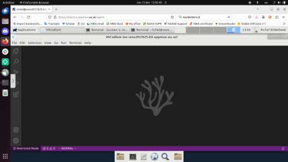

# VSCodium

!!! info "Objectives" 

    - Start VSCodium on Bianca

???- info "Notes for teachers"

    Teaching goals:

    - The learners demonstrate to have started VSCodium on Bianca

    Schedule (45 minutes):

    - 5 mins: Let the learners start an interactive node: this can take dozens of minutes!
    - 5 mins: kill some time
    - 5 mins: discuss this page
    - 15 mins: do the exercises
    - 15 mins: discuss the exercises

## Exercises

Read the UPPMAX documentation on VSCodium on Bianca
[here](https://uppmax.github.io/UPPMAX-documentation/cluster_guides/vscodium_on_bianca/),
then do these exercises.

???- question "Exercise: Start VSCodium"

    The goal of this exercise is to make sure you can start
    VSCodium.

???- question "How to find out if you are on a login or interactive node"

    In the terminal, type `hostname`

    - the login node has `[project]-bianca`, where `[project]` is the name of the project, e.g. `sens2023598`
    - the interactive node has `b[number]` in it, where `[number]` is the compute node number

