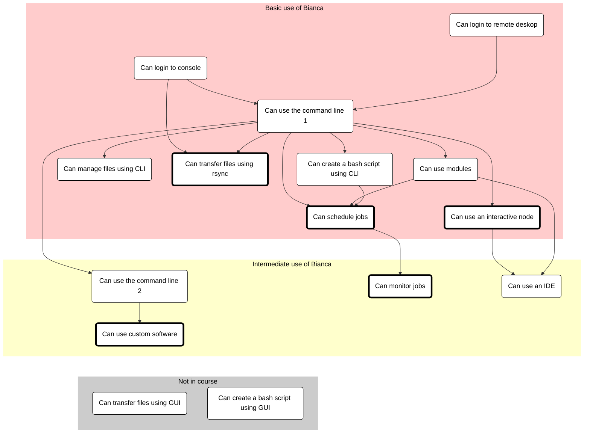

# Introduction to Bianca: Handling Sensitive Research Data

???- question "Prefer a video?"

    In case you prefer a video over reading,
    [watch this YouTube video (6 minutes long)](https://youtu.be/o0fRHoa8C5U)

Are you starting to work with your sensitive data in your research? 

If yes, welcome to a full day introduction to handling sensitive data on the UPPMAX cluster, Bianca!

You will learn about the national infrastructure Bianca is part of, how to login to Bianca, upload and download files, using pre-installed software and how to start your code.

Tentative schedule:

When  | Who  | What
------|------|-----------------------------
9:00  | R    | [Introduction](intro.md) and [logging in](login_bianca.md)
10:00 | .    | Break
10:15 | R    | [Command line](commandline.md)
11:00 | .    | Break
11:15 | R    | [Modules](modules1.md)
12:00 | .    | Lunch
13:00 | P    | [Transferring files to and from Bianca](transfer_basics.md)
13:45 | .    | Break
14:00 | B    | [Compute nodes and SLURM](slurm_intro.md), including interactive nodes
14:45 | .    | Break
15:00 | L    | [Legal aspects of sensitive data](sens_project_short.md)
15:30 | R    | Summary
15:35 | R    | Anonymous evaluation
15:45 | All  |Optional Q&A

 * Who: `B`: Björn, `L`: Lars, `P`: Pavlin, `R`: Richèl

!!! info "Q/A collaboration document"

    - Use the Q/A page for the workshop with your questions.

          - [https://hackmd.io/@UPPMAX/Bianca_Intro_QaA](https://hackmd.io/@UPPMAX/Bianca_Intro_QaA)

    - Depending on how many helpers there are we’ll see how fast there are answers.

        - Some answers may come after the workshop.

    - Create a new line for new questions. Take care if others are editing at the same time.

## Overview of courses

