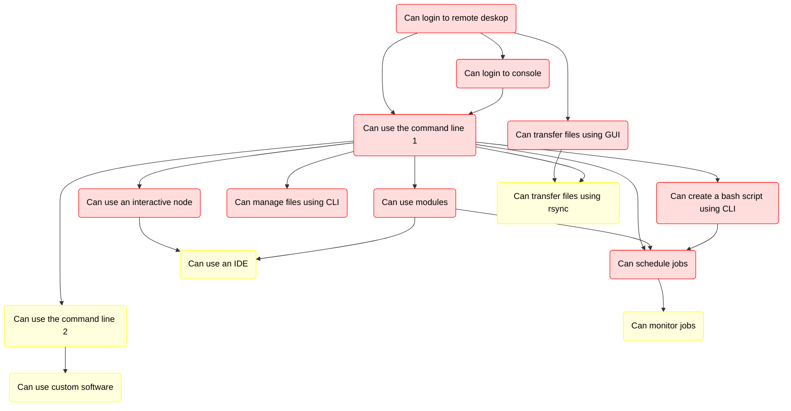

# Introduction to Bianca: Handling Sensitive Research Data

???- question "Prefer a video?"

    In case you prefer a video over reading,
    [watch this YouTube video (6 minutes long)](https://youtu.be/o0fRHoa8C5U)

???- info "Notes for teachers"

    Teaching goals:

    - The learners have heard the topics of this course

    Schedule:

    ```mermaid
    gantt
      title Lesson plan Introduction and Logging in
      dateFormat X
      axisFormat %s
      section Introduction
      Prior knowledge: prior_1, 0, 5s
      Theory : theory_1, after prior_1, 5s
      section Logging In
      Prior knowledge: prior_2, after theory_1, 5s
      Theory: theory, after prior_2, 5s
      Exercises: crit, exercise, after theory, 30s
      Feedback: feedback, after exercise, 10s
    ```

Are you starting to work with your sensitive data in your research?

If yes, welcome to a full day introduction to
handling sensitive data on the UPPMAX cluster, Bianca!

You will learn about the national infrastructure Bianca is part of,
how to login to Bianca, upload and download files,
using pre-installed software and how to run your code.

Schedule:

When  | Who  | What
------|------|-----------------------------
9:00  | R    | [Introduction](intro.md) (this page), [login](login.md), [log in to remote desktop](login_remote_desktop.md)
10:00 | .    | Break
10:15 | R    | [use the remote desktop](use_remote_desktop.md), [log in to console environment](login_console.md), [command line](commandline.md)
11:00 | .    | Break
11:15 | R    | [Modules](modules.md)
12:00 | .    | Lunch
13:00 | P    | Transferring files to and from Bianca 55m
13:55 | .    | Break 10m
14:05 | B    | Compute nodes and SLURM, including interactive nodes 50m
14:55 | .    | Break
15:10 | L    | Legal aspects of sensitive data 20m
15:30 | R    | Summary
15:35 | R    | Anonymous evaluation
15:45 | All  | Optional Q&A

- Who: `B`: Björn, `L`: Lars, `P`: Pavlin, `R`: Richèl

!!! info "Q/A collaboration document"

    - Use the Q/A page for the workshop with your questions.
        - [https://hackmd.io/@UPPMAX/Bianca_Intro_QaA](https://hackmd.io/@UPPMAX/Bianca_Intro_QaA){target="_blank"}
    - Depending on how many helpers there are,
      we'll see how fast there are answers
        - Some answers may come after the workshop.
    - Create a new line for new questions.
      Take care if others are editing at the same time.

## Overview of courses



> Overview of the courses.
> Red nodes: Intro to Bianca.
> Yellow node: Intermediate Bianca.
