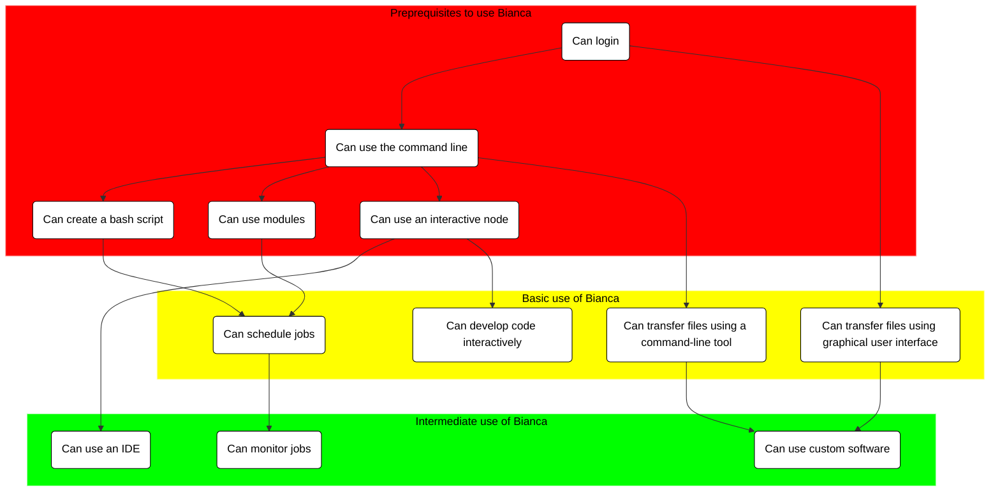

# Introduction to Bianca: Handling Sensitive Research Data

Are you starting to work with your sensitive data in your research? 

If yes, welcome to a full day introduction to handling sensitive data on the UPPMAX cluster, Bianca!

You will learn about the national infrastructure Bianca is part of, how to login to Bianca, upload and download files, using pre-installed software and how to start your code.

Tentative schedule:

Time |Topic
-----|------------------------
9:00 |[Introduction](intro.md)
9:15 |[NAISS-Sens](sens_project_short.md)
9:35 |[Login](login_bianca.md)
9:55 |Break
10:10|[Command line](commandline.md)
10:55|Break
11:10|[Modules](modules1.md)
12:00|Lunch
13:00|[Transferring files to and from Bianca](transfer_basics.md)
13:55|Break
14:10|[Compute nodes and SLURM](slurm_intro.md)
14:55|Break
15:10|Summary
15:15|Q/A
15:55|Closing words
16:00|END

!!! info "Q/A collaboration document"

    - Use the Q/A page for the workshop with your questions.

          - [https://hackmd.io/@bclaremar/bianca_dec_2023?both](https://hackmd.io/@bclaremar/bianca_dec_2023?both)

    - Depending on how many helpers there are we’ll see how fast there are answers.

        - Some answers may come after the workshop.

    - Create a new line for new questions. Take care if others are editing at the same time.

## Overview of courses

    
