# Log in to Bianca

!!! info "Objectives" 

    - Observe that there are two ways to interact with Bianca
    - Observe that there are multiple ways to get inside SUNET
    - Log in to the Bianca remote desktop
    - Log in to the Bianca console environment
    - First step in understanding what a login node is 

???- info "Notes for teachers"

    Teaching goals:

    - The learners demonstrate to have logged in to the Bianca remote desktop environment 
      using the UPPMAX Bianca login website
    - The learners demonstrate to have started a terminal in the Bianca remote desktop environment
    - The learners demonstrate to have logged in to the Bianca console environment 
    - The learners demonstrate to have started an interactive node

    Schedule (20 minutes):

    - 5 minutes: talk about page structure
    - 10 minutes: exercise: answer the questions at the bottom in a shared document
    - 5 minutes: discuss answers

## Overview


Bianca is an HPC cluster for sensitive data.

???- tip "What is an HPC cluster for sensitive data?"

    What an HPC cluster for sensitive data is, is described 
    in general terms [here](overview.md).

As Bianca is an HPC cluster that should be as easy to 
use as possible, there are two ways to interact with Bianca:
one more visual, the other a command-line environment.
Both environments are shown below.

In either environment, one must use the terminal, to, for example,
start a job. As Bianca uses the Linux operating system,
the terminal uses Linux.

???- tip "Using the Linux terminal"

    Using the Linux terminal and learning the essential Linux commands 
    is part of this course and is described [here](linux.md).

As Bianca has sensitive data, there are constraints on how to
access Bianca. These constraints can be solved in multiple ways.
These procedures are shown below.

## The two Bianca environments and the terminal

Bianca, like most HPC clusters, uses Linux.
To use Bianca, there are two environments:

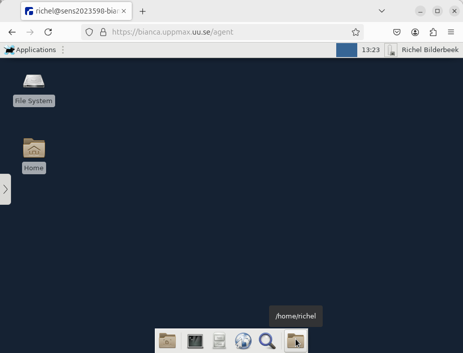

- A remote desktop environment, also called 'graphical environment', 
  'GUI environment', 'ThinLinc environment'. It looks like the picture above.

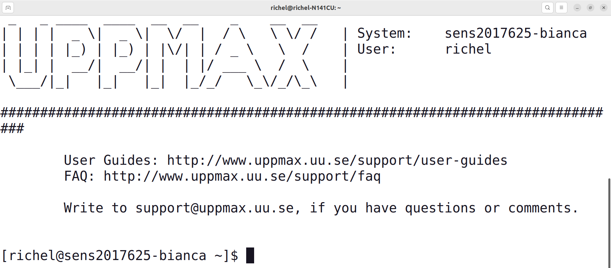

- A console environment, also called 'terminal environment' or 'terminal'
  It looks like the picture above.

The remote desktop environment is considered the easier place to start for most
new users, as it has most similarities with what a new user is familiar with.
However, one must always use a terminal to some extent.

???- tip "Using the Linux terminal"

    Using the Linux terminal and learning the essential Linux commands 
    is part of this course and is described [here](linux.md).


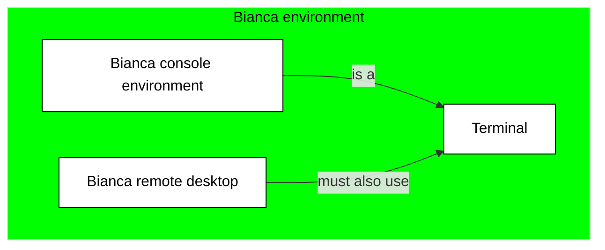

## Get inside SUNET

Bianca has sensitive data. 
To protect this data from leaking,
Bianca can only be access from within the
Swedish university network.
This network is called [SUNET](https://www.sunet.se/).

One cannot access Bianca outside of SUNET.
Hence, one must get inside SUNET first. 
There are these ways to do this:

- Physically move inside SUNET
- Use a virtual private network
- Use an HPC cluster within SUNET

Each of these three ways are described below.

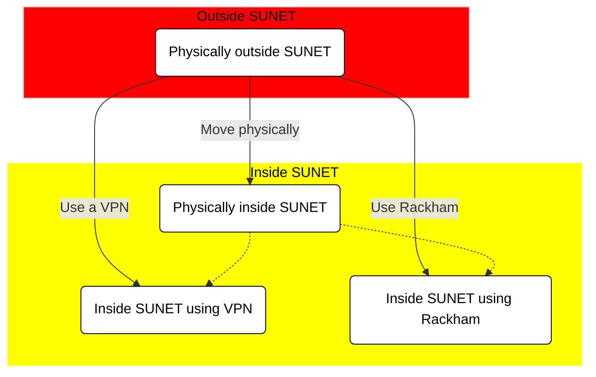

### Physically move inside SUNET

One must be inside SUNET to access Bianca directly.
All Swedish university buildings are within SUNET.
Hence, working from a University building 
is a non-technical solution to get direct access to Bianca.

### Use a virtual private network

One must be inside SUNET to access Bianca directly.

A virtual private network (VPN) allows one to access Bianca indirectly:
your computer connects to the VPN within SUNET, where that VPN
accesses Bianca.

To be able to use a VPN to get inside of SUNET:

 * For Uppsala University: [go to this page](https://mp.uu.se/en/web/info/stod/it-telefoni/anvandarguider/network/vpn-service)
 * For other Swedish universities, search their websites to get a VPN setup

???- tip "Video"

    This video shows how to use an installed VPN,
    after which the UPPMAX Bianca login website is used to
    access the Bianca remote desktop environment: [YouTube](https://youtu.be/Ni9nyCf7me8), [download (.mp4)](https://richelbilderbeek.nl/login_bianca_vpn.mp4)

### Use an HPC cluster within SUNET

One must be inside SUNET to access Bianca directly.

An HPC cluster within SUNET (for example, Rackham)
allows one to access Bianca indirectly:
your computer connects to the HPC cluster within SUNET, 
after which one accesses Bianca.

When using this method, one can only use the
Bianca console environment.

## Get inside the Bianca environment

When inside SUNET, one can access the Bianca environments.

For a remote desktop environment, one can use:

- the UPPMAX Bianca login website at
  [http://bianca.uppmax.uu.se/](http://bianca.uppmax.uu.se/)
- a locally installed ThinLinc server

Note that the UPPMAX Bianca login website uses ThinLinc too,
which can give rise to confusion.

For a console environment, one can use:

- SSH, for a terminal environment

Below, the ways to access these Bianca environments 
are discussed

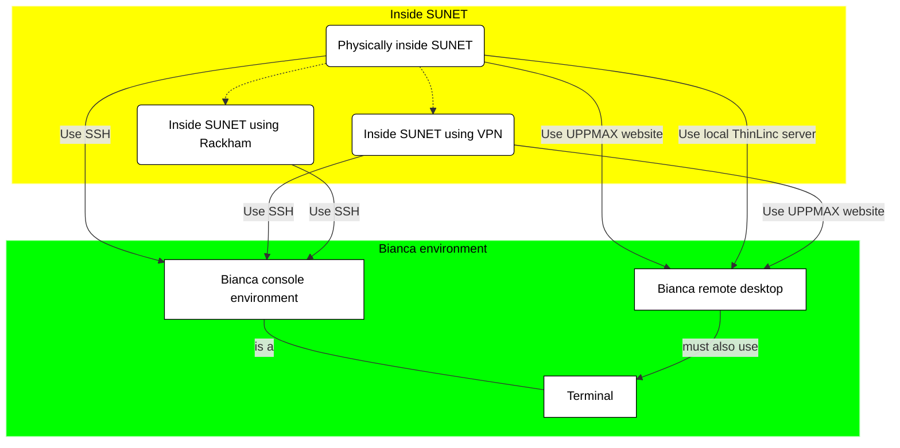

### Use the UPPMAX Bianca login website

When inside SUNET, one can access a remote desktop environment
using a website:

  1. In your web browser, go to [https://bianca.uppmax.uu.se](https://bianca.uppmax.uu.se)

  2. Fill in the first dialog. Do use the `UPPMAX` [2-factor authentication](https://www.uppmax.uu.se/support/user-guides/setting-up-two-factor-authentication/) (i.e. not SUPR!)

     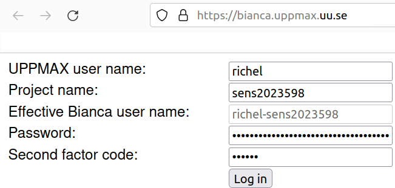
     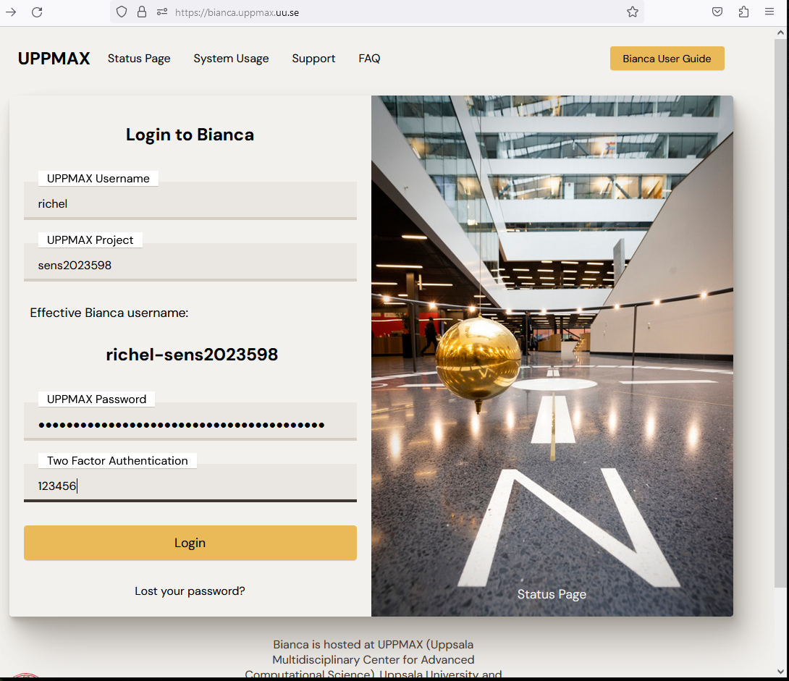


  3. Fill in the second dialog, using your regular password (i.e. no need for two-factor authentication)

     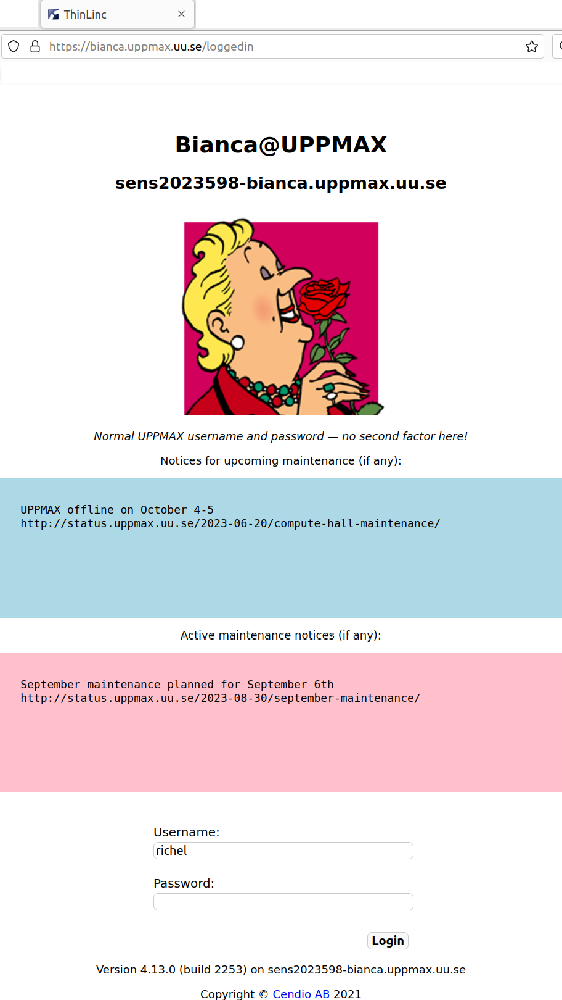

     > The second Bianca remote desktop login dialog. 
     > Note that it uses ThinLinc to establish this connection

  4. Enjoy! You are in!

     

     > The Bianca remote desktop

???- tip "Video: using VPN"

    This video shows how to use an installed VPN,
    after which the UPPMAX Bianca login website is used to
    access the Bianca remote desktop environment: [YouTube](https://youtu.be/Ni9nyCf7me8), [download (.mp4)](https://richelbilderbeek.nl/login_bianca_vpn.mp4)

???- tip "Video: from within SUNET"

    This video shows how to use a terminal and SSH to access 
    the Bianca console environment: [YouTube](https://youtu.be/upBozh2BI5c), 
    [download (.ogv)](https://richelbilderbeek.nl/login_bianca_inside_sunet.ogv)


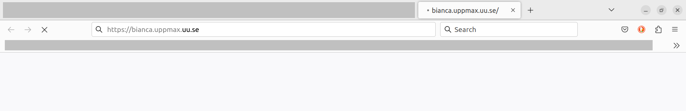

> When accessing the Bianca UPPMAX login website from outside of SUNET,
> nothing will appear in your browser.

### Use a locally installed ThinLinc server

This is beyond the scope of this course.

### Use SSH

When inside SUNET, one can access a console environment
using a terminal and the Secure Shell Protocol (SSH).

You can use your favorite terminal to login (see <https://uppmax.github.io/uppmax_intro/login2.html#terminals> for an overview of many)
to the Bianca command-line environment.

  1. From a terminal, use `ssh` to log in:

```bash
ssh [user]-[project name]@bianca.uppmax.uu.se
```

For example:

```bash
ssh richel-sens2023598@bianca.uppmax.uu.se
```

 2. Type your UPPMAX password, 
    directly followed by the UPPMAX 2-factor authentication number,
    for example `verysecret678123`, then press enter

 3. Type your UPPMAX password,
    for example `verysecret`

 4. Enjoy! You are in!


???- tip "Video"

    This video shows how to use a terminal and SSH to access 
    the Bianca console environment: [YouTube](https://youtu.be/upBozh2BI5c), 
    [download (.ogv)](https://richelbilderbeek.nl/login_bianca_inside_sunet.ogv)

## Going from login to an interactive node

Bianca has three types of nodes:

???- tip "What are nodes?"

    What nodes are, is described in general terms [here](overview.md).

- **login nodes**: nodes where a user enters and interacts with the system
- **calculation nodes**: nodes that do the calculations

???- tip "Requesting a calculation to run"

    Requesting a calculation to run is part of this course 
    and is described [here](slurm_intro.md).
    This is done by using the SLURM scheduler.

- **interactive nodes**: a type of calculation node, 
  where a user can do calculations directly

As a Bianca login is shared with all users, 
there is a simple rule to use it fairly:

> Only do short and light things on the login node

Examples of short and light things are:

- Editing files
- Copying, deleting, moving files
- Scheduling jobs
- Starting an interactive session

Examples of heavy things are:

- Running code with big calculations
- Develop code with big calculations line-by-line 

???- tip "Develop code with big calculations line-by-line "

    This usage is typically done an interactive node

### Use-case for using an interactive node

Some users develop computer code on Bianca
in a line-by-line fashion. 
These users typically want to run a (calculation-heavy) 
script frequently, to test
if the code works.

However, scheduling each new line is too slow, as it
can take minutes before the new code is run.
Instead, there is a way to directly work 
with such code: use an interactive node.

An interactive node is a type of calculation node,
where one can run heavy calculations directly.


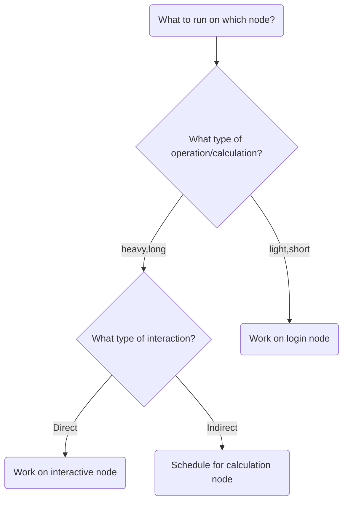

To use an interactive node, in a terminal, type:

```bash
interactive -A [project name] -p core -n [number_of_cores] -t [session_duration]
```

For example:

```bash
interactive -A sens2023598 -p core -n 2 -t 8:0:0
```

This starts an interactive session using project `sens2023598` 
that uses 2 cores and has a maximum duration of 8 hours.

## Exercises


???- question "Your colleague visits [http://bianca.uppmax.uu.se/](http://bianca.uppmax.uu.se/) and sees nothing appear on the website (see also image above). What is likely the problem?"

    He/she is not inside of SUNET. 
    Show him/her the section above on how to get into SUNET.

???- question "Exercise: login into the Bianca remote desktop"

    The goal of this exercise is: (1) troubleshooting, to make sure one can access
    this environment (2) see how it looks like, this may help one decide to
    use this environment yes of no.

    Note that you have to be within SUNET.

???- question "Exercise: start a terminal in the Bianca remote desktop environment"

    The goal of this exercise is that one makes him/herself slightly
    familiar within the remote desktop environment. When one knows where
    it is, this exercise takes literally one mouse click.

???- question "Exercise: login into the Bianca console environment"

    The goal of this exercise is: (1) troubleshooting, to make sure one can access
    this environment (2) see how it looks like, this may help one decide to
    use this environment yes of no.

    Do this after having logged in to the Bianca remote desktop,
    as most troubleshooting occurs in that exercise.

???- question "Your colleague finds out that one can run scripts with calculations directly on the login node. This saves him/her much time waiting for a calculation to start. Is this OK and why?"

    For that colleague, there seems to be no problem. 
    However, for everyone else this is a problem,
    as the login node is a *shared* node.

    The colleague will be asked to *schedule* his/her jobs instead.
    This is usually done by an email from the UPPMAX staff.

    Requesting a calculation to run is part of this course 
    and is described [here](slurm_intro.md).
    This is done by using the SLURM scheduler.

???- question "You are developing code on Bianca. You write the code line-by-line and schedule a test run after each addition. However, after each new line, it takes a couple of minutes before you know your code worked yes/no. How could you develop your code quicker?"

    This is the typical use-case to use an interactive node.
    One could also consider to develop code on a local computer 
    instead (which uses nonsensitive/simulated/fake testing data)
    and upload the final code instead.

    Requesting an interactive node is part of this course 
    and is described on this page.

???- question "Exercise: Start an interactive session"

    The goal of this exercise is to make sure you know how to start an 
    interactive session. 

???- question "Why not always use an interactive session?"

    Because it is an inefficient use of your core hours.

    An interactive session means that you use a calculation node with low
    efficiency: only irregularly you will use such a node to its full
    capacity. 
    However, the number of core hours are registered as if the node is used
    at full capacity, as it is *reserved* to be used at that capacity.


## Conclusions

 * Bianca makes it hard to leak data
 * Login differs from where you are and what you need
 * Only do light things on login nodes

## Footnotes

 * [1] 'no internet' meaning 'no direct way to download or upload data from/to
   the internet

## Extra material

### The relation between Bianca and the Internet


> The relation between Bianca and the Internet

### The ways to access Bianca's environments

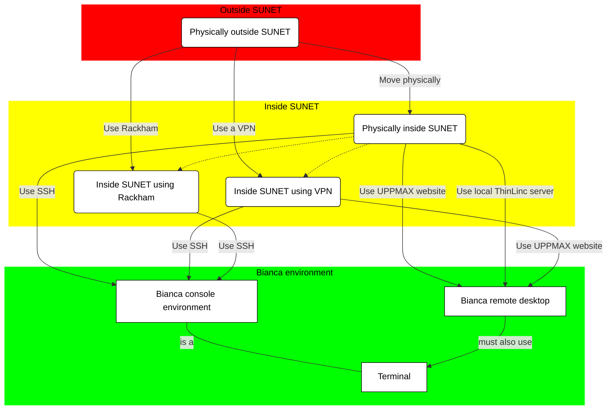

