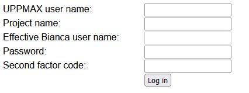

# Log in to Bianca

!!! info "Objectives" 

    - First step in understanding why Bianca login is the way it is
    - Log in via SSH
    - Log in via ThinLinc
    - First step in understanding what a login node is 

## Exercises

 1. Discuss: what is the purpose of Bianca? What kind of consequences will this have for its design?
 2. Login via SSH
 3. Login via ThinLinc
 4. Start an interactive session

## Bianca's design

Bianca was designed to:

 * make accidental data leaks difficult
 * make correct data management as easy as possible
 * emulate a standard HPC cluster environment
 * provide a maximum amount of resources
 * satisfy (privacy) regulations
    
### Bianca and the Internet


> The way Bianca is organised

Bianca and the Internet have this relation:

 * Bianca has no internet [1], to prevent accidental data leaks. 
 * Bianca is only accessible from within SUNET (i.e. from university networks),
   to protect the sensitive data better.

Login depends on where you are and what you need:

Where you are|What you need   |What to do
-------------|----------------|------------------------------
Inside SUNET |A terminal      |`ssh` into Bianca
Inside SUNET |A remote desktop|Login at [https://bianca.uppmax.uu.se](https://bianca.uppmax.uu.se)
Outside SUNET|A terminal      |`ssh` into a VPN/Rackham first
Outside SUNET|A remote desktop|Login at [https://bianca.uppmax.uu.se](https://bianca.uppmax.uu.se) via a VPN

The be able to use VPN:

 * For Uppsala Univerity: [go to this page](https://mp.uu.se/en/web/info/stod/it-telefoni/anvandarguider/network/vpn-service)
 * For other Swedish universities, search their websites to get a VPN setup

Data can be transferred to/from the `wharf`, 
which is a special folder that is visible from the Internet.

## Log in

You can log in either through ThinLinc or via SSH, `ssh`:

 * ThinLinc: provides a remote desktop, needed for using graphical tools
 * SSH: provides only the command line
    - ``ssh`` from home terminal
    - ``ssh`` from a session on Rackham 

## Log in to Bianca with ThinLinc

!!! warning

    You need to be within SUNET or use a VPN

Bianca offers a graphical login at [https://bianca.uppmax.uu.se](https://bianca.uppmax.uu.se).

Filling in the form is easy, do use the `UPPMAX` [2-factor authentication](https://www.uppmax.uu.se/support/user-guides/setting-up-two-factor-authentication/) (i.e. not SUPR!).


### The log in steps

1. When you log in to [https://bianca.uppmax.uu.se](https://bianca.uppmax.uu.se), your SSH or ThinLinc client first meets the Bianca login node (blue in the graph above).
    
    - In ThinLinc session:
    
        
 
    - In SSH session

        - user name: `<username>-<projid>@bianca.uppmax.uu.se`
        
            - like: `myname-sens2023531@bianca.uppmax.uu.se`
           
        - password: your password, directly followed by the 6-digit 2-factor
        
            - like: verysecret678123

2. After checking your [2-factor authentication] this server looks for your virtual project cluster.
3. If it's present, then you are transferred to a login prompt on your cluster's login node. If not, then the virtual cluster is started.

    - you are prompted to give your username and password again, this time without projid and 2nd-factor:

        - username: `<myname>`
        - password: verysecret
        
4. Inside each virtual project cluster, by default there is just a one-core login node. When you need more memory or more CPU power, you submit a job (interactive or batch), and an idle node will be moved into your project cluster.


## Log in via SSH
    
You may try to log in any of your terminals <https://uppmax.github.io/uppmax_intro/login2.html#terminals>
    
``` bash
    $ ssh <user>-sens2023531@bianca.uppmax.uu.se
```

- you are prompted to give your password directly followed by the 6-digit 2-factor
    - like: verysecret678123

## Login node

When you are logged in, you are on a login node.
There are two types of nodes:

Type        |Purpose
------------|--------------------------
Login node  |Start jobs for worker nodes, do easy things
Worker node |Do hard calculations, either from scripts of an interactive session

Bianca contains hundreds of nodes, each of which is isolated from each other and the Internet.

As Bianca is a shared resources, there are rules to use it together in fair way:

 * The login node is only for easy things, such as moving files,
   starting jobs or starting an interactive session
 * The worker nodes are for harder things, such as
   running a script or running an interactive session.

To start an interactive session [2], type:


```bash
interactive -A [project name] -p core -n 2 -t 8:0:0
```

For example:

```bash
interactive -A sens2023531 -p core -n 2 -t 8:0:0
```

## Conclusions

 * Bianca makes it hard to leak data
 * Login differs from where you are and what you need
 * Only do light things on login nodes

## Footnotes

 * [1] 'no internet' meaning 'no direct way to download or upload data from/to
   the internet
 * [2] In this case, 8 hour long, with 2 cores

## Videos

 * Login from outside SUNET: [YouTube](https://youtu.be/W-PMTyNcbYI), [download (.mp4)](https://richelbilderbeek.nl/login_bianca_outside_sunet.mp4)
 * Login from inside SUNET: [YouTube](https://youtu.be/upBozh2BI5c), [download (.ogv)](https://richelbilderbeek.nl/login_bianca_inside_sunet.ogv)

## Links

 * [The Bianca remote desktop login](https://bianca.uppmax.uu.se)
 * [How get a VPN for UU](https://mp.uu.se/en/web/info/stod/it-telefoni/anvandarguider/network/vpn-service)
