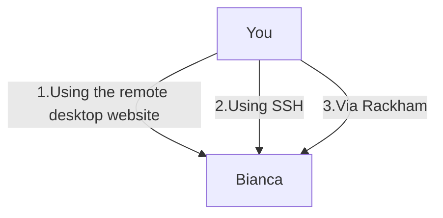

# Log in to Bianca


!!! info "Objectives" 

    - Use the UPPMAX documentation
    - Observe the most common problems when accessing Bianca
    - Log in into Bianca's remote desktop environment using a website 
    - Log in into Bianca's console environment using SSH
    - Log in into Bianca's console environment via Rackham

???- info "Notes for teachers"

    Teaching goals:

    - The learners have used the UPPMAX documentation
    - The learners have observed the most common problems when accessing Bianca
    - The learners have logged in into Bianca's remote desktop environment using a website 
    - The learners have logged in into Bianca's console environment using SSH
    - The learners have logged in into Bianca's console environment via Rackham

    Schedule:

    ```mermaid
    gantt
      title Lesson plan Introduction and Logging in
      dateFormat X
      axisFormat %s
      section Introduction
      Prior knowledge: prior_1, 0, 5s
      Theory : theory_1, after prior_1, 5s
      section Logging In
      Prior knowledge: prior_2, after theory_1, 5s
      Theory: theory, after prior_2, 5s
      Exercises: crit, exercise, after theory, 30s
      Feedback: feedback, after exercise, 10s
    ```

## Why?

There are multiple ways to log in to Bianca, each having its own features:



Way                                                     |Features
--------------------------------------------------------|--------------------------------------------------------------------------------------------------
1. Using the remote desktop website                     |Must be within SUNET, requires no setup, visual, clunky to work with
2. Using the console environment                        |Must be within SUNET, requires an SSH client, terminal, powerful to work with (if you know how)
3. (optional) Using the console environment from Rackham|Can be done everywhere, requires an SSH client, terminal, powerful to work with (if you know how)

Here you will see how these looks like,
so you can decide which environment to use.

## Exercises

???- question "Prefer a video?"

    [This 17 minutes long YouTube video](https://youtu.be/74f9AyKkOjg) 
    shows how to do these exercises, so you can check your answers.

    A goal of these exercises is to practice to use the UPPMAX documentation.
    Such active learning is more effective than watching a video passively.
    Please try to do the exercises first!

    Specialized videos:
    - You can see [a YouTube video here](https://youtu.be/UpNI5OUlIo8).


### 1. Using the remote desktop website

#### 1a. Find the documentation

Search the UPPMAX documentation at
[https://docs.uppmax.uu.se/](https://docs.uppmax.uu.se/)
for how to log in to the Bianca remote desktop environment website.

???- info "Answer"

    In the search box, type 'Bianca log in remote desktop website' or something
    similar. This will take you to
    [https://docs.uppmax.uu.se/getting_started/login_bianca_remote_desktop_website/](https://docs.uppmax.uu.se/getting_started/login_bianca_remote_desktop_website/)

#### 1b. Seeing nothing


> A colleague visiting [https://bianca.uppmax.uu.se/](https://bianca.uppmax.uu.se/) and sees nothing...

Your colleague visits [https://bianca.uppmax.uu.se/](https://bianca.uppmax.uu.se/)
and sees nothing appear on the website (see also image above).
What is likely the problem?"

???- question "Answer"

    He/she is not inside of SUNET. 

    Show him/her the section above on how to get into SUNET.

#### 1c. Log in to the Bianca remote desktop

Log in to the Bianca remote desktop.

    Note that you have to be within SUNET.

???- question "Answer"

    You can see [a YouTube video here](https://youtu.be/UpNI5OUlIo8).

???- question "1c. Exercise: start a terminal in the Bianca remote desktop environment"

    The goal of this exercise is that one makes him/herself slightly
    familiar within the remote desktop environment. When one knows where
    it is, this exercise takes literally one mouse click.

???- question "1d. Your colleague finds out that one can run scripts with calculations directly on the login node. This saves him/her much time waiting for a calculation to start. Is this OK and why?"

    For that colleague, there seems to be no problem. 
    However, for everyone else this is a problem,
    as the login node is a *shared* node.

    The colleague will be asked to *schedule* his/her jobs instead.
    This is usually done by an email from the UPPMAX staff.

    Requesting a calculation to run is part of this course 
    and is described [here](slurm_intro.md).
    This is done by using the SLURM scheduler.

???- question "1e. You are developing code on Bianca. You write the code line-by-line and schedule a test run after each addition. However, after each new line, it takes a couple of minutes before you know your code worked yes/no. How could you develop your code quicker?"

    This is the typical use-case to use an interactive node.
    One could also consider to develop code on a local computer 
    instead (which uses nonsensitive/simulated/fake testing data)
    and upload the final code instead.

    Requesting an interactive node is part of this course 
    and is described on this page.

### 2. Using SSH

???- question "(optional) 6. Exercise: login into the Bianca console environment"

    The goal of this exercise is: (1) troubleshooting, to make sure one can access
    this environment (2) see how it looks like, this may help one decide to
    use this environment yes of no.

    Do this after having logged in to the Bianca remote desktop,
    as most troubleshooting occurs in that exercise.

### 3. Using SSH via Rackham

???- question "(optional) 7. Exercise: login into the Bianca console environment from Rackham"

    Read [the UPPMAX documentation's 'Login to the Rackham console environment with a password'](https://docs.uppmax.uu.se/getting_started/login_rackham_console_password/).

    Then, log in to the Rackham console environment.
    From there, log in to the Bianca console environment.

    Do this after having logged in to the Bianca console environment,
    as most troubleshooting occurs in that exercise.

