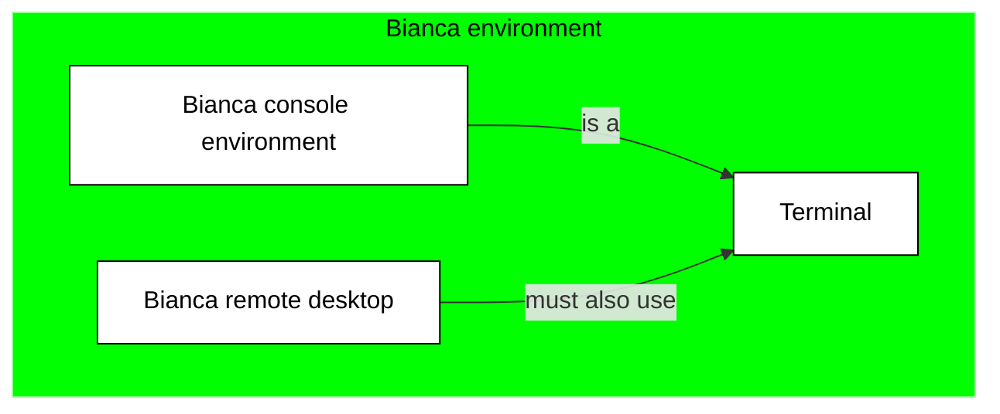
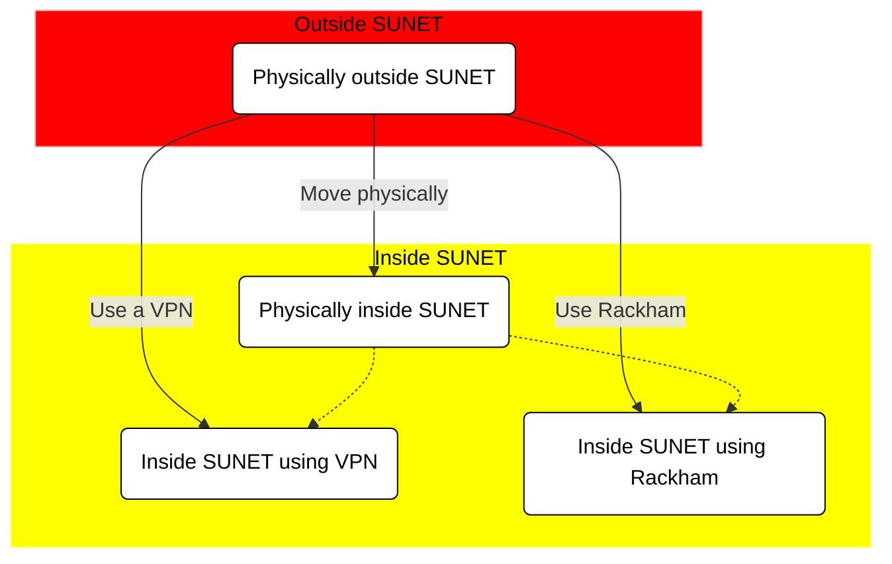
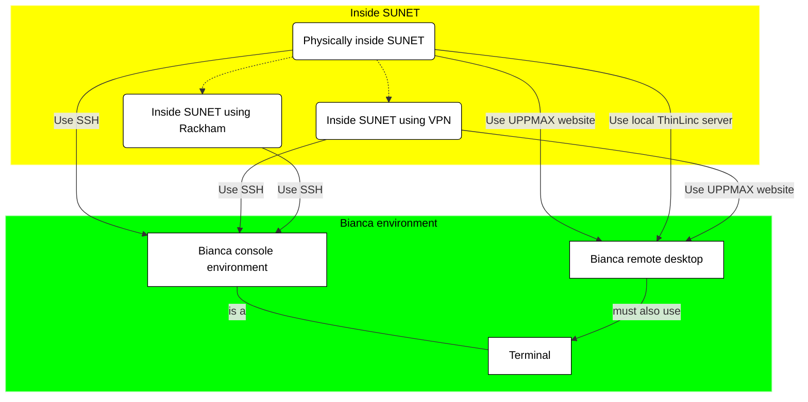
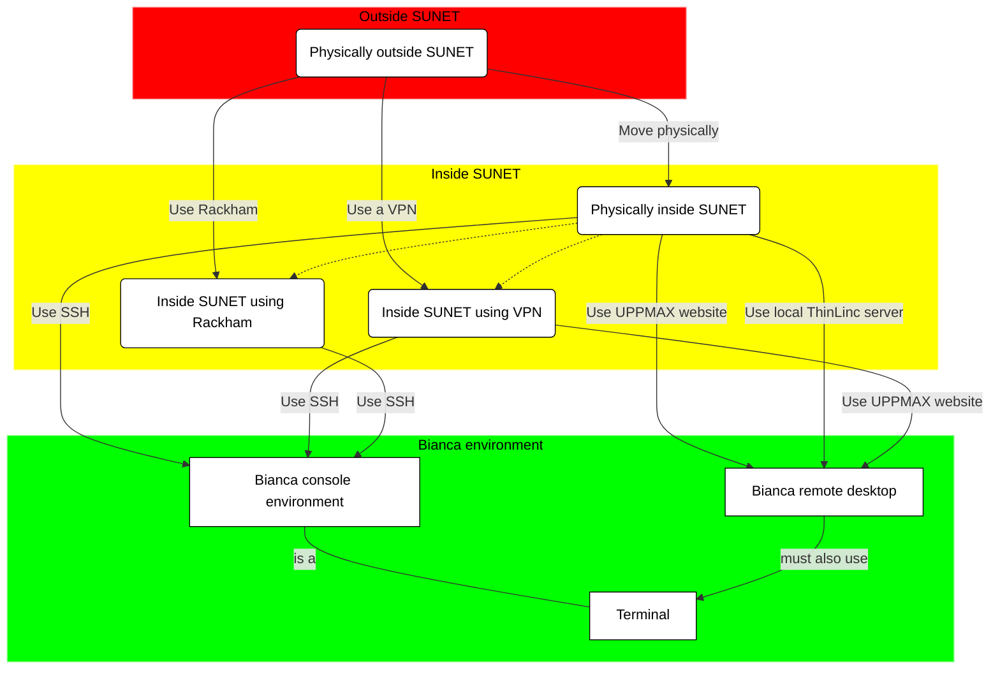

# Log in to Bianca

!!! info "Objectives" 

    - Observe that there are two ways to interact with Bianca
    - Observe that there are multiple ways to get inside SUNET
    - Log in to the Bianca remote desktop (uses ThinLinc)
    - Log in to the Bianca terminal (using `ssh`)
    - First step in understanding what a login node is 

## Overview


> The voyage from outside the university network to a cluster login node 

Bianca is an HPC cluster for sensitive data.

???- tip "What is an HPC cluster for sensitive data?"

    What an HPC cluster for sensitive data is, is described 
    in general terms [here](overview.md).

As Bianca is an HPC cluster that should be as easy to 
use as possible, there are two ways to interact with Bianca:
one more visual, the other a command-line environment.
Both environments are shown below.

In either environment, one must use the terminal, to, for example,
start a job. As Bianca uses the Linux operating system,
the terminal uses Linux.

???- tip "Using the Linux terminal"

    Using the Linux terminal and learning the essential Linux commands 
    is part of this course and is described [here](linux.md).

As Bianca has sensitive data, there are constraints on how to
access Bianca. These constraints can be solved in multiple ways.
These procedures are shown below.

## The two Bianca environments and the terminal

Bianca, like most HPC clusters, uses Linux.
To use Bianca, there are two environments:


- A remote desktop environment, also called 'graphical environment', 
  'GUI environment', 'ThinLinc environment'. It looks like the picture above.


- A console environment, also called 'terminal environment' or 'terminal'
  It looks like the picture above.

The remote desktop environment is considered the easier place to start for most
new users, as it has most similarities with what a new user is familiar with.
However, one must always use a terminal to some extent.

???- tip "Using the Linux terminal"

    Using the Linux terminal and learning the essential Linux commands 
    is part of this course and is described [here](linux.md).




## Get inside SUNET

Bianca has sensitive data. 
To protect this data from leaking,
Bianca can only be access from within the
Swedish university network.
This network is called [SUNET](https://www.sunet.se/).

One cannot access Bianca outside of SUNET.
Hence, one must get inside SUNET first. 
There are these ways to do this:

- Physically move inside SUNET
- Use a virtual private network
- Use an HPC cluster within SUNET

Each of these three ways are described below.



### Physically move inside SUNET

One must be inside SUNET to access Bianca directly.
All Swedish university buildings are within SUNET.
Hence, working from a University building 
is a non-technical solution to get direct access to Bianca.

### Use a virtual private network

One must be inside SUNET to access Bianca directly.

A virtual private network (VPN) allows one to access Bianca indirectly:
your computer connects to the VPN within SUNET, where that VPN
accesses Bianca.

To be able to use a VPN to get inside of SUNET:

 * For Uppsala University: [go to this page](https://mp.uu.se/en/web/info/stod/it-telefoni/anvandarguider/network/vpn-service)
 * For other Swedish universities, search their websites to get a VPN setup

???- tip "Video"

    This video shows how to use an installed VPN,
    after which the UPPMAX Bianca login website is used to
    access the Bianca remote desktop environment: [YouTube](https://youtu.be/Ni9nyCf7me8), [download (.mp4)](https://richelbilderbeek.nl/login_bianca_vpn.mp4)

### Use an HPC cluster within SUNET

One must be inside SUNET to access Bianca directly.

An HPC cluster within SUNET (for example, Rackham)
allows one to access Bianca indirectly:
your computer connects to the HPC cluster within SUNET, 
after which one accesses Bianca.

When using this method, one can only use the
Bianca console environment.

## Get inside the Bianca environment

When inside SUNET, one can access the Bianca environments.

For a remote desktop environment, one can use:

- the UPPMAX Bianca login website at
  [http://bianca.uppmax.uu.se/](http://bianca.uppmax.uu.se/)
- a locally installed ThinLinc server

Note that the UPPMAX Bianca login website uses ThinLinc too,
which can give rise to confusion.

For a console environment, one can use:

- SSH, for a terminal environment

Below, the ways to access these Bianca environments 
are discussed



### Use the UPPMAX Bianca login website

When inside SUNET, one can access a remote desktop environment
using a website:

 1. In your web browser, go to [https://bianca.uppmax.uu.se](https://bianca.uppmax.uu.se)

 2. Fill in the first dialog. Do use the `UPPMAX` [2-factor authentication](https://www.uppmax.uu.se/support/user-guides/setting-up-two-factor-authentication/) (i.e. not SUPR!)


 3. Fill in the second dialog, using your regular password (i.e. no need for two-factor authentication)


> The second Bianca remote desktop login dialog. 
> Note that it uses ThinLinc to establish this connection

 4. Enjoy! You are in!


> The Bianca remote desktop

???- tip "Video: using VPN"

    This video shows how to use an installed VPN,
    after which the UPPMAX Bianca login website is used to
    access the Bianca remote desktop environment: [YouTube](https://youtu.be/Ni9nyCf7me8), [download (.mp4)](https://richelbilderbeek.nl/login_bianca_vpn.mp4)

???- tip "Video: from within SUNET"

    This video shows how to use a terminal and SSH to access 
    the Bianca console environment: [YouTube](https://youtu.be/upBozh2BI5c), 
    [download (.ogv)](https://richelbilderbeek.nl/login_bianca_inside_sunet.ogv)

### Use a locally installed ThinLinc server

This is beyond the scope of this course.

### Use SSH

When inside SUNET, one can access a console environment
using a terminal and the Secure Shell Protocol (SSH).

You can use your favorite terminal to login (see <https://uppmax.github.io/uppmax_intro/login2.html#terminals> for an overview of many)
to the Bianca command-line environment.

  1. From a terminal, use `ssh` to log in:

```bash
ssh [user]-[project name]@bianca.uppmax.uu.se
```

For example:

```bash
ssh richel-sens2023598@bianca.uppmax.uu.se
```

 2. Type your UPPMAX password, 
    directly followed by the UPPMAX 2-factor authentication number,
    for example `verysecret678123`, then press enter

 3. Type your UPPMAX password,
    for example `verysecret`

 4. Enjoy! You are in!


???- tip "Video"

    This video shows how to use a terminal and SSH to access 
    the Bianca console environment: [YouTube](https://youtu.be/upBozh2BI5c), 
    [download (.ogv)](https://richelbilderbeek.nl/login_bianca_inside_sunet.ogv)

## Being on a Bianca login node

When you are logged in, you are on a login node.
There are two types of nodes:

Type        |Purpose
------------|--------------------------
Login node  |Start jobs for worker nodes, do easy things
Worker node |Do hard calculations, either from scripts of an interactive session

Bianca contains hundreds of nodes, each of which is isolated from each other and the Internet.

As Bianca is a shared resources, there are rules to use it together in fair way:

 * The login node is only for easy things, such as moving files,
   starting jobs or starting an interactive session
 * The worker nodes are for harder things, such as
   running a script or running an interactive session.

To start an interactive session [2], type:

```bash
interactive -A [project name] -p core -n 2 -t 8:0:0
```

For example:

```bash
interactive -A sens2023598 -p core -n 2 -t 8:0:0
```

## Exercises

!!! info "Solutions" 
    See section 'Video' for the videos that show how to do these exercises

 1. Discuss: what is the purpose of Bianca? What kind of consequences will this have for its design?
 2. If outside of SUNET: use a VPN
 3. Log in to the Bianca remote desktop
 4. Log in to the Bianca terminal using `ssh`
 5. Start an interactive session

## Conclusions

 * Bianca makes it hard to leak data
 * Login differs from where you are and what you need
 * Only do light things on login nodes

## Footnotes

 * [1] 'no internet' meaning 'no direct way to download or upload data from/to
   the internet
 * [2] In this case, 8 hour long, with 2 cores

## Extra material

### Video

 * Login to Bianca, using a VPN: [YouTube](https://youtu.be/Ni9nyCf7me8), [download (.mp4)](https://richelbilderbeek.nl/login_bianca_vpn.mp4)

### Links

 * [The Bianca remote desktop login](https://bianca.uppmax.uu.se)
 * [How get a VPN for UU](https://mp.uu.se/en/web/info/stod/it-telefoni/anvandarguider/network/vpn-service)

### The relation between Bianca and the Internet


> The relation between Bianca and the Internet

### The ways to access Bianca's environments



