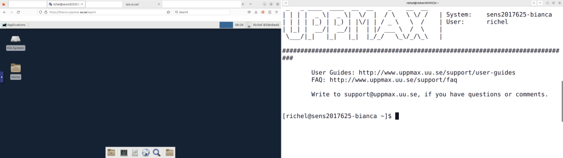

# Log in to Bianca



!!! info "Objectives" 

    - Observe that there are two ways to interact with Bianca
    - Observe that there are multiple ways to get inside SUNET
    - Log in to a terminal in the Bianca remote desktop
    - Log in to the Bianca console environment

???- info "Notes for teachers"

    Teaching goals:

    - The learners demonstrate to have logged in to the Bianca remote desktop environment 
      using the UPPMAX Bianca login website
    - The learners demonstrate to have started a terminal in the Bianca remote desktop environment
    - The learners demonstrate to have logged in to the Bianca console environment 

    Schedule:

    ```mermaid
    gantt
      title Lesson plan Introduction and Logging in
      dateFormat X
      axisFormat %s
      section Introduction
      Prior knowledge: prior_1, 0, 5s
      Theory : theory_1, after prior_1, 5s
      section Logging In
      Prior knowledge: prior_2, after theory_1, 5s
      Theory: theory, after prior_2, 5s
      Exercises: crit, exercise, after theory, 30s
      Feedback: feedback, after exercise, 10s
    ```

## Exercises

???- question "Prefer a video?"

    [This 17 minutes long YouTube video](https://youtu.be/74f9AyKkOjg) 
    shows how to do these exercises, so you can check your answers.

    A goal of these exercises is to practice to use the UPPMAX documentation.
    Such active learning is more effective than watching a video passively.
    Please try to do the exercises first!


Use [the UPPMAX documentation on logging in to Bianca](https://uppmax.github.io/UPPMAX-documentation/getting_started/login_bianca/) 
to answer the questions below. 


> A colleague visiting [https://bianca.uppmax.uu.se/](https://bianca.uppmax.uu.se/) and sees nothing...

???- question "1. Your colleague visits [https://bianca.uppmax.uu.se/](https://bianca.uppmax.uu.se/) and sees nothing appear on the website (see also image above). What is likely the problem?"

    He/she is not inside of SUNET. 
    Show him/her the section above on how to get into SUNET.

???- question "2. Exercise: login into the Bianca remote desktop"

    The goal of this exercise is: (1) troubleshooting, to make sure one can access
    this environment (2) see how it looks like, this may help one decide to
    use this environment yes of no.

    Note that you have to be within SUNET.

???- question "3. Exercise: start a terminal in the Bianca remote desktop environment"

    The goal of this exercise is that one makes him/herself slightly
    familiar within the remote desktop environment. When one knows where
    it is, this exercise takes literally one mouse click.

???- question "4. Exercise: login into the Bianca console environment"

    The goal of this exercise is: (1) troubleshooting, to make sure one can access
    this environment (2) see how it looks like, this may help one decide to
    use this environment yes of no.

    Do this after having logged in to the Bianca remote desktop,
    as most troubleshooting occurs in that exercise.

???- question "5. Your colleague finds out that one can run scripts with calculations directly on the login node. This saves him/her much time waiting for a calculation to start. Is this OK and why?"

    For that colleague, there seems to be no problem. 
    However, for everyone else this is a problem,
    as the login node is a *shared* node.

    The colleague will be asked to *schedule* his/her jobs instead.
    This is usually done by an email from the UPPMAX staff.

    Requesting a calculation to run is part of this course 
    and is described [here](slurm_intro.md).
    This is done by using the SLURM scheduler.

???- question "6. You are developing code on Bianca. You write the code line-by-line and schedule a test run after each addition. However, after each new line, it takes a couple of minutes before you know your code worked yes/no. How could you develop your code quicker?"

    This is the typical use-case to use an interactive node.
    One could also consider to develop code on a local computer 
    instead (which uses nonsensitive/simulated/fake testing data)
    and upload the final code instead.

    Requesting an interactive node is part of this course 
    and is described on this page.
