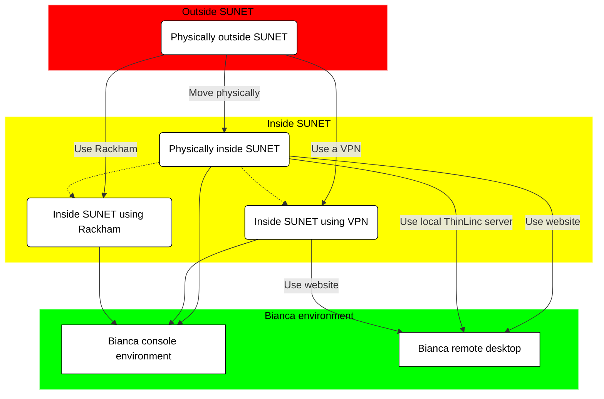

# Log in to Bianca

!!! info "Objectives" 

    - First step in understanding why Bianca login is the way it is
    - If outside of SUNET: Start VPN
    - Log in to the Bianca remote desktop (uses ThinLinc)
    - Log in to the Bianca terminal (using `ssh`)
    - First step in understanding what a login node is 





## Exercises

!!! info "Solutions" 
    See section 'Video' for the videos that show how to do these exercises

 1. Discuss: what is the purpose of Bianca? What kind of consequences will this have for its design?
 2. If outside of SUNET: use a VPN
 3. Log in to the Bianca remote desktop
 4. Log in to the Bianca terminal using `ssh`
 5. Start an interactive session


> The voyage from outside the university network to a cluster login node 


> The relation between Bianca and the Internet

Bianca and the Internet have this relation:

 * Bianca has no internet [1], to prevent accidental data leaks. 
 * Bianca is only accessible from within SUNET (i.e. from university networks),
   to protect the sensitive data better.

Data can be transferred to/from the `wharf`, 
which is a special folder that is visible from the Internet.

If you are outside of SUNET, you need to use a VPN,
as is described in the next section.

If you are inside of SUNET, 
you can skip the next section.

## Login types

- [http://bianca.uppmax.uu.se/](http://bianca.uppmax.uu.se/)
  for a remote desktop environment, 
  that works only from within the universities' network (i.e. SUNET)
- ThinLinc server, a local program for a remote desktop environment
- SSH, for a terminal environment

Note that [http://bianca.uppmax.uu.se/](http://bianca.uppmax.uu.se/) uses
ThinLinc.

## 2. Use a VPN

If you are outside of SUNET, you need to use a VPN.

To be able to use VPN:

 * For Uppsala University: [go to this page](https://mp.uu.se/en/web/info/stod/it-telefoni/anvandarguider/network/vpn-service)
 * For other Swedish universities, search their websites to get a VPN setup

## 3. Logging in

Inside of SUNET or with a VPN, 
login depends on what you need:

What you need   |What to do
----------------|------------------------------
A remote desktop|Login at [https://bianca.uppmax.uu.se](https://bianca.uppmax.uu.se)
A terminal      |`ssh` into Bianca

## 4. Log in to the Bianca remote desktop environment

!!! warning

    You need to be within SUNET or use a VPN

Bianca offers a remote desktop environment (which uses ThinLinc to establish
the connection). Here is how to login:

 1. In your web browser, go to [https://bianca.uppmax.uu.se](https://bianca.uppmax.uu.se)

 2. Fill in the first dialog. Do use the `UPPMAX` [2-factor authentication](https://www.uppmax.uu.se/support/user-guides/setting-up-two-factor-authentication/) (i.e. not SUPR!)


 3. Fill in the second dialog, using your regular password (i.e. no need for two-factor authentication)


> The second Bianca remote desktop login dialog. 
> Note that it uses ThinLinc to establish this connection

 4. Enjoy! You are in!


> The Bianca remote desktop

## 5. Log in to the Bianca command-line environment

!!! warning

    You need to be within SUNET or use a VPN

You can use your favorite terminal to login (see <https://uppmax.github.io/uppmax_intro/login2.html#terminals> for an overview of many)
to the Bianca command-line environment.

  1. From a terminal, use `ssh` to log in:

```bash
ssh [user]-[project name]@bianca.uppmax.uu.se
```

For example:

```bash
ssh richel-sens2023598@bianca.uppmax.uu.se
```

 2. Type your UPPMAX password, 
    directly followed by the UPPMAX 2-factor authentication number,
    for example `verysecret678123`, then press enter

 3. Type your UPPMAX password,
    for example `verysecret`

 4. Enjoy! You are in!

## 6. Login node

When you are logged in, you are on a login node.
There are two types of nodes:

Type        |Purpose
------------|--------------------------
Login node  |Start jobs for worker nodes, do easy things
Worker node |Do hard calculations, either from scripts of an interactive session

Bianca contains hundreds of nodes, each of which is isolated from each other and the Internet.

As Bianca is a shared resources, there are rules to use it together in fair way:

 * The login node is only for easy things, such as moving files,
   starting jobs or starting an interactive session
 * The worker nodes are for harder things, such as
   running a script or running an interactive session.

To start an interactive session [2], type:


```bash
interactive -A [project name] -p core -n 2 -t 8:0:0
```

For example:

```bash
interactive -A sens2023598 -p core -n 2 -t 8:0:0
```

## 7. Conclusions

 * Bianca makes it hard to leak data
 * Login differs from where you are and what you need
 * Only do light things on login nodes

## 8. Footnotes

 * [1] 'no internet' meaning 'no direct way to download or upload data from/to
   the internet
 * [2] In this case, 8 hour long, with 2 cores

## 9. Video

 * Login to Bianca, using a VPN: [YouTube](https://youtu.be/Ni9nyCf7me8), [download (.mp4)](https://richelbilderbeek.nl/login_bianca_vpn.mp4)

## 10. Links

 * [The Bianca remote desktop login](https://bianca.uppmax.uu.se)
 * [How get a VPN for UU](https://mp.uu.se/en/web/info/stod/it-telefoni/anvandarguider/network/vpn-service)
