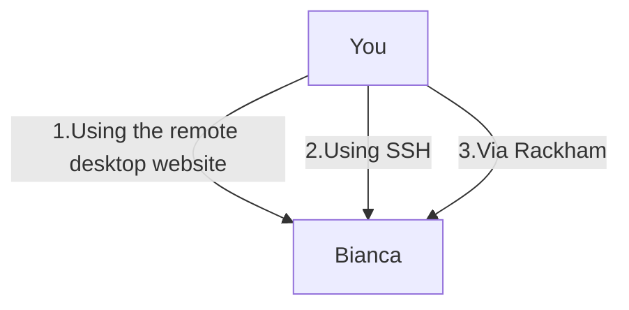

# Log in to the Bianca console environment


!!! info "Learning objectives"

    - Use the UPPMAX documentation
    - Observe the most common problems when accessing Bianca
    - Log in into Bianca's remote desktop environment using a website 
    - Log in into Bianca's console environment using SSH
    - Log in into Bianca's console environment via Rackham

???- info "Notes for teachers"

    Teaching goals:

    - The learners have used the UPPMAX documentation
    - The learners have observed the most common problems when accessing Bianca
    - The learners have logged in into Bianca's remote desktop environment using a website 
    - The learners have logged in into Bianca's console environment using SSH
    - The learners have logged in into Bianca's console environment via Rackham

    Schedule:

    ```mermaid
    gantt
      title Lesson plan Introduction and Logging in
      dateFormat X
      axisFormat %s
      section Introduction
      Prior knowledge: prior_1, 0, 5s
      Theory : theory_1, after prior_1, 5s
      section Logging In
      Prior knowledge: prior_2, after theory_1, 5s
      Theory: theory, after prior_2, 5s
      Exercises: crit, exercise, after theory, 30s
      Feedback: feedback, after exercise, 10s
    ```

## Why?

There are multiple ways to log in to Bianca, each having its own features:



Way                                                     |Features
--------------------------------------------------------|--------------------------------------------------------------------------------------------------

1. Using the remote desktop website                     |Must be within SUNET, requires no setup, visual, clunky to work with
2. Using the console environment                        |Must be within SUNET, requires an SSH client, terminal, powerful to work with (if you know how)
3. (optional) Using the console environment from Rackham|Can be done everywhere, requires an SSH client, terminal, powerful to work with (if you know how)

Here you will see how these looks like,
so you can decide which environment to use.

## Using

### 2. Using SSH

???- question "(optional) 6. Exercise: login into the Bianca console environment"

    The goal of this exercise is: (1) troubleshooting, to make sure one can access
    this environment (2) see how it looks like, this may help one decide to
    use this environment yes of no.

    Do this after having logged in to the Bianca remote desktop,
    as most troubleshooting occurs in that exercise.

### 3. Using SSH via Rackham

???- question "(optional) 7. Exercise: login into the Bianca console environment from Rackham"

    Read [the UPPMAX documentation's 'Login to the Rackham console environment with a password'](https://docs.uppmax.uu.se/getting_started/login_rackham_console_password/).

    Then, log in to the Rackham console environment.
    From there, log in to the Bianca console environment.

    Do this after having logged in to the Bianca console environment,
    as most troubleshooting occurs in that exercise.
