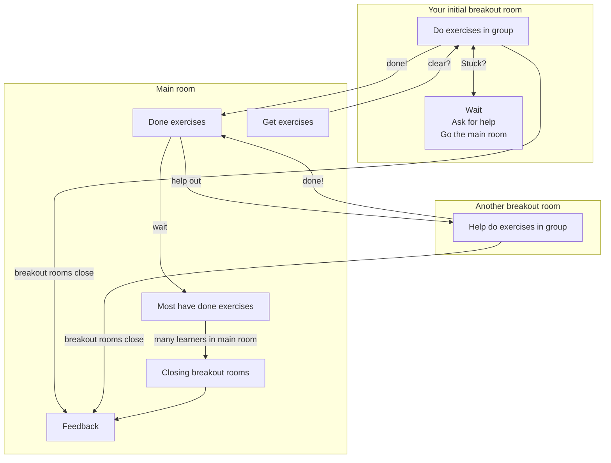

# Duo's in breakout rooms exercise procedure

???- info "For teachers: why this setup?"

    > Ideally, both learners have a camera and microphone on

    This allows for a learning environment that is engaging
    and where discussion can take place easily.

    > You will be put into Zoom Breakout rooms, in random pairs.

    This assures everyone learns effectively: pairs are optimal.

    > Ideally, all do the exercises on their computer,
    > yet derive at a shared answer

    This assures everyone can give a answer that is not personal.

    > One should commonly share screens

    Encourage teaching and learning.

    > There is no silent room.

    There is no silent room, as:

    - (1) working in pairs allows 'Think, Pair, Share' to work;
      answering is not personal anymore,
    - (2) getting the experienced learners to teach makes them learn too,
    - (3) this does not work well with Zoom assigning random pairs,
    - (4) this is not designed to be a self-study course

    > When done with the exercises, go back to the main room

    This helps set the pace of the course.

    > Learners that are done will be asked to try to help
    > the remaining working learners,
    > by joining their breakout rooms

    This helps wisdom to spread.

    The majority of learners is keen to help out
    directly.

    The majority of the remaining learners feel not knowledgeable
    enough to help out, but is keen to *try to* help out.
    Remind these learners they are here to learn, and not to already know
    to content.

    > When two-thirds of the learners are in the main room, all break-out rooms
    > will be closed ruthlessly

    The parameter value two-thirds is picked as it means that most learners
    have arrived at the answer. The hope is that the members of a slower
    pair in one iteration will catch up when paired up with other learners.

    Closing breakout rooms is not ultra-ruthless: learners still have 1 minute
    left. But it is a simple and ruthless rule.

    > Breaks are always on the scheduled time. You will be reminded in that chat

    Breaks are important.

    > Take that break, either in the main room or in your breakout room.
    > The breakout rooms will not be closed

    Do not disrupt the flow (even more) by closing the breakout rooms.

    > In the main room, random learners will be asked questions
    > regarding those exercises.
    > Say the answer you agreed upon as a group (i.e. not your personal answer!)

    This is form is described as 'Think, Pair, Share' in 'The Fundamentals
    of Teaching' by Mike Bell

???- info "For teachers: breakout room visit policy"

    The goal of visiting the breakout room,
    is to ensure there is a learning environment.
    Try to disturb as little as possible.
    Avoid to lecture and avoid to correct the learners,
    as this will make their learning less efficient.

    If learners are asking a question,
    coach the learners in finding the answer.
    Avoid giving a direct answer,
    as this will make their learning less efficient.

    ```mermaid
    flowchart TD
      question_asked[Learners ask a question?]
      maybe_answer[Reply, maybe answer the question]
      how_many_cameras[How many camaras are on?]
      concentrated[Do the learners appear concentrated?]
      discussion[Are the learners having a useful discussion?]
      arguing[Are the learners arguing?]
      chatting[Are the learners chatting informally?]
      huh[Then what are they doing?]

      fix[Re-establish learning environment]
      next[Go to the next breakout room]

      question_asked --> |Yes| maybe_answer
      question_asked --> |No| how_many_cameras
      maybe_answer --> |Done| how_many_cameras
      how_many_cameras --> |Zero or one| next
      how_many_cameras --> |Two| concentrated
      concentrated --> |Yes| next
      concentrated --> |No| discussion
      discussion --> |Yes| next
      discussion --> |No| arguing
      arguing --> |Yes| fix
      arguing --> |No| chatting
      chatting --> |Yes| fix
      chatting --> |No| huh
      fix --> |Done| next
    ```

- Ideally, all learners have a camera and microphone on
- You will be put into Zoom Breakout rooms, in random groups.
- There is no silent room.
- Ideally, all do the exercises on their own computer,
  yet derive at a shared answer
- One should commonly share screens
- Stuck? You can (1) wait for a teacher to come by,
  (2) click on the Zoom option 'Ask for help', or
  (3) go to the main room
- When done with the exercises, go back to the main room
- Learners that are done will be asked to try to help
  the remaining working learners,
  by joining their breakout rooms
- When two-thirds of the learners are in the main room, all break-out rooms
  will be closed ruthlessly.
  It may take 1 minute before the room closes though :-)
- Breaks are always on the scheduled time. You will be reminded in that chat
- Take that break, either in the main room or in your breakout room.
  The breakout rooms will not be closed
- In the main room, random learners will be asked questions
  regarding those exercises.
  Say the answer you agreed upon as a group (i.e. not your personal answer!)



> Overview of the exercise procedure

## Questions

- You are in a breakout room with someone else.
  You both do not know what to do.
  What went wrong?

???- info "Answer"

    Before you are sent to the breakout rooms,
    it is asked if you know what to do,
    with the goal of preventing this situation.

    Try to help the teacher give clear enough instructions
    next time.

- You are in a breakout room with someone else.
  You need to install a piece of software,
  which takes a couple of minutes of time.
  Will you still have enough time for the exercises?

???- info "Answer"

    Likely: yes, you will have enough time for the exercises.

    It is likely you are not the only one that
    has this problem.
    The course follows the pace of the learners,
    hence, we move on to the next session when most learners
    have finished the exercises

- You finished the exercise and are in the main room,
  waiting for the course to move on.
  You were asked to help in another breakout room,
  yet you did not feel comfortable to do so.
  What do you do?

???- info "Answer"

    These are your options:

    - Wait
    - Ask questions
    - Read the next session.
      Turn of your camera to indicate you need to concentrate

- I am alone in my Zoom breakout room. What do I do?

???- info "Answer"

    It is likely a teacher will quickly see this and ruthlessly
    move you to another breakout room, so waiting is an option.

    Else, go to the main room.
