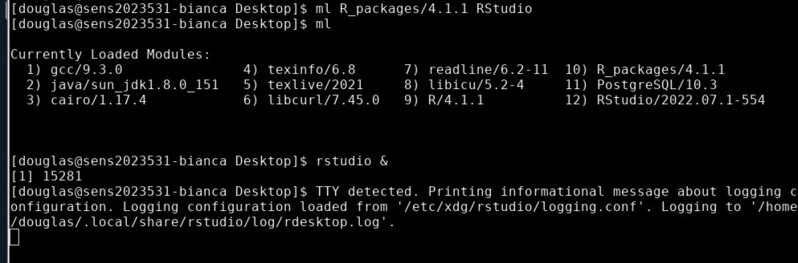
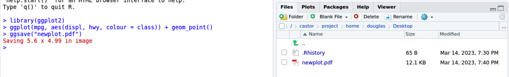

# Working with environment modules on Bianca

!!! info "Objectives" 

    - Being able to search/load/unload modules
    - Create an executable Bash script that uses a module (without SLURM)

???- info "Notes for teachers"

    Teaching goals:

    - The learners demonstrate they can find a module
    - The learners demonstrate they can load a module of a specific version
    - The learners demonstrate they can unload a module
    - The learners demonstrate they can load a module in a script

    Schedule (15 minutes):

    - 5 minutes: summarize page, start exercise
    - 10 minutes: let learners do exercise
    - 5 minutes: feedback

## Why Bianca uses environment modules


Bianca is shared Linux computer with all the standard Linux tools installed,
on which all users should be able to 
do their work independently and undisturbed.

To ensure this, users cannot modify, upgrade or uninstall software themselves
and instead an [environment module system](https://lmod.readthedocs.io/en/latest/) 
(from now on: 'module system') is used.
This allow users to independently use their favorite versions of their
favorite software.

To have new software installed on Bianca,
users must explicitly request a version of a piece of software.
As of today, there are nearly [800+ programs and packages, with multiple versions](https://www.uppmax.uu.se/resources/software/installed-software/) 
available on all UPPMAX clusters.
Using explicit versions of software is easy to do 
and improves the reproducibility of the scripts written.

To preserve hard disk space, Bianca also
has [multiple big databases installed](https://www.uppmax.uu.se/resources/databases/).

!!! warning 
    - To access bioinformatics tools, load the **bioinfo-tools** module first.

## What is `cowsay`?

`cowsay` is a tool that is commonly use as a toy example tool.

From a terminal, running:


```
cowsay hello
```

results in:

``` _______
< hello >
 -------
        \   ^__^
         \  (oo)\_______
            (__)\       )\/\
                ||----w |
                ||     ||
```

Because `cowsay` is not part of the Linux kernel, 
users commonly need to install it. 
Or in our case: load a module to use it.

## Working with the module system

!!! info Overview of module commands

    Command                         |Description
    --------------------------------|--------------------------------------
    `module load bioinfo-tools`     |Load this module first, to find others
    `module spider`                 |Search for a module
    `module spider [module]`        |Get info about a module, e.g. `module spider cowsay`
    `module list`                   |List all activated modules
    `module load [module]`          |Load a module, e.g. `module load cowsay`
    `module load [module]/[version]`|Load a module of a specific versions, e.g. `module load cowsay/3.03`
    `module help`                   |Show the help for a module
    `module unload [module]`        |Unload the module `[module]`, e.g. `module unload cowsay`

Working with the module system means:

- searching for a module
- activating ('loading') a module
- de-activate ('unloading') a module

This section describes these steps in more details.

The `module` command is the basic interface to the module system.

To search for a module, use `module spider [module]`,
for example `module spider cowsay`.
If there is an exact match, that module is reported first.
Of the module shown, also the different versions are reported.

!!! tip "Do `module load bioinfo-tools` first"

    When working with modules, do `module load bioinfo-tools` first

???- tip "What to do when you cannot find a module"

    Run `module load bioinfo-tools`.

    This will allow other modules to be found.

To load a module, use  `module load [module]`, 
for example `module load cowsay`.
This will load the default version of that module,
which is almost always the latest version.
Loading a module always results in a helpful message 
(such as that it worked fine), however,
it is *not* general help for using the tool itself.

!!!- tip "Getting help on a module"

    Run `module help [module]`, e.g. `module help cowsay`
    to get the general help on a module

For reproducible research, however, it is good practice
to load a specific version. The information given by
`module spider` contains the versions of the module.
For example, to load the `samtools/1.17` module, 
do `module load samtools/1.17`.

???- tip "Huh, `module load samtools/1.17` gives an error?"

    If you do `module load samtools/1.17` without 
    doing `module load bioinfo-tools` first, you'll get the error:

    ```
    $ module load samtools/1.17
    Lmod has detected the following error:  These module(s) or
    extension(s) exist but cannot be loaded as requested: "samtools/1.17"
       Try: "module spider samtools/1.17" to see how to load the module(s).
    ```

    The solution is to do `module load bioinfo-tools` first.

To see which modules are loaded, use `module list`.

To see a module-specific help, use `module help [module]` (e.g. `module help cowsay`).

To unload a module, do `module unload [module]` (e.g. `module unload cowsay`).
This will also unload module that depend on the unloaded one.
For example, `module unload bioinfo-tools` will unload all bioinformatics tool.

## Using modules in an executable script

Using modules in an executable script is straightforward:
just load the module needed before using the software in that module.

For example, this is a valid bash script:

```
#!/bin/bash
module load cowsay/3.03
cowsay hello
```

When using a bioinformatics tool such as `samtools` version 1.17,
one needs to first load `bioinfo-tools`:

```
#!/bin/bash
module load bioinfo-tools
module load samtools/1.17
```

## Exercises

???- tip "Video with solutions"

    There is a video that shows the solution of all these exercises: 
    [YouTube](https://youtu.be/lNlq2Eb-qgc), [Download (.ogv)](https://richelbilderbeek.nl/bianca_modules.ogv)

???- question "2a. Verify that the tool `cowsay` is not available by default"

    ```
    cowsay hello
    ```

    Gives the error message: `cowsay: command not found`.

???- question "2b. Search for the module providing `cowsay`"

    ```
    module spider cowsay
    ```

    You will find the `cowsay/3.03` module.

???- question "2c. Load a specific version of that module"

    ```
    module load cowsay/3.03
    ```

???- question "2d. Verify that the tool `cowsay` now works"

    ```
    cowsay hello
    ```

???- question "2e. Unload that module"


    ```
    module unload cowsay/3.03
    ```

???- question "2f. Verify that the tool `cowsay` is not available anymore"


    ```
    cowsay hello
    ```

    Gives the error message: `cowsay: command not found`.


???- question "3a. Create an executable script called `cow_says_hello.sh`. It should load a specific version of the `cowsay` module, after which it uses `cowsay` to do something"

    ```
    nano cow_says_hello.sh
    ```

    Copy-paste this example text:

    ```
    #!/bin/bash
    module load cowsay/3.03
    cowsay hello
    ```

    Run:

    ```
    ./cow_says_hello.sh
    ```

???- question "3b. Find out: if the `cowsay` module is not loaded, after running the script, is it loaded yes/no?"
    
    Running the script does not load the module beyond running the script.

    ```
    [richel@sens2023598-bianca ~]$ cowsay hello
    -bash: cowsay: command not found
    [richel@sens2023598-bianca ~]$ ./cow_says_hello.sh 
     ________ 
    < hello >
     -------- 
            \   ^__^
             \  (oo)\_______
                (__)\       )\/\
                    ||----w |
                    ||     ||
    [richel@sens2023598-bianca ~]$ cowsay hello
    -bash: cowsay: command not found
    ```

???- question "`module load samtools/1.17` gives the error `These module(s) or extension(s) exist but cannot be loaded as requested: "samtools/1.17`. How to fix this?"

    If you do `module load samtools/1.17` without 
    doing `module load bioinfo-tools` first, you'll get the error:

    ```
    $ module load samtools/1.17
    Lmod has detected the following error:  These module(s) or
    extension(s) exist but cannot be loaded as requested: "samtools/1.17"
       Try: "module spider samtools/1.17" to see how to load the module(s).
    ```

    The solution is to do `module load bioinfo-tools` first.

???- info "Want more complex/realistic exercises?" 

    The goal of this lesson is to work with the module system
    in a minimal/fast way. 
    These exercises do not achieve anything useful.
    See 'Bigger exercises' for more complex/realistic exercises

## Conclusion

 * Use the module system to use centrally installed software that is available on all nodes
 * Include versions when loading modules for reproducibility
 * Your own installed software, scripts, Python packages etc. are available from their paths

## Extra material

### Common shorthand names

Full command            |Shorthand name
------------------------|--------------
`module`                |-
`module avail`          |`ml av`
`module spider`         |`ml spider`
`module list`           |`ml`
`module unload [module]`|`ml -[module]`

### Bigger exercises

!!! warning 
    - To access bioinformatics tools, load the **bioinfo-tools** module first.

???- question "Hands on: Processing a BAM file to a VCF using GATK, and annotating the variants with snpEff"

    This workflow uses a pre-made BAM file that contains a subset of reads from a sample from European Nucleotide Archive project [PRJEB6463](https://www.ebi.ac.uk/ena/browser/view/PRJEB6463) aligned to human genome build hg38. These reads are from the region `chr1:100300000-100800000`.

    1. Copy example BAM file to your working directory.
    ```
    $ cp -a /proj/sens2023598/workshop/data/ERR1252289.subset.bam .
    ```

    2. Take a quick look at the BAM file. First see if `samtools` is available.
    ```
    $ which samtools
    ```

    3. If `samtools` is not found, load `bioinfo-tools` then `samtools/1.17`
    ```
    $ ml bioinfo-tools samtools/1.17
    ```

    4. Now create an index for the BAM file, and examine the first 10 reads aligned within the BAM file.
    ```
    $ samtools index ERR1252289.subset.bam
    $ samtools view ERR1252289.subset.bam | head
    ```

    5. Looks good. Now load the `GATK/4.3.0.0` module.
    ```
    $ module load GATK/4.3.0.0
    ```

    6. Make symbolic links to hg38 genome resources already available on UPPMAX. This provides local symbolic links for the hg38 resources `genome.fa`, `genome.fa.fai` and `genome.dict`.
    ```
    $ ln -s /sw/data/iGenomes/Homo_sapiens/UCSC/hg38/Sequence/WholeGenomeFasta/genome.* .
    ```

    7. Create a VCF containing inferred variants. Speed it up by confining the analysis to this region of chr1.
    ```
    $ gatk HaplotypeCaller --reference genome.fa --input ERR1252289.subset.bam --intervals chr1:100300000-100800000 --output ERR1252289.subset.vcf
    ```
    This produces as its output the files `ERR1252289.subset.vcf` and `ERR1252289.subset.vcf.idx`.

    8. Now use `snpEff/5.1` to annotate the variants. Loading `snpEff/5.1` results in a change of java prerequisite. Also take a quick look at the help for the module for help with running this tool at UPPMAX.
    ```
    $ ml snpEff/5.1

    The following have been reloaded with a version change:
      1) java/sun_jdk1.8.0_151 => java/OpenJDK_12+32

    $ ml help snpEff/5.1

    ------------------- Module Specific Help for "snpEff/5.1" --------------------
        snpEff - use snpEff 5.1
        Version 5.1

        Usage: java -jar $SNPEFF_ROOT/snpEff.jar ...

        Usage: java -jar $SNPEFF_ROOT/SnpSift.jar ...
        along with the desired command and possible java options for memory, etc

        Note that databases must be added by an admin -- request via support@uppmax.uu.se
        See http://snpeff.sourceforge.net/protocol.html for general help

    Every database that is provided by snpEff/5.1 as of this installation is installed.  This complete list
    can be generated with

        java -jar $SNPEFF_ROOT/snpEff.jar databases

    Three additional databases have been installed.

        Database name                  Description                                      Notes
        -------------                  -----------                                      -----
        c_elegans.PRJNA13758.WS283     Caenorhabditis elegans genome version WS283      MtDNA uses Invertebrate_Mitochondrial codon table
        canFam4.0                      Canis familiaris genome version 4.0
        fAlb15.e73                     Ficedula albicollis ENSEMBLE 73 release

    The complete list of locally installed databases is available at $SNPEFF_ROOT/data/databases_list.installed

    To add your own snpEff database, see the guide at http://pcingola.github.io/SnpEff/se_buildingdb/#option-1-building-a-database-from-gtf-files
    ```

    9. Annotate the variants.
    ```
    $ java -jar $SNPEFF_ROOT/snpEff.jar eff hg38 ERR1252289.subset.vcf > ERR1252289.subset.snpEff.vcf
    ```

    10. Take a quick look!
    ```
    $ less ERR1252289.subset.snpEff.vcf
    ```

    11. Compress the annotated VCF and index it, using `bgzip` and `tabix` provided by the `samtools/1.17` module, already loaded.
    ```
    $ bgzip ERR1252289.subset.snpEff.vcf
    $ tabix -p vcf ERR1252289.subset.snpEff.vcf.gz
    ```


???- question "Hands on: Running R within RStudio, use ggplot2 from R_packages/4.1.1"

    1. Load the `R_packages/4.1.1` module and the latest `RStudio` module, and start RStudio with `rstudio &`.
    

    2. Load the `ggplot2` R library, provided by `R_packages/4.1.1`, and produce an example plot.
    

    2. Save the plot using `ggsave`.
    


???- question "Hands on: Loading the conda/latest module"

    1. Load the `conda/latest` module.
    ```
    $ ml conda/latest
    The variable CONDA_ENVS_PATH contains the location of your environments. Set it to your project's environments folder if you have one.
    Otherwise, the default is ~/.conda/envs. Remember to export the variable with export CONDA_ENVS_PATH=/proj/...

    You may run "source conda_init.sh" to initialise your shell to be able
    to run "conda activate" and "conda deactivate" etc.
    Just remember that this command adds stuff to your shell outside the scope of the module system.

    REMEMBER TO USE 'conda clean -a' once in a while
    ```

    We want to set the `CONDA_ENVS_PATH` variable to a directory within our project, rather than use the default which is our home directory.
    If you do not set this variable, your home directory will easily exceed its quotas when creating even a single Conda environment.
    This will be covered in more detail in the afternoon.

### Installed software

 * [Almost all installed software](https://www.uppmax.uu.se/resources/software/installed-software/)
  
### Installed databases

 * [Almost all installed databases](https://www.uppmax.uu.se/resources/databases/)

### Links

 * [Software at UPPMAX](https://www.uppmax.uu.se/resources/software/)
 * [The UPPMAX module system](https://www.uppmax.uu.se/resources/software/module-system/)
 * [Almost all installed software on UPPMAX](https://www.uppmax.uu.se/resources/software/installed-software/)
 * [Almost all installed databases on UPPMAX](https://www.uppmax.uu.se/resources/databases/)
 * [Wikipedia page on environment modules](https://en.wikipedia.org/wiki/Environment_Modules_(software))
 * [lmod homepage](https://www.tacc.utexas.edu/research/tacc-research/lmod/)

### About `module avail`

!!! info "Why here?"

    As far as I can see, there is no use case for `module avail`.

`module avail` list all modules immediately available, 
or search for a specific available module:

- `module avail`
- `module avail *tool*`

This command is not so smart, 
though, especially when searching for a specific tool, or a bioinformatics tool.
It only reports modules that are immediately available.

```
$ module avail R
```
outputs everything that has an `r` in the name... not useful.

```
$ module avail samtools
No module(s) or extension(s) found!
Use "module spider" to find all possible modules and extensions.
Use "module keyword key1 key2 ..." to search for all possible modules matching any of the "keys".
```

### Example output

???- info "`module spider R` detailed output"

    ```
    $ module spider R

    -------------------------------------------
      R:
    -------------------------------------------
         Versions:
            R/3.0.2
            R/3.2.3
            R/3.3.2
            R/3.4.0
            R/3.4.3
            R/3.5.0
            R/3.5.2
            R/3.6.0
            R/3.6.1
            R/4.0.0
            R/4.0.4
            R/4.1.1
            R/4.2.1
         Other possible modules matches:
            454-dataprocessing  ADMIXTURE  ANTLR  ARCS  ARC_assembler  ARPACK-NG  ART  AdapterRemoval  AlienTrimmer  Amber  AnchorWave  Arlequin  Armadillo  ArrowGrid  Bamsurgeon  BclConverter  BioBakery  BioBakery_data  ...

    -------------------------------------------
      To find other possible module matches execute:

          $ module -r spider '.*R.*'

    -------------------------------------------
      For detailed information about a specific "R" package (including how to load the modules) use the module's full name.
      Note that names that have a trailing (E) are extensions provided by other modules.
      For example:

         $ module spider R/4.2.1
    -------------------------------------------
    ```

???- info "`module spider samtools` detailed output"

    ```
    $ module spider samtools

    -------------------------------------------
      samtools:
    -------------------------------------------
         Versions:
            samtools/0.1.12-10
            samtools/0.1.19
            samtools/1.1
            samtools/1.2
            samtools/1.3
            samtools/1.4
            samtools/1.5_debug
            samtools/1.5
            samtools/1.6
            samtools/1.8
            samtools/1.9
            samtools/1.10
            samtools/1.12
            samtools/1.14
            samtools/1.16
            samtools/1.17
         Other possible modules matches:
            SAMtools

    -------------------------------------------
      To find other possible module matches execute:

          $ module -r spider '.*samtools.*'

    -------------------------------------------
      For detailed information about a specific "samtools" package (including how to load the modules) use the module's full name.
      Note that names that have a trailing (E) are extensions provided by other modules.
      For example:

         $ module spider samtools/1.17
    -------------------------------------------
    ```

???- info "`module spider samtools/1.17` detailed output"

    ```
    $ module spider samtools/1.17

    -------------------------------------------
      samtools: samtools/1.17
    -------------------------------------------

        You will need to load all module(s) on any one of the lines below before the "samtools/1.17" module is available to load.

          bioinfo-tools

        Help:
            samtools - use samtools 1.17

            Version 1.17
    ```

    This reminds us that we need to load the `bioinfo-tools` 
    module to be able to load `samtools/1.17`.
    Again, this is required (just once) before loading bioinformatics software.


???- info "`module load` detailed output"

    ```
    $ module load GATK/4.3.0.0
    Note that all versions of GATK starting with 4.0.8.0 use a different wrapper
    script (gatk) than previous versions of GATK.  You might need to update your
    jobs accordingly.

    The complete GATK resource bundle is in /sw/data/GATK

    See 'module help GATK/4.3.0.0' for information on activating the GATK Conda
    environment for using DetermineGermlineContigPloidy and similar other tools.
    ```

    This message references the command `module help GATK/4.3.0.0` for additional help with this module.

???- info "`module list` detailed output"

    ```
    $ module list

    Currently Loaded Modules:
      1) uppmax   2) bioinfo-tools   3) samtools/1.17
    ```

    In this example case, we can see that `bioinfo-tools` is already loaded,
    so loading it again is not required.

???- info "`module help` detailed output"

    ```
    $ module help GATK/4.3.0.0

    -------------- Module Specific Help for "GATK/4.3.0.0" ---------------
    GATK - use GATK 4.3.0.0
    Version 4.3.0.0

    **GATK 4.3.0.0**

    Usage:

        gatk --help     for general options, including how to pass java options

        gatk --list     to list available tools

        gatk ToolName -OPTION1 value1 -OPTION2 value2 ...
                      to run a specific tool, e.g., HaplotypeCaller, GenotypeGVCFs, ...

    For more help getting started, see

        https://software.broadinstitute.org/gatk/documentation/article.php?id=9881

    ...
    ```

    When we list the loaded modules, we see that `GATK/4.3.0.0` is now loaded, as is its prerequisite module `java/sun_jdk1.8.0_151`.

???- info "`module list` detailed output"

    ```
    $ module list

    Currently Loaded Modules:
      1) uppmax   2) bioinfo-tools   3) samtools/1.17   4) java/sun_jdk1.8.0_151   5) GATK/4.3.0.0
    ```

    Modules can also be unloaded, which also unloads their prerequisites.

???- info "`module help` detailed output"

    ```
    $ module help GATK/4.3.0.0

    -------------- Module Specific Help for "GATK/4.3.0.0" ---------------
    GATK - use GATK 4.3.0.0
    Version 4.3.0.0

    **GATK 4.3.0.0**

    Usage:

        gatk --help     for general options, including how to pass java options

        gatk --list     to list available tools

        gatk ToolName -OPTION1 value1 -OPTION2 value2 ...
                      to run a specific tool, e.g., HaplotypeCaller, GenotypeGVCFs, ...

    For more help getting started, see

        https://software.broadinstitute.org/gatk/documentation/article.php?id=9881

    ...
    ```
