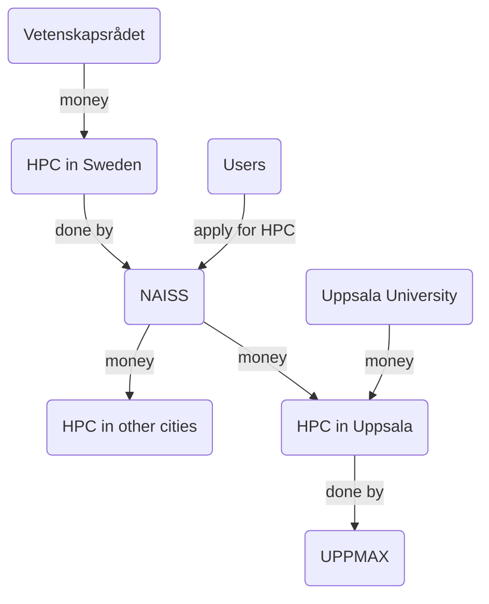
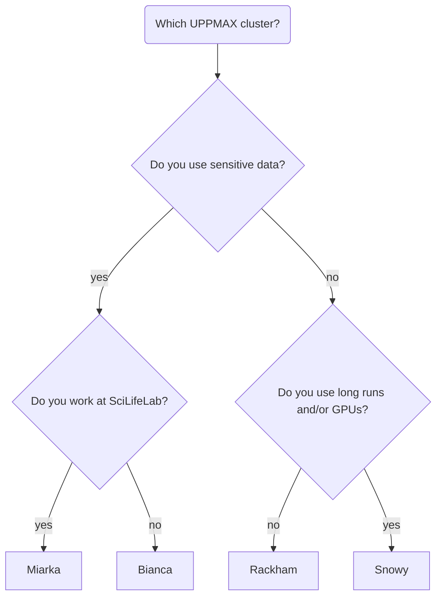
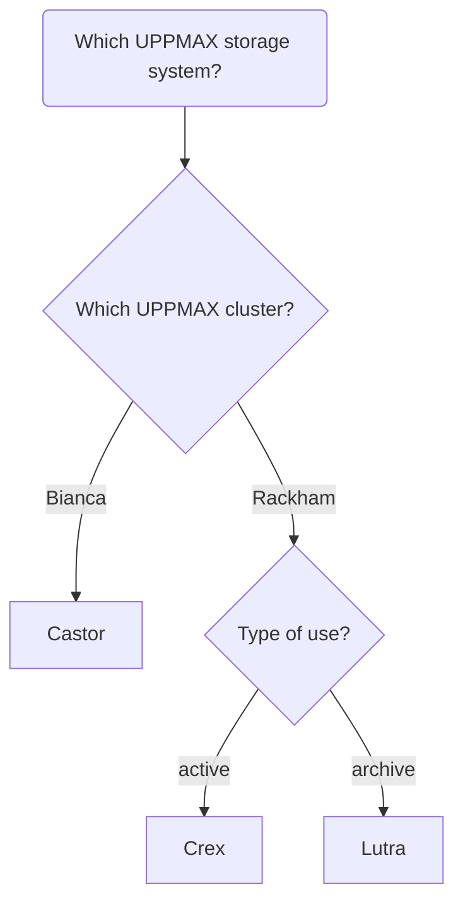
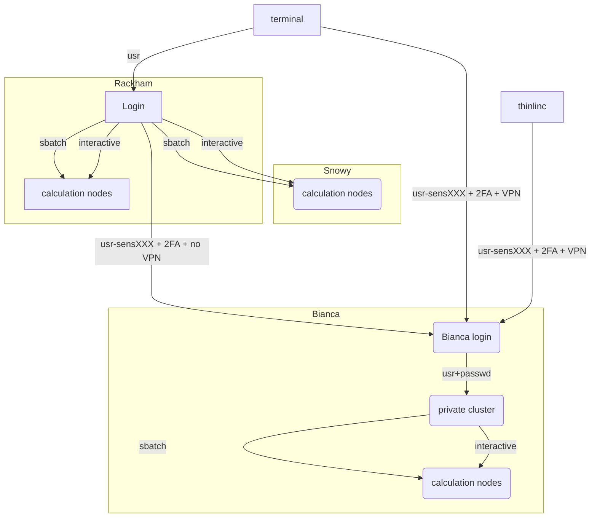

# Overview

!!! info "Objectives"
    - We'll get an overview of UPPMAX and SNIC/NAISS and how a computer cluster works

## The bigger picture

[Vetenskapsrådet](https://www.vr.se) ('Science counsel', VR) is biggest funder
of research in Sweden and funds HPC infrastructure. 

The [National Academic Infrastructure for Supercomputing in Sweden](https://www.naiss.se/) (NAISS) provides such HPC infrastructure: computing power, storage and data services. Applications for these resources starts at
[this NAISS page](https://www.naiss.se//#application-rounds-for-compute-and-storage-resources). These resources are physically located in multiple places in Sweden,
among other Uppsala.

[Uppsala Multidisciplinary Center for Advanced Computational Science](https://www.uppmax.uu.se/) (**UPPMAX = UppMACS**) provides the HPC infrastructure 
that is physically located in Uppsala

## UPPMAX systems

- [UPPMAX clusters](https://www.uppmax.uu.se/resources/systems/) are:
    - Rackham: regular data, general purpose
    - Snowy: regular data, long runs and GPU:s
    - **Bianca: for sensitive data, general use**
    - Miarka: for sensitive data, SciLifeLab-only

- [UPPMAX storage](https://www.uppmax.uu.se/resources/systems/storage-systems/)
    - On-load, active use: Castor of Bianca, Crex for Rackham
    - Off-load, archive: Lutra for Rackham

- [UPPMAX cloud](https://www.uppmax.uu.se/resources/systems/the-uppmax-cloud/),
      called 'Dis' (the Swedish word for 'haze'), it is
      the `EAST-1` region of the SNIC science cloud. 

## High Performance Computing — HPC

### What is a cluster?

- A network of computers, each computer working as a **node**.

- From small scale RaspberryPi cluster... 
     
{ width="400" }

- To supercomputers like Rackham.

- Each node contains several processor cores and RAM and a local disk called scratch.

- The user logs in to **login nodes** via Internet through ssh or ThinLinc.

  - Here the file management and lighter data analysis can be performed.

{ width="400" }

- The **calculation nodes** have to be used for intense computing. 

## Summary about the three "common" UPPMAX clusters

| |Rackham|Snowy|Bianca|
|-------|-----|------|---|
|**Purpose**|General-purpose|General-purpose|Sensitive|
|**#  Nodes (Intel)**|486+144|228+  50 Nvidia T4 GPUs|288 +   10 nodes á 2  NVIDIA A100 GPUs|
|**Cores per node**|20/16|16|16/64|
|**Memory per node**|128 GB|128 GB|128 GB
|**Fat nodes**|256 GB & 1 TB| 256, 512 GB & 4 TB| 256 & 512 GB|
|**Local disk (scratch)**|2/3 TB| 4 TB| 4 TB |
|**Login nodes**|Yes| No (reached from Rackham)|Yes (2 cores and 15 GB)|
|**"Home" storage**|Domus|Domus|Castor|
|**"Project" Storage**|Crex, Lutra|Crex, Lutra|Castor|

## Overview of the UPPMAX systems

!!! info "Next session"

    We will try the different forms to log in to Bianca!

!!! abstract "keypoints"
    - NAISS makes available large-scale high-performance computing resources, storage capacity, and advanced user support, for Swedish research. 
    - UPPMAX runs the local resources placed at Uppsala University
    - A cluster consists of several inter-connected computers that can work individually or together.

