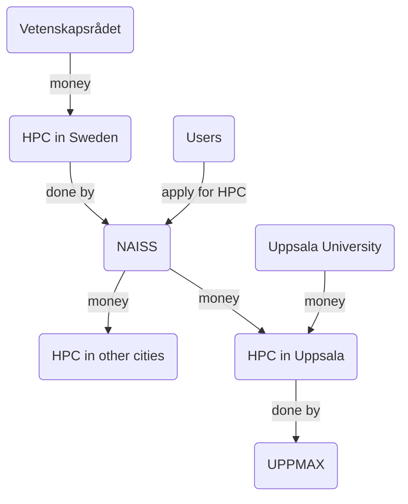
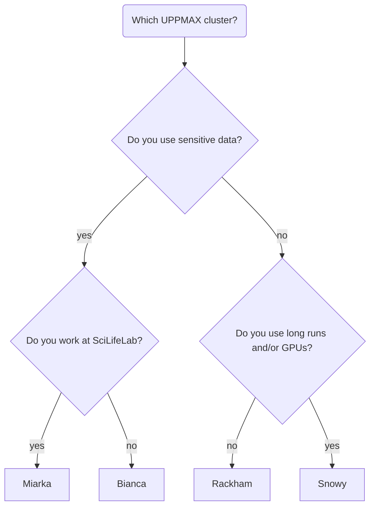
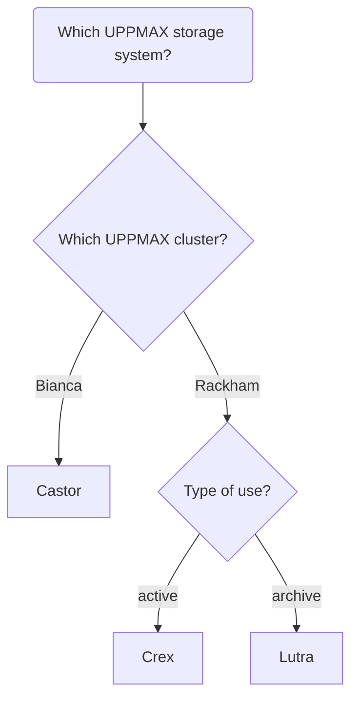
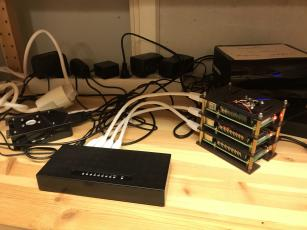
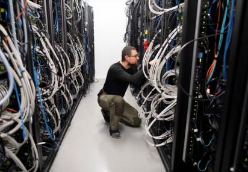
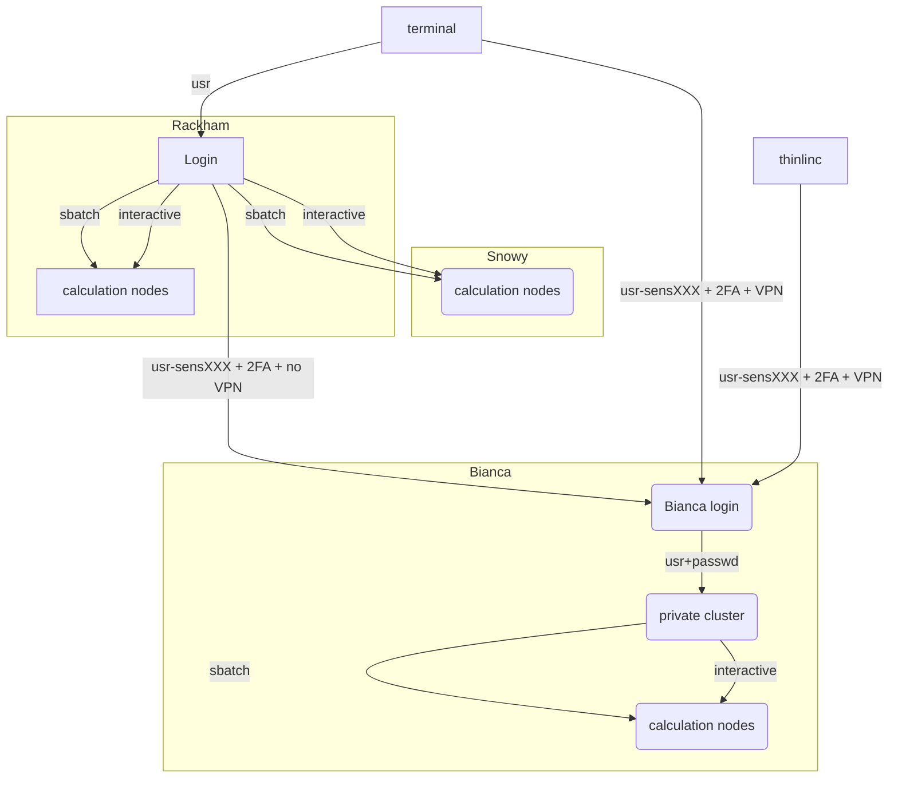

# Overview

!!! info "Goals"
    - See the bigger picture UPPMAX is part of
    - See other UPPMAX systems
    - First understanding why Bianca is how she is

## The bigger picture

Here we place UPPMAX within the bigger, national, picture,
starting from the biggest source of money for research in Sweden.

[Vetenskapsrådet](https://www.vr.se) ('Science counsel', VR) is biggest funder
of research in Sweden and funds the national HPC infrastructure. 

The [National Academic Infrastructure for Supercomputing in Sweden](https://www.naiss.se/) (NAISS) provides such HPC infrastructure: computing power, storage and data services. Applications for these resources starts at
[this NAISS page](https://www.naiss.se//#application-rounds-for-compute-and-storage-resources). These resources are physically located in multiple places in Sweden,
among other Uppsala.

[Uppsala Multidisciplinary Center for Advanced Computational Science](https://www.uppmax.uu.se/) (**UPPMAX = UppMACS**) provides the HPC infrastructure 
that is physically located in Uppsala

## UPPMAX systems

Here we place Bianca between the other UPPMAX systems.

- For computing power, the [UPPMAX clusters](https://www.uppmax.uu.se/resources/systems/) are:
    - Rackham: regular data, general purpose
    - Snowy: regular data, long runs and GPU:s
    - **Bianca: for sensitive data, general use**
    - Miarka: for sensitive data, SciLifeLab-only

A technical summary can be found below.

- For storage, the [UPPMAX storage systems](https://www.uppmax.uu.se/resources/systems/storage-systems/) are:
    - On-load, active use: Castor of Bianca, Crex for Rackham
    - Off-load, archive: Lutra for Rackham

- For cloud services: use the [UPPMAX cloud](https://www.uppmax.uu.se/resources/systems/the-uppmax-cloud/). It is called 'Dis' (the Swedish word for 'haze') and
the `EAST-1` region of the SNIC science cloud. 

## Bianca is a computer cluster for sensitive data

Bianca is a computer cluster for sensitive data.

Or: Bianca is a group of computers that can run many calculations, 
as requested by multiple people, at the same time.
As the data is sensitive, it is protected to remain only on Bianca.

### Difference between supercomputer and computer cluster

A supercomputer is a machine that is optimized for doing calculations
quickly. For example, to predict the weather for tomorrow, the calculation
may not take a week. The image above is a supercomputer.

A computer cluster is a machine that is optimized for doing a lot of calculations.
The images above shows a home-made computer cluster above,
and Rackham below, another UPPMAX computer cluster.

Bianca is a computer cluster.

### Restrictions on a computer cluster

A computer cluster is a group of computers that can run
many calculations, as requested by multiple people, at the same time.

To ensure fair use of this shared resource, regular users
are restricted in some ways:

- Users cannot run calculations directly. 
  Instead, users need to request either (1) a calculation to be run,
  or (2) an interactive node
- Users cannot install software directly. 
  Instead, users need to use pre-installed software or learn
  techniques how to run custom software anyway

These restrictions apply to most general-purpose clusters. 
However, Bianca is a **sensitive data** cluster, to which
more restrictions apply.

### Restrictions on a sensitive data computer cluster

Next to the general restrictions above, 
Bianca also is a **sensitive data** cluster.
This sensitive data must be protected to remain only on Bianca,
due to which there are these additional restrictions to users:

- Users have no direct access to internet.
  Instead, users can up/download files from/to a special folder.

The goal is *not* to prevent the up/download of sensitive data,
instead it is to prevent the *accidental* up/download of sensitive data.
As these up/downloads are monitored, in case of an accident, 
the extent of the leak and the person (accidentally) causing it
is known.

### What is a computer cluster?

Each computer is called a **node**.

There are three types of nodes:

- **login nodes**: nodes where a user enters and interacts with the system
- **calculation nodes**: nodes that do the calculations
- **interactive nodes**: a type of calculation node, where a user can do calculations directly

Each node contains several CPU/GPU cores, RAM and local storage space.

A user logs in to a login node via the Internet through:

- [http://bianca.uppmax.uu.se/](http://bianca.uppmax.uu.se/)
  for a remote desktop environment, 
  that works only from within SUNET
- ThinLinc, for a remote desktop environment
- SSH, for a terminal environment

Note that [http://bianca.uppmax.uu.se/](http://bianca.uppmax.uu.se/) uses
ThinLinc.

## Questions

???- question "Your want to request access to general-purpose HPC. At which website does your journey start?"

    Either a search engine to google for 'NAISS', or directly [https://naiss.se](https://naiss.se)

???- question "Your colleague visits [http://bianca.uppmax.uu.se/](http://bianca.uppmax.uu.se/) and sees nothing appear. What is likely the problem?"

    He/she is not inside of SUNET.

???- question "You want to use a piece of software that came out this morning (!) on Bianca. Will you be able to? Why?"

    This will likely fail, as it is not a pre-installed piece of software.
    
    If you are more advanced, there are ways to get it running yourself.

???- question "You want to use an online tool to do a calculation on Bianca. Will this work? Why?"

    This will fail, because Bianca has (close to) no internet access.

???- question "You find out you can run scripts with calculations directly on the login node. This saves him/her much time waiting for a calculation to start. Is this OK and why?"

    For you, there seems to be no problem. 
    However, for everyone else this is a problem,
    as the login node is a *shared* node.

    You will be asked to *schedule* your jobs instead. 

???- question "You are developing code on Bianca. You write the code line-by-line and schedule a test run after each addition. However, after each new line, it takes a couple of minutes before you know your code worked yes/no. How could you develop your code quicker?"

    This is the typical use-case to use an interactive node.
    One could also consider to develop code on a local computer 
    instead (which uses nonsensitive/simulated/fake testing data)
    and upload the final code instead.

???- question "Your script downloads a human reference genome from a secure website. Will this work on Bianca? Why?"

    This will fail, because Bianca has (close to) no internet access.

## Summary

!!! abstract "keypoints"
    - NAISS makes available large-scale high-performance computing resources, storage capacity, and advanced user support, for Swedish research. 
    - UPPMAX runs the local resources placed at Uppsala University
    - A cluster consists of several inter-connected computers that can work individually or together.

## Extra material

### UPPMAX clusters technical summary

|                        |Rackham        |Snowy                     |Bianca                                      |
|------------------------|---------------|--------------------------|--------------------------------------------|
|**Purpose**             |General-purpose|General-purpose           |Sensitive                                   |
|**# Intel CPU Nodes**   |486+144        |228                       |288                                         |
|**# GPU Nodes**         |-              |50, Nvidia T4             |10, 2x Nvidia A100 each                     |
|**Cores per node**      |20/16          |16                        |16/64                                       |
|**Memory per node**     |128 GB         |128 GB                    |128 GB                                      |
|**Fat nodes**           |256 GB & 1 TB  |256, 512 GB & 4 TB        |256 & 512 GB                                |
|**Local disk (scratch)**|2/3 TB         |4 TB                      |4 TB                                        |
|**Login nodes**         |Yes            |No (reached from Rackham) |Yes (2 cores and 15 GB)                     |
|**"Home" storage**      |Domus          |Domus                     |Castor                                      |
|**"Project" Storage**   |Crex, Lutra    |Crex, Lutra               |Castor                                      |

## Detailed overview of the UPPMAX systems

