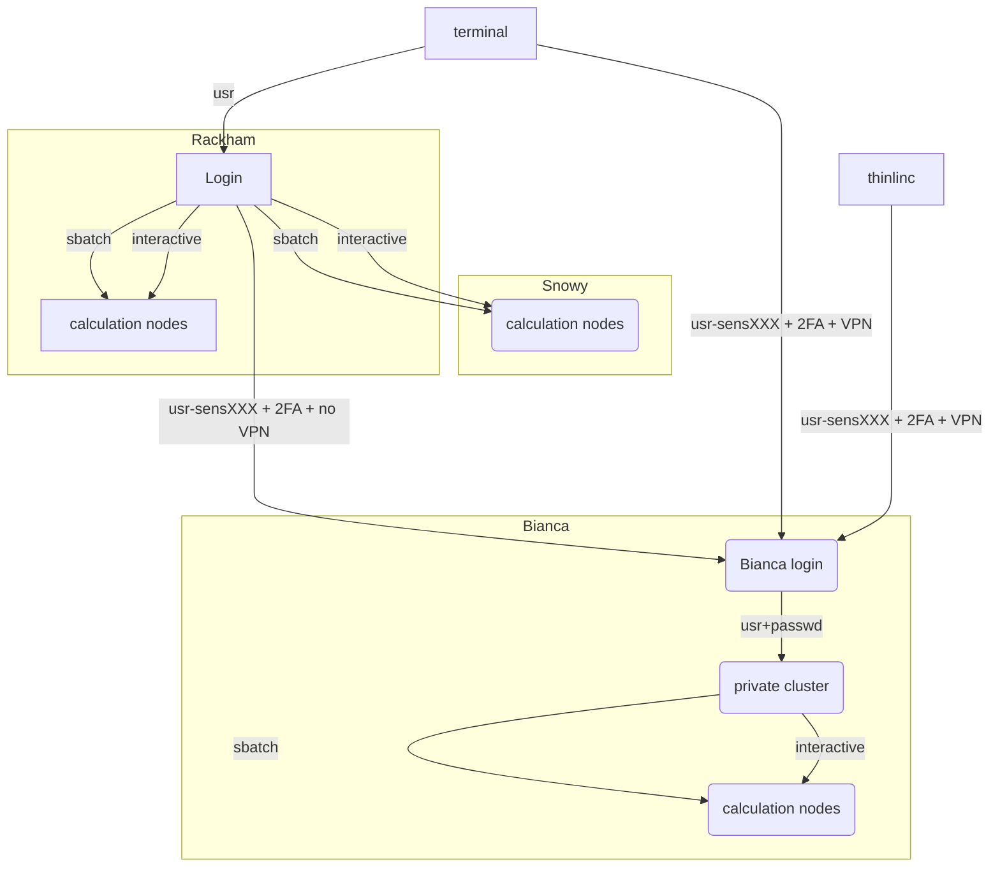

# Introduction to compute nodes

!!! info "Objectives"
    - This is a short introduction in how to reach the calculation nodes
    - We will cover
        - queue system
        - allocation of the compute nodes
        - batch job scripts
        - interactive session
        - job efficiency

## The compute nodes

When you are logged in, you are on a login node.
There are two types of nodes:

Type        |Purpose
------------|--------------------------
Login node  |Start jobs for worker nodes, do easy things
Worker node |Do hard calculations, either from scripts of an interactive session

Bianca contains hundreds of nodes, each of which is isolated from each other and the Internet.

As Bianca is a shared resources, there are rules to use it together in fair way:

 * The login node is only for easy things, such as moving files,
   starting jobs or starting an interactive session
 * The worker nodes are for harder things, such as
   running a script or running an interactive session.



## Slurm, sbatch, the job queue
- Problem: _1000 users, 300 nodes, 5000 cores_


- We need a queue:

- [Slurm](https://slurm.schedmd.com/) is a jobs scheduler

### Choices
- Work interactively with your data or development
    - Run an **Interactive session**
    - ``$ interactive <flags> ...``
- If you don't need any live interaction with your workflow/analysis/simulation
    - Send your job to the slurm job batch (sbatch)
    - `$ sbatch <flags> <program>` or
    - `$ sbatch <job script>`

### Jobs
- Job = what happens during booked time
- Described in a script file or 
- Described in the command-line (priority over script)
- The definitions of a job:
    - Slurm parameters (**flags**)
    - Load software modules
    - (Navigate in file system)
    - Run program(s)
    - (Collect output)
- ... and more

### Slurm parameters
- 1 mandatory setting for jobs:
    - Which compute project? (`-A`)
- 3 settings you really should set:
    - Type of queue? (`-p`)
        - core, node, (for short development jobs and tests: devcore, devel)
    - How many cores? (`-n`)
        - up to 16 for core job
    - How long at most? (`-t`)
- If in doubt:
    - `-p core`
    - `-n 1`
    - `-t 10-00:00:00`

### The queue

- x-axis: cores, one thread per core
- y-axis: time
<br/><br/>
- [Slurm](https://slurm.schedmd.com/) is a jobs scheduler
- Plan your job and but in the slurm job batch (sbatch)
    `sbatch <flags> <program>` or
    `sbatch <job script>`

- Easiest to schedule *single-threaded*, short jobs


- Left: 4 one-core jobs can run immediately (or a 4-core wide job).

  - The jobs are too long to fit in core number 9-13.

- Right: A 5-core job has to wait.

  - Too long to fit in cores 9-13 and too wide to fit in the last cores.

### To think about

- Where should it run? (`-p node` or `-p core`)
- Use a whole node or just part of it?
    - 1 node = 16 cores
    - 1 hour walltime = 16 core hours = expensive
        - Waste of resources unless you have a parallel program or need all the memory, e.g. 128 GB per node
- Default value: core

## Job scripts (batch)

### Interactive jobs
- Most work is most effective as submitted jobs, but e.g. development needs responsiveness
- Interactive jobs are high-priority but limited in `-n` and `-t`
- Quickly give you a job and logs you in to the compute node
- Require same Slurm parameters as other jobs

#### Try interactive

```
$ interactive -A sens2023598 -p core -n 1 -t 10:00
```

- Which node are you on?
  - Logout with `<Ctrl>-D` or `logout`
 
##### Start RStudio
ThinLinc

When logging onto Bianca, you are placed on a login node, which has 2 CPU and a few GB of RAM. This is sufficient for doing some lightweight calculations, but interactive sessions and batch jobs provide access to much more resources and should be requested via the SLURM system.

Such is the case for using RStudio on Bianca. We recommend using at least two cores for this, and to get those resources, you must start an interactive job, for example,

$ interactive -A <project> -n 2 -t hours:minutes:seconds

Once the interactive job has begun, load an RStudio module and an R_packages module and run "rstudio" from there. 
 
#### A simple job script template

```bash
#!/bin/bash

#SBATCH -A sens2023598  # Project ID

#SBATCH -p devcore  # Asking for cores (for test jobs and as opposed to multiple nodes) 

#SBATCH -n 1  # Number of cores

#SBATCH -t 00:10:00  # Ten minutes

#SBATCH -J Template_script  # Name of the job

# go to some directory

cd /proj/sens2023598/
pwd -P

# load software modules

module load bioinfo-tools
module list

# do something

echo Hello world!  

```

## How compute nodes are moved between project clusters

The total job queue, made by putting together job queues of all project clusters, is monitored, and acted upon, by an external program, named meta-scheduler.

In short, this program goes over the following procedure, over and over again:

1. Finds out where all the compute nodes are: on a specific project cluster or yet unallocated.
1. Reads status reports from all compute nodes, about all their jobs, all their compute nodes, and all their active users.
1. Are there unallocated compute nodes for all queued jobs?
1. Otherwise, try to "steal" nodes from project clusters, to get more unallocated compute nodes. This "stealing" is done in two steps: 
    - "drain" a certain node, i.e. disallow more jobs to start on it; 
    - remove the compute node from the project cluster, if no jobs are running on the node.
3. Use all unallocated nodes to create new compute nodes. Jobs with a higher priority get compute nodes first.


### Other Slurm tools

- `squeue` — quick info about jobs in queue
- `jobinfo` — detailed info about jobs
- `finishedjobinfo` — summary of finished jobs
- `jobstats` — efficiency of booked resources
- `bianca_combined_jobinfo`

!!! note "Node types"

    - Bianca has three node types: thin, fat and gpu. 
        - thin being the typical cluster node with 128 GB memory 
        - fat nodes having 256 GB or 512 GB of memory. 
            - You may specify a node with more RAM, by adding the words "-C fat" to your job submission line and thus making sure that you will get at least 256 GB of RAM on each node in your job. 
            - If you absolutely must have more than 256 GB of RAM then you can request to get 512 GB of RAM specifically by adding the words "-C mem512GB" to your job submission line. 
            - Please note that requesting 512 GB can not be combined with requesting GPUs.
        - You may also add "-C gpu" to your submission line to request a GPU node with two NVIDIA A100 40 GB. 
            - Please note that all GPU nodes have 256 GB of RAM, and are thus "fat" as well. All compute nodes in Bianca has 16 CPU cores in total.
    - Please note that there are only 5 nodes with 256 GB of RAM, 2 nodes with 512 GB of RAM and 4 nodes with 2xA100 GPUs. The wait times for these node types are expected to be somewhat longer.
   
!!! note "Some Limits"

    - There is a job wall time limit of ten days (240 hours).
    - We restrict each user to at most 5000 running and waiting jobs in total.
    - Each project has a 30 days running allocation of CPU hours. We do not forbid running jobs after the allocation is over-drafted, but instead allow to submit jobs with a very low queue priority, so that you may be able to run your jobs anyway, if a sufficient number of nodes happens to be free on the system.

## Summary about the Bianca Hardware

- Intel Xeon E5-2630 v3 Huawei XH620 V3 nodes with 128, 256 or 512 GB memory
- GPU nodes with two NVIDIA A100 40GB GPUs each.

**Cores per node:** 16, or on some 128

**Details about the compute nodes**

- Thin nodes
    - 194 compute nodes with 16 cores and a 4TB mechanical drive or 1TB SSD as SCRATCH.
- Fat nodes
    - 74 compute nodes, 256 GB memory
    - 14 compute nodes, 512 GB memory
    - 10 compute nodes, 256 GB memory each and equipped with 2xNVIDIA A100 (40GB) GPUs
- Total number of CPU cores is about 5000
- Login nodes have 2vCPU each and 16GB memory
- Network
    - Dual 10 Gigabit Ethernet for all nodes

**Storage**

- Local disk (scratch): 4 TB 
- Home storage: 32 GB at Castor
- Project Storage: Castor


!!! abstract "Keypoints"
    - You are always in the login node unless you:
        - start an interactive session
        - start a batch job
    - Slurm is a job scheduler
        - add flags to describe your job.
    - There is a job wall time limit of ten days (240 hours).
 
