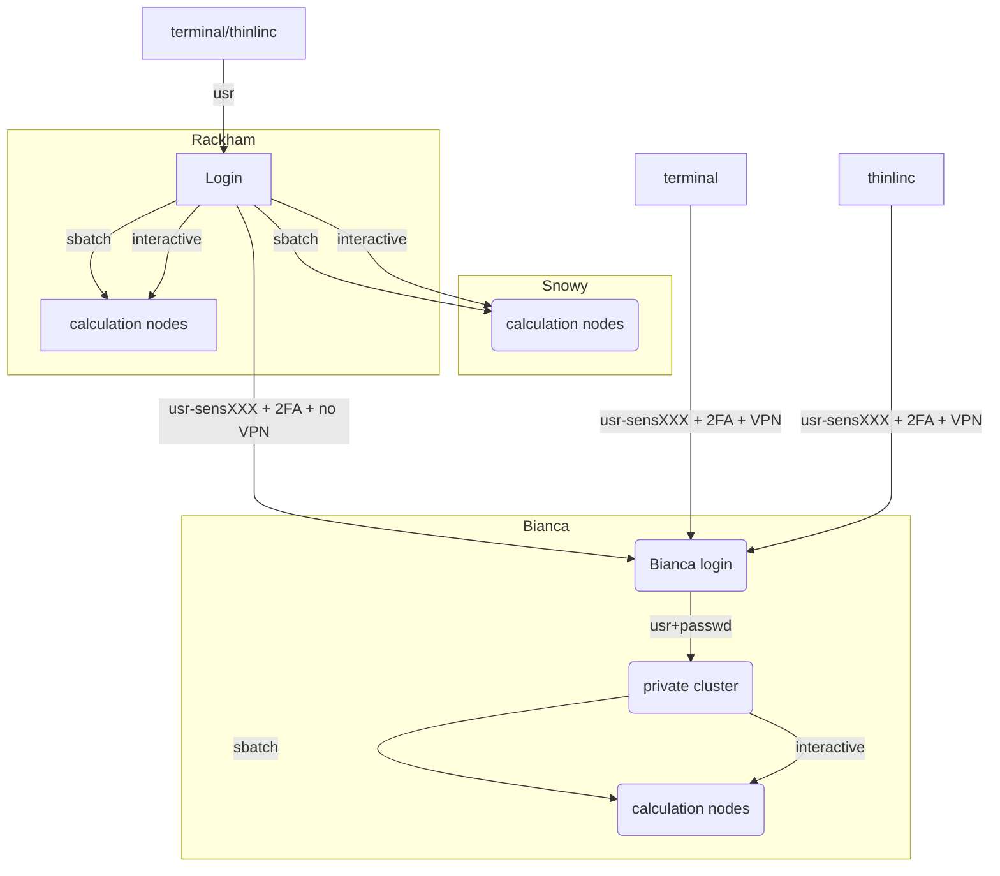
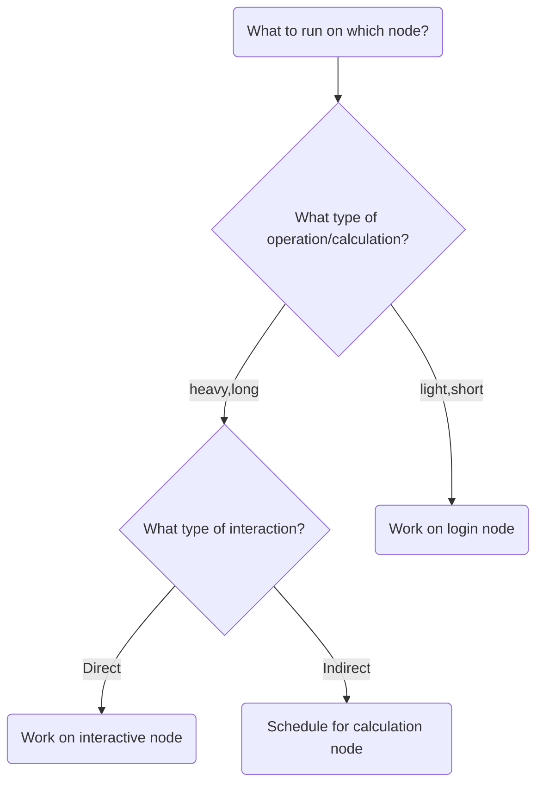

# Introduction to compute nodes

!!! info "Objectives"
    - This is a short introduction in how to reach the calculation/compute/worker nodes
    - We will cover
        - queue system
        - allocation of the compute nodes
        - batch job scripts
        - interactive sessions

???- info "Notes for teachers"

    Teaching goals:

    - The learners demonstrate to have run in interactive 
    - The learners demonstrate to have run batch job
    - The learners demonstrate to have understood when to use batch or interactive 
    - The learners demonstrate to have understood how to plan for jobs

    Schedule (45 minutes):

    - 15 minutes: lecturing
    - 15 minutes type-alongs x 2
    - 10 minutes: exercise+ quiz
    - 5 minutes: discuss answers
    
## Nodes

### One node consists of...


### The compute clusters have this principle


## The compute nodes

When you are logged in, you are on a login node.
There are two types of nodes:

Type        |Purpose
------------|--------------------------
Login node  |Start jobs for worker nodes, do easy things. You share 2 cores and 15 GB RAM with active users within your project
Compute nodes |Do hard calculations, either from scripts of an interactive session

Bianca contains hundreds of nodes, each of which is isolated from each other and the Internet.



!!! info "Bianca standard nodes"

    - **A node:** 128 GB RAM and a 4TB local disk aka "SCRATCH".
    - **Cores per node:** 16
    - **Memory per core:** 7 GB available for you


??? "Summary about the Bianca Hardware"

    - Login nodes (as seen by a user) have virtual 2vCPUs each and 15GB memory
    - Intel Xeon E5-2630 v3 Huawei XH620 V3 nodes
    
    **Details about the compute nodes**
    
    - Intel Xeon E5-2630 v3 Huawei XH620 V3 nodes
    - Thin nodes
        - 194 compute nodes with 16 cores and a 4TB mechanical drive or 1TB SSD as SCRATCH.
    - Fat nodes
        - 74 compute nodes, 256 GB memory
        - 14 compute nodes, 512 GB memory
        - 10 compute nodes, 256 GB memory each and equipped with 2xNVIDIA A100 (40GB) **GPUs**
    - Total number of CPU cores is about 5000
    - Network
        - Dual 10 Gigabit Ethernet for all nodes

    **Storage**

    - Local disk (scratch): 4 TB 
    - Home storage: 32 GB at Castor
    - Project Storage: Castor

## Slurm, sbatch, the job queue
- Problem: _1000 users, 300 nodes, 5000 cores_
- We need a **queue**:

    - [Slurm](https://slurm.schedmd.com/) is a job scheduler
 
- You define **jobs** to be run on the compute nodes and therefore sent to the queue.


### Jobs
- Job = what happens during booked time
- Described in
    - a script file or 
    - the command-line (priority over script)
- The definitions of a job:
    - Slurm parameters (**flags**)
    - Load software modules
    - (Navigate in file system)
    - Run program(s)
    - (Collect output)
    - ... and more


!!! info "Some keywords"
    - A program may run _serially_ and then needs only ONE _compute thread_, which will occupy 1 core, which is a physical unit of the CPU on the node.
        - You should most often just book 1 core. If you require more than 7 GB you can allocate more cores and you will get multiples of 7 GB.
    - A program may run in _parallel_ and then needs either several _threads_ or several _tasks_, both occupying several cores. 
        - If you need all 128 GB RAM (actually 112) or all 16 cores for your job, book a complete node.

      
### Slurm parameters
- 1 mandatory setting for jobs:
    - Which compute project? (`-A`)
- 3 settings you really should set:
    - Type of queue or partition? (`-p`)
        - ``core``  for most jobs and **default**!
        - ``node``  for larger jobs
        - for short development jobs and tests: ``devcore``, ``devel``)
    - How many cores? (`-n`)
        - up to 16 for core job
    - How long at most? (`-t`)
- If in doubt:
    - `-p core`
    - `-n 1`
    - `-t 10-00:00:00`

### The queue

- How does the queue work?

- Let's look graphically at jobs presently running.


- *x-axis: cores, one thread per core*
- *y-axis: time*
<br/><br/>

- We see some holes where we may fit jobs already!
- Let's see which type of jobs that can fit!


<br>

- 4 one-core jobs can run immediately (or a 4-core wide job).*

    - *The jobs are too long to fit at core number 9-13.*


<br>

- A 5-core job has to wait.*

    - *Too long to fit in cores 9-13 and too wide to fit in the last cores.*

- Easiest to schedule *single-threaded*, short jobs


!!! tip

    - You don't see the queue graphically, however.
    - But, overall:
        - short and narrow jobs will start fast
        - test and development jobs can get use of specific development nodes if they are shorter than 1 hour and uses up to two nodes.
        - waste of resources unless you have a parallel program or need all the memory, e.g. 128 GB per node

### Core-hours

- Remember that you are charged CPU-hours according to booked #cores x hours
- Example 1: 60 hours with 2 cores = 120 CPU-hours
- Example 2: 12 hours with a full node = 192 hours
   - Waste of resources unless you have a parallel program using all cores or need all the memory, e.g. 128 GB per node
  
### Choices
- Work interactively with your data or develop or test
    - Run an **Interactive session**
    - ``$ interactive <flags> ...``
- If you _don't_ need any live interaction with your workflow/analysis/simulation
    - Send your job to the slurm job batch (sbatch)
    - `$ sbatch <flags> <program>` or
    - `$ sbatch <job script>`
 


### What kind of compute work are you doing?
- Compute bound
    - you use mainly CPU power
    - does the software support threads or MPI?
       - **Threads/openMP** are rather often supported. **Use several cores!**
       - **MPI** (Message Passing Interface) allows for inter-node jobs but are seldom supported for bioinformatics software. **You could use several nodes!**
- Memory bound
    - if the bottlenecks are allocating memory, copying/duplicating
    - use more cores up to 1 node, perhaps using a "fat" node.

   


!!! admonition "Slurm Cheat Sheet"

    - ``-A``    project number
    - ``-t``    wall time
    - ``-n``    number of cores
    - ``-N``    number of nodes (can only be used if your code is parallelized with MPI)
    - ``-p``    partition
        - ``core`` is default and works for jobs narrower than 16 cores
        - ``node`` can be used if you need the whole node and its memory

## Interactive jobs
- Most work is most effective as submitted jobs, but e.g. development needs responsiveness
- Interactive jobs are high-priority but limited in `-n` and `-t`
- Quickly give you a job and logs you in to the compute node
- Require same Slurm parameters as other jobs
- Log in to compute node
    -  `$ interactive ...`
- Logout with `<Ctrl>-D` or `logout`

- To use an interactive node, in a terminal, type:

```bash
interactive -A [project name] -p core -n [number_of_cores] -t [session_duration]
```

For example:

```bash
interactive -A sens2023598 -p core -n 2 -t 8:0:0
```

This starts an interactive session using project `sens2023598` 
that uses 2 cores and has a maximum duration of 8 hours.

!!! tip
   
    


### Try interactive and run RStudio

!!! note "Copied to [intermediate/rstudio.md](intermediate/rstudio.md)"

    One may consider linking to that page :-)

We recommend using at least two cores for RStudio, and to get those resources, you must should start an interactive job.

!!! example "Type-along"
    Use **ThinLinc**

    - Start **interactive session** on compute node (2 cores)
    
    - If you already have an interactive session going on use that.
   
        - If you don't find it, do
        
          ``$ squeue``
            
        - find your session, ssh to it, like:
        
            ``$ ssh sens2023598-b9``

    - ``$ interactive -A sens2023598 -p devcore -n 2 -t 60:00`` 


    - Once the interactive job has begun you need to load needed modules, even if you had loaded them before in the login node
    - You can check which node you are on?

        `$ hostname`
    
    - Also try: 

        `$ srun hostname`

        - This will give several output lines resembling the number of cores you allocated.
        - How many in this case??
        
    - If the name before ``.bianca.uppmax.uu.se`` is ending with bXX you are on a compute node!
    - The login node has ``sens2023598-bianca``
    - You can also probably see this information in your prompt, like:
        ``[bjornc@sens2023598-b9 ~]$`` 
  
    - Load an RStudio module and an R_packages module (if not loading R you will have to stick with R/3.6.0) and run "rstudio" from there. 

        `$ ml R_packages/4.2.1`
  
        `$ ml RStudio/2022.07.1-554`


    - **Start rstudio**, keeping terminal active (`&`)

      `$ rstudio &`

    - Slow to start?
    - Depends on:
        - number of packages 
        - if you save a lot of data in your RStudio workspace, to be read during start up.

    - **Quit RStudio**!
    - **Log out** from interactive session with `<Ctrl>-D` or `logout` or `exit`
 
 
## Job scripts (batch)

- Batch scripts can be written in any scripting language. We will use BASH
- Make first line be  `#!/bin/bash` in the top line
    - It is good practice to end the line with ``-l`` to reload a fresh environment with no modules loaded.
    - This makes you sure that you don't enable other software or versions that may interfere with what you want to do in the job. 
- Before the job content, add the batch flags starting the lines with the keyword `#SBATCH`, like:
    - ``#SBATCH -t 2:00:00``
    - ``#SBATCH -p core``
    - ``#SBATCH -n 3``
- `#` will be ignored by `bash` and can run as an ordinary bash script
- if running the script with the command `sbatch <script>` the `#SBATCH` lines will be interpreted as slurm flags


### Try batch job

!!! example "Type-along"

    - Write a bash script called ``jobscript.sh`` 
         - You can be in your `~` folder    
    - To make it faster Copy-paste the code below.

!!! tip
   
    


#### A simple job script template

```bash
#!/bin/bash

#SBATCH -A sens2023598  # Project ID

#SBATCH -p devcore  # Asking for cores (for test jobs and as opposed to multiple nodes) 

#SBATCH -n 1  # Number of cores

#SBATCH -t 00:10:00  # Ten minutes

#SBATCH -J Template_script  # Name of the job

# go to some directory

cd /proj/sens2023598/
pwd -P

# load software modules

module load bioinfo-tools
module list

# do something

echo Hello world!  

```

- Run it:

    ``$ sbatch jobscript.sh``

  
!!! tip "Do you need more resources?"

    Do you need more memory than 128 GB or GPU:s?
    
    - ``-C mem256GB`` allocate a fat node with 256 GB RAM
    - ``-C mem512GB`` allocate a fat node with 512 GB RAM
    - ``-C gpu``
    - ``-p node`` must be used when allocating these nodes
    - GPU example asking for a node, using one GPU and 3 CPU cores. TIP: ask always for more than one hour!
        - ``interactive -A <proj> -n 3 -C gpu --gres=gpu:1 -t 01:10:00``

!!! note "Some Limits"

    - There is a job wall time limit of ten days (**240 hours**).
    - We restrict each user to at most 5000 running and waiting jobs in total.
    - Each project has a 30 days running allocation of CPU hours. 
        - We do not forbid running jobs after the allocation is over-drafted
        - Instead allow to submit jobs with a very low queue priority, so that you may be able to run your jobs anyway, if a sufficient number of nodes happens to be free on the system.


## Other Slurm tools

- `squeue` — quick info about jobs in queue
- `jobinfo` — detailed info about jobs
- `finishedjobinfo` — summary of finished jobs
- `jobstats` — efficiency of booked resources
    - use ``eog`` to watch the ``png`` output files
- `bianca_combined_jobinfo`


!!! admonition "See also"

    - [Intermediate workshop material on slurm](https://uppmax.github.io/bianca_workshop/extra/slurm/)


!!! admonition "Slurm Cheat Sheet"

    - ``-A``    project number
    - ``-t``    wall time
    - ``-n``    number of cores
    - ``-N``    number of nodes (can only be used if your code is parallelized with MPI)
    - ``-p``    partition
        - ``core`` is default and works for jobs narrower than 16 cores
        - ``node`` can be used if you need the whole node and its memory
            - must be used when allocating the fat nodes, see below
    - ``-C mem256GB`` allocate a fat node with 256 GB RAM
    - ``-C mem512GB`` allocate a fat node with 512 GB RAM
    - ``-C gpu``

    **Batch jobs**
    
    - Two alternatives
        - ``sbatch <jobscript with all #SBATCH options>``
        - ``sbatch <options that will be prioritized over the options within the jobs script> <jobscript>``
           - can for instance be used if you just want to test with, for instance, fewer cores and shorter time
           - Example: ``sbatch -t  60:00 -p devcore -n 2 job.sh``
          
    **Interactive**
    
    - ``interactive -A <project> <other options if not using default settings>`` 
    - load your modules when session starts

## Exercises

???+ question "You are developing code on Bianca."

    - You write the code line-by-line and schedule a test run after each addition. 
    - However, after each new line, it takes a couple of minutes before you know your code worked yes/no. 
    - How could you develop your code quicker?"

    ??? tip "Answer"
    
        - This is the typical use-case to use an interactive node.
        - One could also consider to develop code on a local computer instead (which uses nonsensitive/simulated/fake testing data) and upload the final code instead.
    
??? question "Start an interactive session"

    The goal of this exercise is to make sure you know how to start an 
    interactive session. 

???- question "Why not always use an interactive session?"

     - Because it is an inefficient use of your core hours.

     - An interactive session means that you use a calculation node with low efficiency: only irregularly you will use such a node to its full
    capacity. 
     - However, the number of core hours are registered as if the node is used at full capacity, as it is *reserved* to be used at that capacity.

???+ question "Which approach is best in the following use cases? Batch jobs or interactive sessions?"

    1.  Long jobs
    1.  Short jobs with interactive "run-time"/interactive user input
    1.  Short jobs without interactive "run-time"/interactive user input
    1.  Test/debugging/developing code
    1.  Playing with and plotting large data

    ??? tip "Answer"

        1.  batch
        1.  interactice
        1.  batch
        1.  interactive
        1.  interactive


???+ question "Submit a Slurm job"

    - Make a batch job to run the [demo](https://uppmax.github.io/bianca_workshop/modules1/#bigger-exercises) "Hands on: Processing a BAM file to a VCF using GATK, and annotating the variants with snpEff". Ask for 2 cores for 1h.
        - You can copy the my_bio_workflow.sh file in ``/proj/sens2023598/workshop/slurm`` to your home folder and make the necessary changes.
    
    ??? tip "Answer"
        - edit a file using you preferred editor, named `my_bio_worksflow.sh`, for example, with the content
        - alternatively copy the ``/proj/sens2023598/workshop/slurm/my_bio_workflow.sh`` file and modify it
          ``cd ~`` 
          ``cp /proj/sens2023598/workshop/slurm/my_bio_workflow.sh .``
          - edit ``my_bio_workflow.sh`` and add the SBATCH commands
        
        ```bash
        #!/bin/bash
        #SBATCH -A sens2023598
        #SBATCH -J workflow
        #SBATCH -t 01:00:00
        #SBATCH -p core
        #SBATCH -n 2


        cd ~
        mkdir -p myworkflow
        cd myworkflow

        module load bioinfo-tools

        # load samtools
        module load samtools/1.17

        # copy and example BAM file
        cp -a /proj/sens2023598/workshop/data/ERR1252289.subset.bam .

        # index the BAM file
        samtools index ERR1252289.subset.bam

        # load the GATK module
        module load GATK/4.3.0.0

        # make symbolic links to the hg38 genomes
        ln -s /sw/data/iGenomes/Homo_sapiens/UCSC/hg38/Sequence/WholeGenomeFasta/genome.* .

        # create a VCF containing inferred variants
        gatk HaplotypeCaller --reference genome.fa --input ERR1252289.subset.bam --intervals chr1:100300000-100800000 --output ERR1252289.subset.vcf

        # use snpEFF to annotate variants
        module load snpEff/5.1
        java -jar $SNPEFF_ROOT/snpEff.jar eff hg38 ERR1252289.subset.vcf > ERR1252289.subset.snpEff.vcf

        # compress the annotated VCF and index it
        bgzip ERR1252289.subset.snpEff.vcf
        tabix -p vcf ERR1252289.subset.snpEff.vcf.gz
        ```

        - make the job script executable
        ```bash
        $ chmod a+x my_bio_workflow.sh
        ```
        
        - submit the job
        ```bash
        $ sbatch my_bio_workflow.sh
        ```
## Links

- [Slurm documentation](https://slurm.schedmd.com/){:target="_blank"}
- [Slurm user guide](https://www.uppmax.uu.se/support/user-guides/slurm-user-guide/){:target="_blank"}
- [New Slurm user guide (needs updates)](https://uppmax.github.io/UPPMAX-documentation/cluster_guides/slurm/){:target="_blank"}
- [Discovering job resource usage with `jobstats`](https://www.uppmax.uu.se/support/user-guides/jobstats-user-guide/){:target="_blank"} 
- [Plotting your core hour usage](https://www.uppmax.uu.se/support/user-guides/plotting-your-core-hour-usage/){:target="_blank"} 


!!! abstract "Keypoints"
    - You are always in the login node unless you:
        - start an interactive session to do development or hands-on work
        - start a batch job to run jobs not needing any manual input
    - Slurm is a job scheduler
        - add flags to describe your job.
    - There is a job wall time limit of ten days (240 hours).
 
