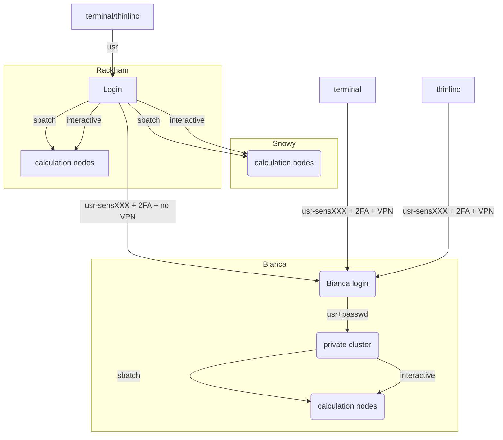

# Introduction to compute nodes

!!! info "Objectives"
    - This is a short introduction in how to reach the calculation/compute/worker nodes
    - We will cover
        - queue system
        - allocation of the compute nodes
        - batch job scripts
        - interactive sessions

???- info "Notes for teachers"

    Teaching goals:

    - The learners demonstrate to have run in interactive 
    - The learners demonstrate to have run batch job
    - The learners demonstrate to have understood when to use batch or interactive 
    - The learners demonstrate to have understood how to plan for jobs

    Schedule (45 minutes):

    - 15 minutes: lecturing
    - 15 minutes type-alongs x 2
    - 10 minutes: exercise+ quiz
    - 5 minutes: discuss answers
    
 ## The compute nodes

When you are logged in, you are on a login node.
There are two types of nodes:

Type        |Purpose
------------|--------------------------
Login node  |Start jobs for worker nodes, do easy things. You share 2 cores with active users within your project
Worker nodes |Do hard calculations, either from scripts of an interactive session

Bianca contains hundreds of nodes, each of which is isolated from each other and the Internet.



## Slurm, sbatch, the job queue
- Problem: _1000 users, 300 nodes, 5000 cores_
- We need a queue:

    - [Slurm](https://slurm.schedmd.com/) is a job scheduler


### Jobs
- Job = what happens during booked time
- Described in a script file or 
- Described in the command-line (priority over script)
- The definitions of a job:
    - Slurm parameters (**flags**)
    - Load software modules
    - (Navigate in file system)
    - Run program(s)
    - (Collect output)
- ... and more

### Slurm parameters
- 1 mandatory setting for jobs:
    - Which compute project? (`-A`)
- 3 settings you really should set:
    - Type of queue? (`-p`)
        - core, node, (for short development jobs and tests: devcore, devel)
    - How many cores? (`-n`)
        - up to 16 for core job
    - How long at most? (`-t`)
- If in doubt:
    - `-p core`
    - `-n 1`
    - `-t 10-00:00:00`

## The queue


- *x-axis: cores, one thread per core*
- *y-axis: time*
<br/><br/>

- Easiest to schedule *single-threaded*, short jobs


<br>

- *Left: 4 one-core jobs can run immediately (or a 4-core wide job).*

    - *The jobs are too long to fit in core number 9-13.*

- *Right: A 5-core job has to wait.*

    - *Too long to fit in cores 9-13 and too wide to fit in the last cores.*

### To think about

- Where should it run? (`-p node` or `-p core`)
- Use a whole node or just part of it?
    - 1 node = 16 cores
    - 1 hour walltime = 16 core hours = expensive
        - Waste of resources unless you have a parallel program or need all the memory, e.g. 128 GB per node
- Default value: core
  
!!! Slurm Cheat Sheet

    - ``-A``    project number
    - ``-t``    wall time
    - ``-n``    number of cores
    - ``-N``    number of nodes (can only be used if your code is parallelized with MPI)
    - ``-p``    partition
       - ``core`` is default and works for jobs narrower than 16 cores
       - ``node`` can be used if you need the whole node and its memory
          - must be used when allocating the fat nodes, see below
    - ``-C mem256GB`` allocate a fat node with 256 GB RAM
    - ``-C mem512GB`` allocate a fat node with 512 GB RAM
    - ``-C gpu --gres=gpu:1`` allocate one GPU (also define number of CPU cores with ``-n 3 `` or similar)
    - ``-C gpu --gres=gpu:2`` allocate two GPU:s (also define number of CPU cores with ``-n 3 `` or similar)

### Choices
- Work interactively with your data or develop or test
    - Run an **Interactive session**
    - ``$ interactive <flags> ...``
- If you don't need any live interaction with your workflow/analysis/simulation
    - Send your job to the slurm job batch (sbatch)
    - `$ sbatch <flags> <program>` or
    - `$ sbatch <job script>`

 ## Interactive jobs
- Most work is most effective as submitted jobs, but e.g. development needs responsiveness
- Interactive jobs are high-priority but limited in `-n` and `-t`
- Quickly give you a job and logs you in to the compute node
- Require same Slurm parameters as other jobs
- Log in to compute node
    -  `$ interactive ...`
- Logout with `<Ctrl>-D` or `logout`

### Try interactive and run RStudio

We recommend using at least two cores for RStudio, and to get those resources, you must should start an interactive job.

!!! example "Type-along"
    Use **ThinLinc**

    - Start **interactive session** on compute node (2 cores)
    - If you already have an interactive session going on use that.
        - If you don't find it, do
        
            ``$ squeue``
            
        - find your session, ssh to it, like:
        
            ``$ ssh sens2023598-b9``

    - ``$ interactive -A sens2023598 -p core -n 2 -t 60:00`` 


    - Once the interactive job has begun you need to load needed modules, even if you had loaded them before in the login node
    - You can check which node you are on?

        `$ hostname`
    
    - Also try: 

        `$ srun hostname`
  
    - If the name before ``.bianca.uppmax.uu.se`` is ending with bXX you are on a compute node!
    - The login node has ``sens2023598-bianca``
    - You can also probably see this information in your prompt, like:
        ``[bjornc@sens2023598-b9 ~]$`` 
  
    - Load an RStudio module and an R_packages module (if not loading R you will have to stick with R/3.6.0) and run "rstudio" from there. 

        `$ ml R_packages/4.2.1`
  
        `$ ml RStudio/2022.07.1-554`


    - **Start rstudio**, keeping terminal active (`&`)

      `$ rstudio &`

    - Slow to start?
    - Depends on:
        - number of packages 
        - if you save a lot of data in your RStudio workspace, to be read during start up.

    - **Quit RStudio**!
    - **Log out** from interactive session with `<Ctrl>-D` or `logout` or `exit`
 
 
## Job scripts (batch)

- Write a bash script called ``jobscript.sh`` 
    - You can be in your `~` folder    
- Make first line be  `#!/bin/bash` in the top line
- Add also before the rest of the commands the the keywords `#SBATCH`
- `#` will be ignored by `bash` and can run as an ordinary bash script
- if running the script with the command `sbatch <script>` the `#SBATCH` lines will be interpreted as slurm flags

#### A simple job script template

```bash
#!/bin/bash

#SBATCH -A sens2023598  # Project ID

#SBATCH -p devcore  # Asking for cores (for test jobs and as opposed to multiple nodes) 

#SBATCH -n 1  # Number of cores

#SBATCH -t 00:10:00  # Ten minutes

#SBATCH -J Template_script  # Name of the job

# go to some directory

cd /proj/sens2023598/
pwd -P

# load software modules

module load bioinfo-tools
module list

# do something

echo Hello world!  

```

- Run it:

    ``$ sbatch jobscript.sh``

  
!!! note "Node types"

    - Bianca has three node types: thin, fat and gpu. 
        - thin being the typical cluster node with 128 GB memory 
        - fat nodes having 256 GB or 512 GB of memory. 
            - You may specify a node with more RAM, by adding the words `-C fat` to your job submission line and thus making sure that you will get at least 256 GB of RAM on each node in your job. 
            - If you absolutely must have more than 256 GB of RAM then you can request to get 512 GB of RAM specifically by adding the words `-C mem512GB` to your job submission line. 
            - Please note that requesting 512 GB can not be combined with requesting GPUs.
        - You may also add `-C gpu` to your submission line to request a GPU node with two NVIDIA A100 40 GB. 
            - Please note that all GPU nodes have 256 GB of RAM, and are thus "fat" as well. All compute nodes in Bianca has 16 CPU cores in total.
    - Please note that there are only 5 nodes with 256 GB of RAM, 2 nodes with 512 GB of RAM and 4 nodes with 2xA100 GPUs. The wait times for these node types are expected to be somewhat longer.
   
!!! note "Some Limits"

    - There is a job wall time limit of ten days (**240 hours**).
    - We restrict each user to at most 5000 running and waiting jobs in total.
    - Each project has a 30 days running allocation of CPU hours. We do not forbid running jobs after the allocation is over-drafted, but instead allow to submit jobs with a very low queue priority, so that you may be able to run your jobs anyway, if a sufficient number of nodes happens to be free on the system.

??? "Summary about the Bianca Hardware"

    - Intel Xeon E5-2630 v3 Huawei XH620 V3 nodes with 128, 256 or 512 GB memory
    - GPU nodes with two NVIDIA A100 40GB GPUs each.

    **Cores per node:** 16, or on some 128

    **Details about the compute nodes**

    - Thin nodes
        - 194 compute nodes with 16 cores and a 4TB mechanical drive or 1TB SSD as SCRATCH.
    - Fat nodes
        - 74 compute nodes, 256 GB memory
        - 14 compute nodes, 512 GB memory
        - 10 compute nodes, 256 GB memory each and equipped with 2xNVIDIA A100 (40GB) GPUs
    - Total number of CPU cores is about 5000
    - Login nodes have 2vCPU each and 16GB memory
    - Network
        - Dual 10 Gigabit Ethernet for all nodes

    **Storage**

    - Local disk (scratch): 4 TB 
    - Home storage: 32 GB at Castor
    - Project Storage: Castor

## Other Slurm tools

- `squeue` — quick info about jobs in queue
- `jobinfo` — detailed info about jobs
- `finishedjobinfo` — summary of finished jobs
- `jobstats` — efficiency of booked resources
    - use ``eog`` to watch the ``png`` output files
- `bianca_combined_jobinfo`


## What kind of work are you doing?
- Compute bound
    - you use mainly CPU power (more cores can help)
- Memory bound
    - if the bottlenecks are allocating memory, copying/duplicating

!!! "See also"

    - [Intermediate workshop material on slurm](https://uppmax.github.io/bianca_workshop/extra/slurm/)


!!! "Slurm Cheat Sheet"

    - ``-A``    project number
    - ``-t``    wall time
    - ``-n``    number of cores
    - ``-N``    number of nodes (can only be used if your code is parallelized with MPI)
    - ``-p``    partition
      - ``core`` is default and works for jobs narrower than 16 cores
      - ``node`` can be used if you need the whole node and its memory
        - must be used when allocating the fat nodes, see below
    - ``-C mem256GB`` allocate a fat node with 256 GB RAM
    - ``-C mem512GB`` allocate a fat node with 512 GB RAM
    - ``-C gpu``

    **Batch jobs**
    - Two alternatives
      - ``sbatch <jobscript with all #SBATCH options>``
      -`` sbatch <options that will be prioritized over the options within the jobs script> <jobscript>``
         - can for instance be used if you just want to test with, for instance, fewer cores and shorter time
         - Example: ``sbatch -t  60:00 -p devcore -n 2 job.sh``
    ** Interactive
    - ``interactive -A <project> <other options if not using default settings>`` 
    - load your modules when session starts

!!! Quiz

    - Q1: Which approach is best in the following use cases? Batch jobs or interactive sessions?

         A. Long jobs
         B. Short jobs with interactive "run-time"/interactive user input
         C. Short jobs without interactive "run-time"/interactive user input
         D. Test/debugging/developing code
         E. Playing with and plotting large data

    ???- Answers

         A. batch
         B. interactice
         C: batch
         D: interactive
         E. interactive
        

## Extra exercise (if time allows)

???+ question "Submit a Slurm job"

    - Make a batch job to run the [demo](https://uppmax.github.io/bianca_workshop/modules1/#bigger-exercises) "Hands on: Processing a BAM file to a VCF using GATK, and annotating the variants with snpEff". Ask for 2 cores for 1h.
        - You can copy the my_bio_workflow.sh file in ``/proj/sens2023598/workshop/slurm`` to your home folder and make the necessary changes.
    
    ??? tip "Answer"
        - edit a file using you preferred editor, named `my_bio_worksflow.sh`, for example, with the content
        - alternatively copy the ``/proj/sens2023598/workshop/slurm/my_bio_workflow.sh`` file and modify it
          ``cd ~`` 
          ``cp /proj/sens2023598/workshop/slurm/my_bio_workflow.sh .``
          - edit ``my_bio_workflow.sh`` and add the SBATCH commands
        
        ```bash
        #!/bin/bash
        #SBATCH -A sens2023598
        #SBATCH -J workflow
        #SBATCH -t 01:00:00
        #SBATCH -p core
        #SBATCH -n 2


        cd ~
        mkdir -p myworkflow
        cd myworkflow

        module load bioinfo-tools

        # load samtools
        module load samtools/1.17

        # copy and example BAM file
        cp -a /proj/sens2023598/workshop/data/ERR1252289.subset.bam .

        # index the BAM file
        samtools index ERR1252289.subset.bam

        # load the GATK module
        module load GATK/4.3.0.0

        # make symbolic links to the hg38 genomes
        ln -s /sw/data/iGenomes/Homo_sapiens/UCSC/hg38/Sequence/WholeGenomeFasta/genome.* .

        # create a VCF containing inferred variants
        gatk HaplotypeCaller --reference genome.fa --input ERR1252289.subset.bam --intervals chr1:100300000-100800000 --output ERR1252289.subset.vcf

        # use snpEFF to annotate variants
        module load snpEff/5.1
        java -jar $SNPEFF_ROOT/snpEff.jar eff hg38 ERR1252289.subset.vcf > ERR1252289.subset.snpEff.vcf

        # compress the annotated VCF and index it
        bgzip ERR1252289.subset.snpEff.vcf
        tabix -p vcf ERR1252289.subset.snpEff.vcf.gz
        ```

        - make the job script executable
        ```bash
        $ chmod a+x my_bio_workflow.sh
        ```
        
        - submit the job
        ```bash
        $ sbatch my_bio_workflow.sh
        ```
## Links

- [Slurm documentation](https://slurm.schedmd.com/){:target="_blank"}
- [Slurm user guide](https://www.uppmax.uu.se/support/user-guides/slurm-user-guide/){:target="_blank"}
- [Discovering job resource usage with `jobstats`](https://www.uppmax.uu.se/support/user-guides/jobstats-user-guide/){:target="_blank"} 
- [Plotting your core hour usage](https://www.uppmax.uu.se/support/user-guides/plotting-your-core-hour-usage/){:target="_blank"} 


!!! abstract "Keypoints"
    - You are always in the login node unless you:
        - start an interactive session to do development or hands-on work
        - start a batch job to run jobs not needing any manual input
    - Slurm is a job scheduler
        - add flags to describe your job.
    - There is a job wall time limit of ten days (240 hours).
 
