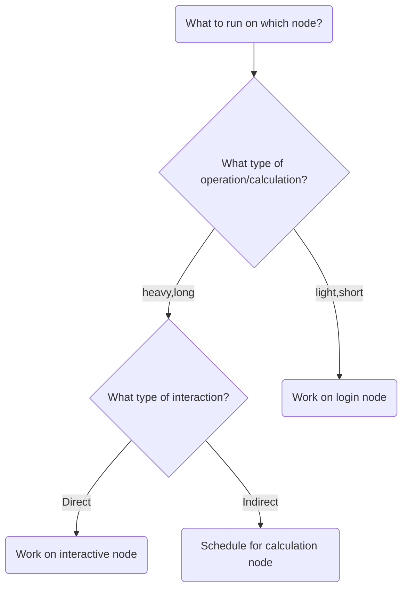

# Introduction to compute nodes

!!! info "Learning objectives"

    - This is a short introduction in how to reach the calculation/compute/worker nodes
    - The learners should be able to:
        - Run simple jobs in the batch system
        - Run interactively on compute nodes
        - See when to run interactive and when to use batch system
        - Check the progress of their jobs

???- info "Notes for teachers"

    Teaching goals:

    - The learners demonstrate to have run in interactive
    - The learners demonstrate to have run batch job
    - The learners demonstrate to have understood when to use batch or interactive
    - The learners demonstrate to have understood how to plan for jobs

    Schedule (45 minutes):

    - 10 minutes: lecturing
    - 15 minutes type-alongs x 2
    - 20 minutes: exercise + quiz
    - 5 minutes: discuss answers

## Nodes

- Bianca contains hundreds of nodes.
- Each node is like a ordinary computer without a screen

### One Bianca node consists of 16 cores

- Each core can do work more or less independently


### Our compute clusters (like Bianca) have this principle


### The compute nodes

There are two types of nodes:

Type        |Purpose
------------|--------------------------
Login node  | Start jobs for worker nodes, do easy things. You share 2 cores and 15 GB RAM with active users within your Sens project
Compute nodes | Do hard calculations, either from scripts of an interactive session


## Slurm schedules and allocates compute resources for you

- Problem: _1000 users, 300 nodes, 5000 cores_
- We need a **queue** system:

    - [Slurm](https://slurm.schedmd.com/) is a job scheduler

### Two ways to allocate compute resources

- Work **interactively** with your data or develop or test
    - Run an **Interactive session**
    - ``$ interactive <flags> ...``
    - Typical use cases:
        - Run RStudio
- If you _don't_ need any live interaction with your workflow/analysis/simulation
    - Send your job to the slurm job **batch** (sbatch)
    - `$ sbatch <flags> <program>` or
    - `$ sbatch <job script>`



### Allocation flags/Slurm parameters

- 1 mandatory setting for jobs:
    - Which compute project? (`-A`)
    - Example: ``interactive -A sens2023598``
- 3 settings you really should set:
    - Type of queue or partition? (`-p`)
        - ``core``  for most jobs and **default**!
        - ``node``  for larger jobs
        - for short development jobs and tests: ``devcore``, ``devel``)
        - Example: ``interactive -A sens2023598 -p core``
    - How many cores? (`-n`)
        - up to 16 for core job (default 1)
        - Example: ``interactive -A sens2023598 -p core -n 4``
    - How long at most? (`-t`)
        - Example: ask for 30 minutes of 4 cores
            - ``interactive -A sens2023598 -p core -n 4 -t 0:30:0``
        - Default is 1 min so set it if the job requires more time!
- If in doubt:
    - `-p core`
    - `-n 1`, for Rstudio `-n 2`
    - `-t 10-00:00:00` (10 days)

!!! admonition "Slurm Cheat Sheet"

    - ``-A``    project number
    - ``-t``    wall time          (default 1 min)
    - ``-n``    number of cores    (default 1)
    - ``-p``    partition
        - ``core`` is default and works for jobs narrower than 16 cores
        - ``node`` can be used if you need the whole node and its memory
    - ``-N``    number of nodes (only needed if your code is parallelized with MPI and with ``-p node´´)

### Jobs

- Job = what happens during booked time
- In interactive session = what you do "live"
- Otherwise (batch described in)
    - a script file or
    - the command-line (priority over script)
- Content of batch script :
    - Slurm parameters (**flags**)
    - Load software modules
    - (Navigate in file system)
    - Run program(s)
    - (Collect output)
    - ... and more

!!! admonition "Slurm Cheat Sheet"

    - ``-A``    project number
    - ``-t``    wall time
    - ``-n``    number of cores
    - ``-N``    number of nodes (can only be used if your code is parallelized with MPI)
    - ``-p``    partition
        - ``core`` is default and works for jobs narrower than 16 cores
        - ``node`` can be used if you need the whole node and its memory

### The queue

!!! tip

    - You don't see the queue graphically.
    - But, overall:
        - short and narrow jobs will start fast
        - test and development jobs can get use of specific development nodes if they are shorter than 1 hour and uses up to two nodes.
        - waste of resources unless you have a parallel program or need all the memory, e.g. 128 GB per node

!!! note "See also"

    [More about the queue](slurm_intro.md#more-about-the-queue)

### Core-hours

- Remember that you are charged CPU-hours according to booked #cores x hours
- Example 1: 60 hours with 2 cores = 120 CPU-hours
- Example 2: 12 hours with a full node = 192 hours
    - Waste of resources unless you have a parallel program using all cores or need all the memory, e.g. 128 GB per node


## Interactive jobs

- Most work is most effective as submitted jobs (batch), but e.g. development needs responsiveness
- Interactive jobs are high-priority but limited in `-n` and `-t`
- Quickly gives you a job and logs you in to the compute node
- Require same Slurm parameters as other jobs
- Log in to compute node
    - `$ interactive -A <sensXXXXXXX>...`
- Log out with `<Ctrl>-D` or `logout`

- To use an interactive node, in a terminal, type:

```bash
interactive -A [project name] -p core -n [number_of_cores] -t [session_duration]
```

For example:

```bash
interactive -A sens2023598 -p core -n 2 -t 8:0:0
```

This starts an interactive session using project `sens2023598`
that uses 2 cores and has a maximum duration of 8 hours.

!!! tip

    

### Try interactive and run RStudio

We recommend using at least two cores for [RStudio](http://docs.uppmax.uu.se/software/rstudio/), and to get those resources, you must should start an interactive job.

!!! example "Type-along"

    Use **ThinLinc**

    - Start **interactive session** on compute node (2 cores)

    - If you already have an interactive session going on use that.

        - If you don't find it, do

          ``$ squeue``

        - find your session, ssh to it, like:

            ``$ ssh sens2023598-b9``

    - ``$ interactive -A sens2023598 -p devcore -n 2 -t 60:00``

    - Once the interactive job has begun you need to load needed modules, even if you had loaded them before in the login node
    - You can check which node you are on?

        `$ hostname`

    - Also try:

        `$ srun hostname`

        - This will give several output lines resembling the number of cores you allocated.
        - How many in this case??

    - If the name before ``.bianca.uppmax.uu.se`` is ending with bXX you are on a compute node!
    - The login node has ``sens2023598-bianca``
    - You can also probably see this information in your prompt, like:
        ``[bjornc@sens2023598-b9 ~]$``

    - Load an RStudio module and an R_packages module (if not loading R you will have to stick with R/3.6.0) and run "rstudio" from there.

        `$ ml RStudio/2023.06.2-561`

    - **Start rstudio**, keeping terminal active (`&`)

      `$ rstudio &`

    - Slow to start?
    - Depends on:
        - number of packages
        - if you save a lot of data in your RStudio workspace, to be read during start up.

    - **Quit RStudio**!
    - **Log out** from interactive session with `<Ctrl>-D` or `logout` or `exit`

!!! tip

    - (Re-)load modules here in an interactive session
    - Check your working directory, ``pwd``. You are not automatically coming to ``~`` or you project folder

## Job scripts (batch)

- Batch scripts can be written in any scripting language. We will use BASH
- Make first line be  `#!/bin/bash` in the top line
    - It is good practice to end the line with ``-l`` to reload a fresh environment with no modules loaded.
    - This makes you sure that you don't enable other software or versions that may interfere with what you want to do in the job.
- Before the job content, add the batch flags starting the lines with the keyword `#SBATCH`, like:
    - ``#SBATCH -t 0:30:00``
    - ``#SBATCH -p core``
    - ``#SBATCH -n 3``
- `#` will be ignored by `bash` and can run as an ordinary bash script
- if running the script with the command `sbatch <script>` the `#SBATCH` lines will be interpreted as slurm flags


### Try batch job

!!! example "Type-along"

    - Write a bash script called ``jobscript.sh``
        - You can be in your `~` folder
    - To make it faster Copy-paste the code below.

!!! tip

    


#### A simple job script template

```bash
#!/bin/bash -l

#SBATCH -A sens2023598  # Project ID

#SBATCH -p devcore  # Asking for cores (for test jobs and as opposed to multiple nodes)

#SBATCH -n 1  # Number of cores

#SBATCH -t 00:10:00  # Ten minutes

#SBATCH -J Template_script  # Name of the job

# go to some directory

cd /proj/sens2023598/
pwd -P

# load software modules
module load bioinfo-tools
module list

# do something
hostname
echo Hello world!
echo Using the srun command: Running the same commands using the available cores
srun hostname
srun echo Hello world!
```

- Run it:

    - ``$ sbatch jobscript.sh``

- We _can_ modify the slurm parameters for tests from the command-line.

    - ``$ sbatch -n 4 jobscript.sh``

## Exercises

???+ question "You are developing code on Bianca."

    - You write the code line-by-line and schedule a test run after each addition.
    - However, after each new line, it takes a couple of minutes before you know your code worked yes/no.
    - How could you develop your code quicker?"

    ??? tip "Answer"

        - This is the typical use-case to use an interactive node.
        - One could also consider to develop code on a local computer instead (which uses nonsensitive/simulated/fake testing data) and upload the final code instead.

??? question "Start an interactive session"

    The goal of this exercise is to make sure you know how to start an interactive session.

???- question "Why not always use an interactive session?"

    - Because it is an inefficient use of your core hours.
    - An interactive session means that you use a calculation node with low efficiency: only irregularly you will use such a node to its full
    capacity.
    - However, the number of core hours are registered as if the node is used at full capacity, as it is _reserved_ to be used at that capacity.

???+ question "Which approach is best in the following use cases? Batch jobs or interactive sessions?"

    1. Long jobs
    1. Short jobs with interactive "run-time"/interactive user input
    1. Short jobs without interactive "run-time"/interactive user input
    1. Test/debugging/developing code
    1. Playing with and plotting large data

    ??? tip "Answer"

        1. batch
        1. interactice
        1. batch
        1. interactive
        1. interactive

???+ question "Submit a Slurm job"

    - Make a batch job to run the [demo](https://uppmax.github.io/bianca_workshop/modules/#bigger-exercises) "Hands on: Processing a BAM file to a VCF using GATK, and annotating the variants with snpEff". Ask for 2 cores for 1h.
        - You can copy the my_bio_workflow.sh file in ``/proj/sens2023598/workshop/slurm`` to your home folder and make the necessary changes.

    ??? tip "Answer"

        - edit a file using you preferred editor, named `my_bio_worksflow.sh`, for example, with the content
        - alternatively copy the ``/proj/sens2023598/workshop/slurm/my_bio_workflow.sh`` file and modify it
          ``cd ~``
          ``cp /proj/sens2023598/workshop/slurm/my_bio_workflow.sh .``
        - edit ``my_bio_workflow.sh`` and add the SBATCH commands

        ```bash
        #!/bin/bash
        #SBATCH -A sens2023598
        #SBATCH -J workflow
        #SBATCH -t 01:00:00
        #SBATCH -p core
        #SBATCH -n 2

        cd ~
        mkdir -p myworkflow
        cd myworkflow

        module load bioinfo-tools

        # load samtools
        module load samtools/1.17

        # copy and example BAM file
        cp -a /proj/sens2023598/workshop/data/ERR1252289.subset.bam .

        # index the BAM file
        samtools index ERR1252289.subset.bam

        # load the GATK module
        module load GATK/4.3.0.0

        # make symbolic links to the hg38 genomes
        ln -s /sw/data/iGenomes/Homo_sapiens/UCSC/hg38/Sequence/WholeGenomeFasta/genome.* .

        # create a VCF containing inferred variants
        gatk HaplotypeCaller --reference genome.fa --input ERR1252289.subset.bam --intervals chr1:100300000-100800000 --output ERR1252289.subset.vcf

        # use snpEFF to annotate variants
        module load snpEff/5.1
        java -jar $SNPEFF_ROOT/snpEff.jar eff hg38 ERR1252289.subset.vcf > ERR1252289.subset.snpEff.vcf

        # compress the annotated VCF and index it
        bgzip ERR1252289.subset.snpEff.vcf
        tabix -p vcf ERR1252289.subset.snpEff.vcf.gz
        ```

        - make the job script executable

        ```bash
        $ chmod a+x my_bio_workflow.sh
        ```

        - submit the job

        ```bash
        $ sbatch my_bio_workflow.sh
        ```

## Links

- [Official slurm documentation](https://slurm.schedmd.com/){:target="_blank"}
- [New Slurm user guide (needs updates)](https://uppmax.github.io/UPPMAX-documentation/cluster_guides/slurm/){:target="_blank"}
- [Discovering job resource usage with `jobstats`](http://docs.uppmax.uu.se/software/jobstats/){:target="_blank"}
- [Plotting your core hour usage](http://docs.uppmax.uu.se/software/projplot/){:target="_blank"}
- [The job scheduler graphically](https://docs.uppmax.uu.se/cluster_guides/slurm_scheduler/){:target="_blank"}

!!! example "Discussion"

    - Any further thoughts?

!!! abstract "Keypoints"

    - Slurm is a job scheduler to handle the compute nodes
        - add flags to describe your job.
    - You are always in the login node unless you:
        - start an interactive session to do development or hands-on work
        - start a batch job to run jobs not needing any manual input
    - There is a job wall time limit of ten days (240 hours).
