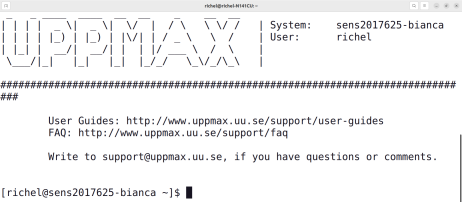

# Starting an interactive node

???- info "Note to teachers"

    We teach `interactive` 
    (over [`salloc`](https://slurm.schedmd.com/salloc.html)) 
    as it is recommended by the UPPMAX system experts.

## Exercises

Read the UPPMAX documentation [here](https://uppmax.github.io/UPPMAX-documentation/cluster_guides/start_interactive_node_on_bianca),
then do these exercises.

???- question "Exercise: Start an interactive session"

    The goal of this exercise is to make sure you know how to start an 
    interactive session. 

???- question "Why not always use an interactive session?"

    Because it is an inefficient use of your core hours.

    An interactive session means that you use a calculation node with low
    efficiency: only irregularly you will use such a node to its full
    capacity. 
    However, the number of core hours are registered as if the node is used
    at full capacity, as it is *reserved* to be used at that capacity.

???- question "How to find out if you are on a login or interactive node"

    In the terminal, type `hostname`

    - the login node has `[project]-bianca`, where `[project]` is the name of the project, e.g. `sens2023598`
    - the interactive node has `b[number]` in it, where `[number]` is the compute node number

