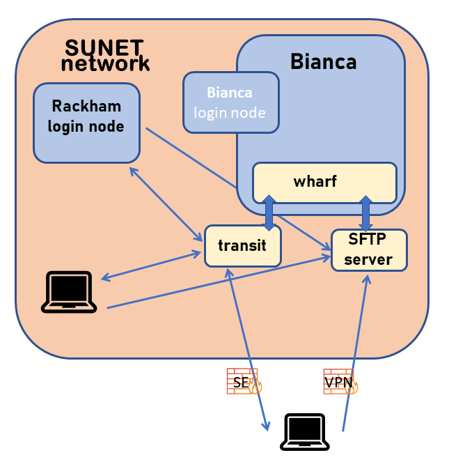
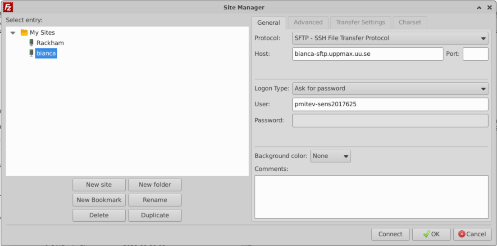

# Introduction to transfer

!!! info "Objectives"

    We'll go through the methods to transfer files

    - wharf
    - transit server
    - rsync, scp/sftp
    - pros/cons of different solutions

!!! warning

    It is important to keep the entire chain of transferring the data secure

## How does it work?



### The `wharf`

!!! info "`wharf` is a harbour dock"

    - The `wharf` area can be reached from both Bianca and any other place on Bianca.
    - Therefore, it serves as a bridge between Internet and Bianca.

## Data transfers

- <http://docs.uppmax.uu.se/cluster_guides/transfer_bianca/>
    - section 3: Transfer files to and from Bianca

### The `wharf` location on Bianca

- The path to this folder, once you are logged into your project's cluster, is:

    `/proj/<projid>/nobackup/wharf/<username>/<username>-<projid>`
E.g.
    `/proj/sens2023598/nobackup/wharf/myuser/myuser-sens2023598`

- To transfer data from Bianca, copy the files you want to transfer here.
- To get the files transferred to the `wharf` area from outside, move the files to you project folder or home folder.

- Please note that in the `wharf` you only have access to upload your files to the directory that is named:
   `<username>-<projid>`
   e.g.
   `myuser-sens2023598`

## Methods

- GUI sftp clients
- Using standard command line sftp client
- Transit Server from/to Rackham
- Mounting the wharf on your local computer

## GUI sftp clients

!!! info "A step-by-step explanation can be found [here](file_transfer_using_gui.md)"

- Please notice that **SFTP is NOT the same as SCP**.

Be sure to really use a SFTP client -- not just a SCP client.

- Also be aware that many SFTP clients use reconnects (with a cached version of your password). This will not work for Bianca, because of the second factor authentication! Other clients try to use multiple connections with the same password, which will fail as well.

- So for example with the command line SFTP client LFTP, you need to "set net:connection_limit 1". LFTP may also defer the actual connection until it's really required unless you end your connect URL with a path.

- An example command line for LFTP would be

`lftp sftp://<username>-<projname>@bianca-sftp.uppmax.uu.se/<username>-<projname>/`

### WinSCP (Windows)

- Connect from local computer


### Filezilla (Linux/MacOS/Windows)

- Asks for password every time you transfer files
- Connect from local computer




## Using standard sftp client (command line)

<http://docs.uppmax.uu.se/software/bianca_file_transfer_using_sftp/>

```bash
$ sftp -q <username>-<projid>@bianca-sftp.uppmax.uu.se
```

Ex.

```bash
$ sftp -q myuser-sens2023598@bianca-sftp.uppmax.uu.se
```

The `-q` flag is to be quiet (not showing the banner intended to help someone trying to ``ssh`` to the host), if your client does not support it, you can just skip it.

Use your normal UPPMAX password directly followed by
the six digits from the second factor application.

Ex. if your password is "VerySecret" and the second factor code is 123 456 you would type VerySecret123456 as the password in this step.

Once connected you will have to type the sftp commands to upload/download files. Have a look at the Basic SFTP commands guide to get started with it.

Please note that in the wharf you only have access to upload your files to the directory that is named:

`<username>-<projid>` e.g. `myuser-sens2023598`

Example:

```bash
$ sftp -q  pmitev-sens2023598@bianca-sftp.uppmax.uu.se
pmitev-sens2023598@bianca-sftp.uppmax.uu.se's password:

sftp> ls
pmitev-sens2023598

sftp> cd pmitev-sens2023598
sftp>
```

Alternatively, you can specify this at the end of the sftp command, so that you will always end up in the correct folder directly.

```bash
$ sftp -q <username>-<projid>@bianca-sftp.uppmax.uu.se:<username>-<projid>
```

E.g.

```bash
`$ sftp -q myuser-sens2023598@bianca-sftp.uppmax.uu.se:myuser-sens2023598
```

- `sftp` supports a recursive flag `-r` to upload (`put -r folder_name`) or download (`get -r folder_name`) entire folders and subfolders.


## Transit server

- To facilitate secure data transfers to, from, and within the system for computing on sensitive data a special service is available via SSH at `transit.uppmax.uu.se`.

```bash
Transit server

You can mount bianca wharf with the command

mount_wharf PROJECT [path]

If you do not give a path the mount will show up as PROJECT in your home
directory.

Note; any chagnes you do to your normal home directory will not persist.
```

- Example

```bash
$ ssh my_user@transit.uppmax.uu.se

my_user@transit:~$ mount_wharf sens2023531
Mounting wharf (accessible for you only) to /home/<user>/sens2023531
<user>-sens2023531@bianca-sftp.uppmax.uu.se's password:
```

- Enter password + F2A

```bash
my_user@transit:~$ ls sens2023531/
my_user@transit:~$
```

- Note that your home directory is mounted _read-only_, any changes you do to your "local" home directory (on transit) will be lost upon logging out.

- You can use commands like ``rsync``, ``scp`` to fetch data and transfer it to your bianca wharf.
    - You can use cp to copy from Rackham to the wharf
- Remember that you cannot make lasting changes to anything except for mounted wharf directories. Therefore you have to use rsync and scp to transfer from the ``wharf`` to Rackham.
- The mounted directory will be kept for later sessions.

### Moving data from transit to Rackham

- **On Rackham:** (_or other computer_) copy files to Bianca via transit:

```bash
# scp
scp path/my_files my_user@transit.uppmax.uu.se:sens2023531/

# rsync
rsync -avh path/my_files my_user@transit.uppmax.uu.se:sens2023531/
```

- **On transit:** copy files to Bianca from Rackham (_or other computer_)

```bash
# scp
scp my_user@rackham.uppmax.uu.se:path/my_files ~/sens2023531/

# rsync
rsync -avh my_user@rackham.uppmax.uu.se:path/my_files ~/sens2023531/
```

    :book:  `rsync` [tutorial](https://www.digitalocean.com/community/tutorials/how-to-use-rsync-to-sync-local-and-remote-directories) for beginners.

:warning: Keep in mind that project folders on Rackham are not available on transit.

### Moving data between projects

- You can use transit to transfer data between projects by mounting the wharfs for the different projects and transferring data with ``rsync``.
- Note that you may of course only do this if this is allowed (agreements, permissions, etc.)

### Software on Transit

- While logged in to Transit, you cannot make lasting changes to anything except for mounted wharf directories. However, anything you have added to your Rackham home directory is available on Transit. In addition, some modules are available.
- SciLifeLab Data Delivery System - [https://delivery.scilifelab.se/](https://delivery.scilifelab.se/)

    ```bash
    # Load the tool from the software module tree
    module load bioinfo-tools dds-cli

    # Run the tool
    dds
    ```

    

- To download data from TCGA, log in to Rackham and install the GDC client to your home directory. Then log in to Transit, mount the wharf, and run ./gdc-client.


!!! info "Summary"

    - Make sure you access Bianca from SUNET Network - use VPN, connect from Rackham, use university connection...
    - For simple transfers use SFP to connect to `bianca-sftp.uppmax.uu.se` - use command line `sftp` or tools that support SFTP protocol.
    - For `rsync` - sync files to pre-mounted wharf folder from Rackham or secure local computer.
    - Keep in mind that project folders on Rackham are not available on transit.

!!! abstract "keypoints"

    - The "WHARF" works like a dock at the harbour.
    - There are several ways to use the wharf to transfer files
        - copy
        - transit server
        - rsync, scp/sftp

## Mounting the SFTP-server with ``sshfs`` on you local machine

**Mount the wharf on your machine**

- This is only possible on your own system.
- ``sshfs`` allows you to mount the ``wharf`` on your own machine.
- You will be able to copy and work on the data using your own local tools such as ``cp`` or ``vim``.
- Remember that you are neither logged in on the distant server, nor is the data physically on your local disk (until you have copied it).

!!! warning

    - UPPMAX doesn't have ``sshfs`` client package installed for security reasons.
    - ``sshfs`` is available on most Linux distributions:
        - install the package ``sshfs`` on Ubuntu,
        - ``fuse-sshfs`` on Fedora, RHEL7/CentOS7 (enable EPEL repository) and RHEL8 (enable codeready-builder repository) / CentOS8 (enable powertools repository).
