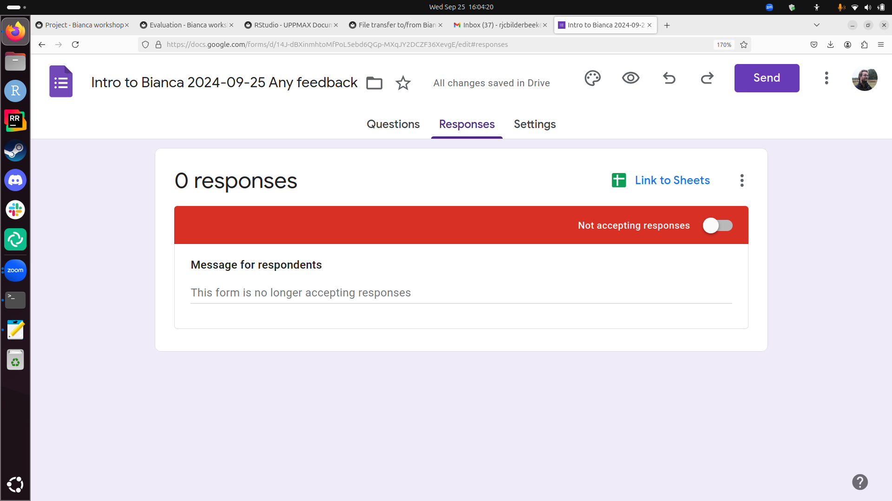
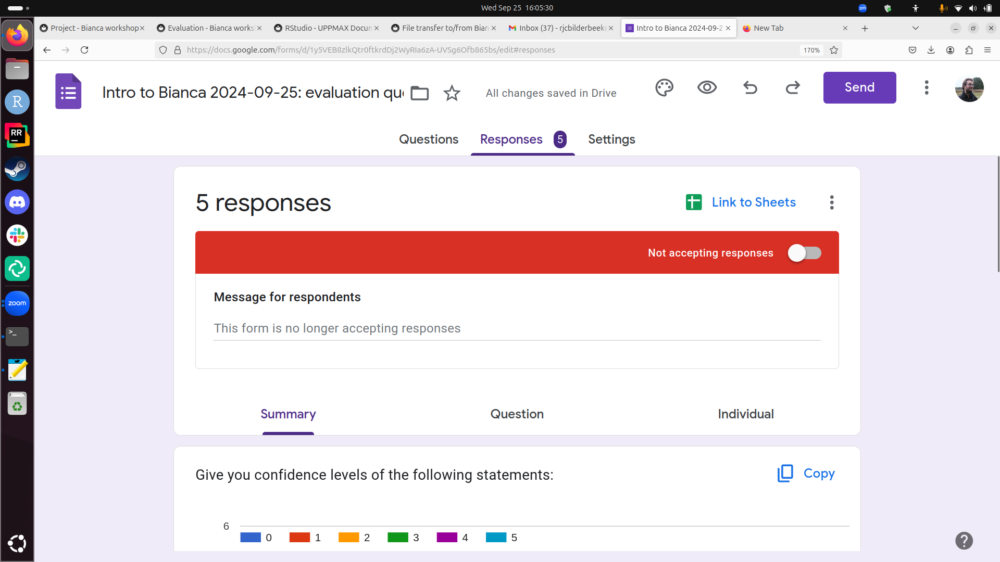
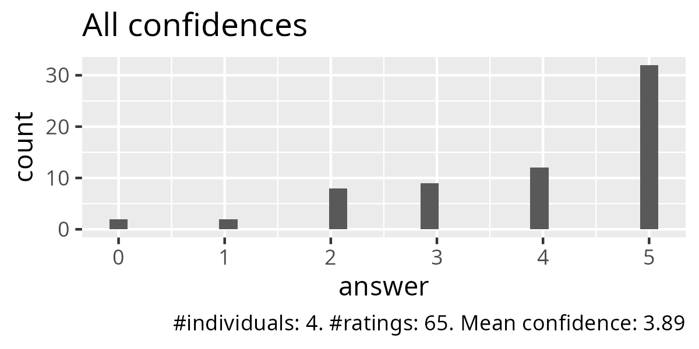
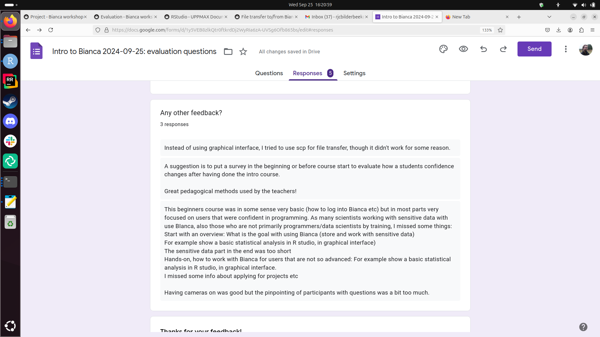

# Evaluation

- Raw data: [20240925.csv](20240925.csv)

> Raw data in Google Forms

> Raw data in Google Forms

> All confidences

> Confidences per question

- Script to create images and tally: [analyse.R](analyse.R)

- Tally of confidences per question: [tally.csv](tally.csv)

## Feedback in text

> Feedback in text as screenshot

> Instead of using graphical interface, I tried to use scp for file transfer, though it didn't work for some reason.

> A suggestion is to put a survey in the beginning or before course start to evaluate how a students confidence changes after having done the intro course.

> Great pedagogical methods used by the teachers!

> This beginners course was in some sense very basic (how to log into Bianca etc) but in most parts very focused on users that were confident in programming. As many scientists working with sensitive data with use BIanca, also those who are not primarily programmers/data scientists by training, I missed some things: 
> Start with an overview: What is the goal with using Bianca (store and work with sensitive data)
> For example show a basic statistical analysis in R studio, in graphical interface)
> The sensitive data part in the end was too short
> Hands-on, how to work with Bianca for users that are not so advanced: For example show a basic statistical analysis in R studio, in graphical interface. 
> I missed some info about applying for projects etc

> Having cameras on was good but the pinpointing of participants with questions was a bit too much. 
