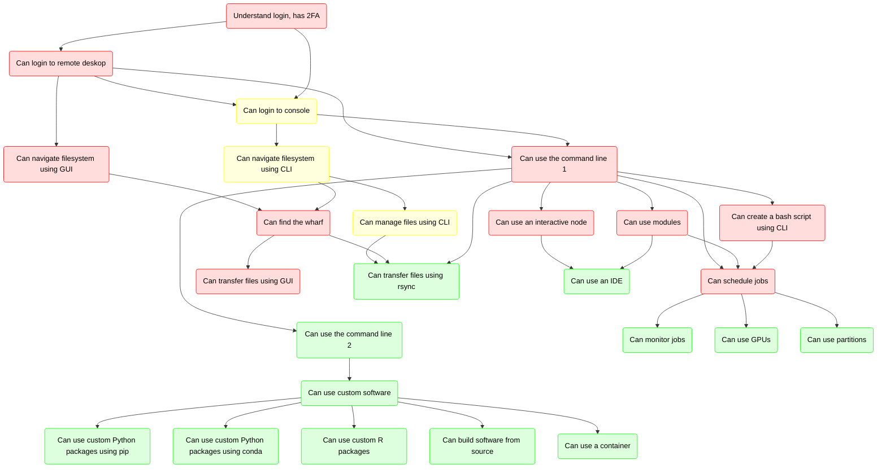

# Lesson plan

- Date: 2024-11-11
- Course: Intermediate Bianca
- Teacher: Richel
- [Reflection](../../reflections/20241111/20241111_richel.md)

I will be teaching at the start and end of the day

## Course structure

Now, this is the course structure:

My current ideal is to have 3 levels instead:

```mermaid
%% Direction is top->down
flowchart TD

    %% Give a white background, instead of a transparent one
    classDef node fill:#fff,color:#000,stroke:#000
    classDef focus_node fill:#fff,color:#000,stroke:#000,stroke-width:4px
    classDef basic_node fill:#fdd,color:#000,stroke:#f00
    classDef intermediate_node fill:#ffd,color:#000,stroke:#ff0
    classDef advanced_node fill:#dfd,color:#000,stroke:#0f0
  
    %% subgraph sub_basic_use[Basic use of Bianca]
      understand_login(Understand login, has 2FA):::basic_node
      can_login_to_remove_desktop(Can login to remote deskop):::basic_node
      can_navigate_filesystem_using_gui(Can navigate filesystem using GUI):::basic_node
      can_find_wharf(Can find the wharf):::basic_node
      can_use_command_line_1(Can use the command line 1):::basic_node
      can_use_modules(Can use modules):::basic_node
      can_use_interactive_node(Can use an interactive node):::basic_node
      can_schedule_jobs(Can schedule jobs):::basic_node
      can_create_bash_script_using_cli(Can create a bash script using CLI):::basic_node
      can_tranfer_files_using_gui(Can transfer files using GUI):::basic_node
      can_use_ide(Can use an IDE):::basic_node
    %% end
    %% style sub_basic_use fill:#fcc,color:#000,stroke:#fcc

    %% subgraph sub_intermediate_use[Intermediate use of Bianca]
      can_login_to_console(Can login to console):::intermediate_node
      can_use_command_line_2(Can use the command line 2):::intermediate_node
      can_navigate_filesystem_using_cli(Can navigate filesystem using CLI):::intermediate_node
      can_manage_files_using_cli(Can manage files using CLI):::intermediate_node
      can_tranfer_files_using_rsync(Can transfer files using rsync):::intermediate_node
      can_monitor_jobs(Can monitor jobs):::intermediate_node
      can_use_gpus(Can use GPUs):::intermediate_node
      can_use_partitions(Can use partitions):::intermediate_node

    %% end
    %% style sub_intermediate_use fill:#ffc,color:#000,stroke:#ffc

    %% subgraph sub_intermediate_use[Intermediate use of Bianca]
      can_use_command_line_3(Can use the command line 3):::advanced_node
      can_use_custom_software(Can use custom software):::advanced_node
      can_use_custom_python_pip(Can use custom Python packages using pip):::advanced_node
      can_use_custom_python_conda(Can use custom Python packages using conda):::advanced_node
      can_use_custom_r(Can use custom R packages):::advanced_node
      can_use_container(Can use a container):::advanced_node
      can_build_from_source(Can build software from source):::advanced_node

    %% end
    %% style sub_intermediate_use fill:#ffc,color:#000,stroke:#ffc


    %% Basic
    understand_login --> can_login_to_remove_desktop
    can_login_to_remove_desktop --> can_login_to_console
    can_login_to_remove_desktop --> can_use_command_line_1
    can_login_to_remove_desktop --> can_navigate_filesystem_using_gui
    can_navigate_filesystem_using_gui --> can_find_wharf
    can_login_to_console --> can_navigate_filesystem_using_cli
    can_use_command_line_2 --> can_navigate_filesystem_using_cli
    can_navigate_filesystem_using_cli --> can_find_wharf
    can_find_wharf --> can_tranfer_files_using_gui
    understand_login --> can_login_to_console
    can_login_to_console --> can_use_command_line_1
    can_use_command_line_1 --> can_use_modules
    can_use_command_line_1 --> can_use_interactive_node
    can_use_command_line_1 --> can_use_command_line_2 --> can_use_command_line_3
    can_use_command_line_1 --> can_create_bash_script_using_cli
    can_use_command_line_1 --> can_schedule_jobs
    can_navigate_filesystem_using_cli --> can_manage_files_using_cli
    can_use_modules --> can_schedule_jobs
    can_create_bash_script_using_cli --> can_schedule_jobs

    %% Basic -> Intermediate
    can_manage_files_using_cli --> can_tranfer_files_using_rsync
    can_find_wharf --> can_tranfer_files_using_rsync
    can_schedule_jobs --> can_monitor_jobs
    can_schedule_jobs --> can_use_gpus
    can_schedule_jobs --> can_use_partitions
    can_use_interactive_node --> can_use_ide
    can_use_modules --> can_use_ide

    %% Make sure Intermediate is below Basic,
    %% using invisible nodes
    can_schedule_jobs ~~~ can_use_command_line_2

    %% Intermediate
    can_use_command_line_1 --> can_tranfer_files_using_rsync
    can_use_command_line_3 --> can_use_custom_software

    can_use_custom_software --> can_use_custom_python_pip
    can_use_custom_software --> can_use_custom_python_conda
    can_use_custom_software --> can_use_custom_r
    can_use_custom_software --> can_build_from_source
    can_use_custom_software --> can_use_container
```

