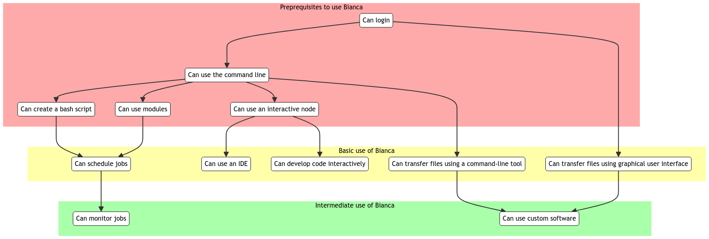
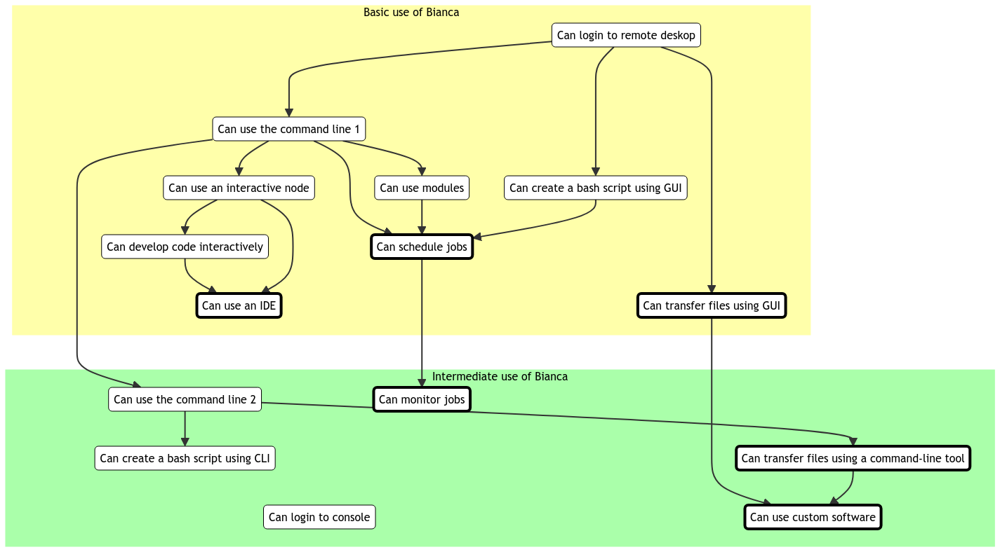
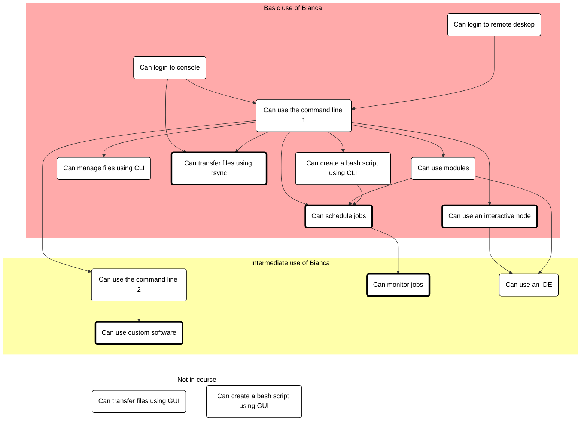

# Reflection 2023-12-14

* Bianca In-Depth Hackathon
* Richel
* [Lesson plan](../lesson_plans/20231214/20231214_richel.md)

Thursday 14th Dec 2023 was the first time we ran the 'Bianca In-Depth Hackathon'
course, with the idea of that day being suitable for experience users,
as we moved the beginner things to the 'Intro to Bianca' course.

This was the course schedule:

Time |Topic
-----|--------------------------
9.00| B: [Introduction](https://uppmax.github.io/bianca_workshop/intermediate/intro/)
9.10| L: [NAISS-SENS summary](https://uppmax.github.io/bianca_workshop/sens_project_short/)
9.20| P: [Transferring files to and from Bianca](https://uppmax.github.io/bianca_workshop/intermediate/transfer/)
10.00| Coffee break
10.15| P: [Transferring files p2](https://uppmax.github.io/bianca_workshop/intermediate/transfer/)
10.35| D: [Slurm jobs p1](https://uppmax.github.io/bianca_workshop/intermediate/slurm_intermed/)
11.00| Break
11.15| D: [Slurm jobs p2](https://uppmax.github.io/bianca_workshop/intermediate/slurm_intermed/)
12.00| LUNCH
13.00| B: [Software and packages installation](https://uppmax.github.io/bianca_workshop/intermediate/install/)
13.50| break
14.05| R: [IDE:s on Bianca](https://uppmax.github.io/bianca_workshop/intermediate/ides/)
15.00| Coffee break
15.15| B: [Summary](https://uppmax.github.io/bianca_workshop/intermediate/summary/)
15.20| B: Q/A and [extra material](https://uppmax.github.io/bianca_workshop/extra/slurm/)
15.55| B: Closing words
16.00| END

I would teach together with Pavlin from 14:05-15:00
about IDEs.

Goal of my preparation was:

* to improve and use the online course materials, as which is used by the others too.
* to find out how to run RStudio and VSCodium on Bianca

I achieved those goals.

I attended the whole day to follow along with the students
and help them enjoy the course better by interjecting
a rare and -hopefully!- helpful questions/comment sometimes
when a colleague was teaching.

The schedule was intended to be flexible and hence was I.
Due to this, we started at 14:30.

I gave a 5 minute short monologue to IDEs after which I distributed the learners:
Pavlin would have a break-out room on the Jupyter IDE, I would
have one for RStudio. Due to an earlier poll at the start of the day,
I knew these were the two major IDEs, hence showing VSCodium was
not needed. Additionally, showing VSCodium was not needed as (1) it
is even simpler than RStudio, and (2) I made a YouTube video about it.

I am happy I distributed the learners: in my breakout room (I had a colleague
'hold the fort' in the main Zoom room) I had around six learners and I
could have a short individual chat with them (I think 2 mins in total),
after which I showed the course material and skipped through the YouTube
video. I asked the learners for questions. One learner asked about
using an interactive node: he never did that, as he was the only one in a
project. With no questions left, I let the learners start RStudio on Bianca.

After a couple of minutes, the learners found out that one couldn't
login to the remote desktop. While sharing my screen, I shared this
with the sysadmins. We discovered together that one could not log
in, as someone was using the remote desktop node without using an interactive
node (just like the learner I had!). I asked my learners if they were confident
they could start RStudio on Bianca and the one learner with a camera claimed
she was confident.

At 15:05 we were done. We went to the general room for a general chat until
Pavlin was ready. I encouraged the learners to look at Pavlins demo
of Jupyter or stick around for a chat. I chatted with around 3 students
until, around 15:15, Pavlins group returned and we had a coffee break.

I think my teaching went well:

* (1) there was plenty of time for exercises,
* (2) I responded well to changes in schedule and breakdown of Bianca,
* (3) I had enough course material in place to allow a good response,
* (4) I had some real contact with some of the learners.

While preparing the course material, I did more than just that:

* I added a section on transferring files using a GUI
* I made an overview of the course material and prerequisites

I added a section on transferring files using a GUI,
which is part of the 'Intro to Bianca' course.
I added this section, as I felt this current
section on file transfer was unsuitable for an Intro course.
I needed a section about file transfer for beginners,
as, in my course materials, I refer to earlier sections.

I made an overview of the course material and prerequisites,
as it helps me and colleagues decide on the order of topics,
as well as what should be in either (i.e. basic or intermediate)
course:

While writing this reflection, I changed it again:

I conclude that the intro course can have a minimal use of the terminal:
only `chmod +x` (if the GUI cannot do this) and `sbatch` are really needed.
My answer to 'What is the goal of the intro course?' would be:

> The goals of the introduction course is to allow a learner to use Bianca

As most learners are most familiar with graphical user interfaces (i.e.
not a terminal), we should use graphical user interfaces.

Or the teaching goals of the introduction course:

* A learner can transfer a file
* A learner can modify and run code
* A learner can schedule a script

Also here, use of the terminal should only be what is essential.

My answer to 'What is the goal of the intermediate course?' would be:

> The goals of the intermediate course is to allow a learner
> to use Bianca more conveniently and/or efficiently

Or the teaching goals of the intermediate course:

* A learner can run a job efficiently
* A learner can install custom software

I hence think the introduction course can/should be simplified.
These things need to be discussed with the team.

## 2023-12-19 Meeting

After a meeting on 2023-12-19, it was decided to:

In Intro course:

* Do file management in command-line, instead of using a graphical file explorer
* No IDE (unsure where this will go)
* Use rsync for file transfer, instead of using FileZilla for file transfer

Resulting in the following structure:

