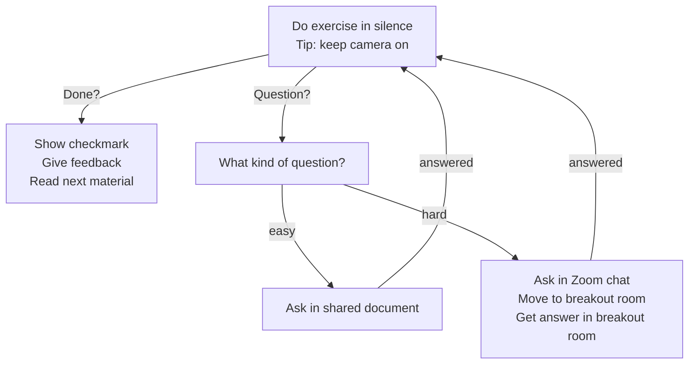

# Reflection Richel

## Until afternoon

I taught these sessions, according to the lesson plan I made:

When  | Who  | What
------|------|-----------------------------
9:00  | R    | Introduction and logging in
10:00 | .    | Break
10:15 | R    | Command line
11:00 | .    | Break
11:15 | R    | Modules
12:00 | .    | Lunch

I general, I am quite happy with the results.
This is also thanks to the learners that kept their
camera on and were sharing openly and volunteered
for the harder demonstrations!

One learner put in the chat:

> Super nice dynamics Richél! Thanks 👌

Where I replied:

> Thanks you for being an awesome learner! Great to see a volunteer for those things!
> P.S. if you'd share that feedback in the shared document (or the anonymous evaluation at the end, you can indirectly encourage my colleagues to do the same :-)

To which I got the reply:

> OF COURSE! Count with that =)

Again, such is an awesome learner to have around!

I missed having the exercise procedure available as a picture. Here I created it:

This was what I want to try out:

- More time for feedback. I met a colleague in the hallways and stated that
  I had 5 minutes for feedback. She said that was too short. I agreed.
  In hindsight, I am unsure. So I try it out in this course

I think 10 minutes feedback is a nice duration:
it is just long enough and we finished on time give or take a few seconds.
Maybe 5 more minutes would be even better, to go into a bit more detail,
but now seems to fit good enough

- Fewer Zoom rooms: I want the learners to remain in the main Zoom room
  and work in silence. Learners can ask questions in the chat or in the shared
  document and if needed, can go to a Zoom room with a TA

I think this worked out nicely!
My colleagues helped out beautifully on the shared document
and/or talking in a breakout room.

Other choices:

- Do tell about myself at the start

Felt OK, even though I still do not like it.

- Do ask random learners

Felt OK. I again shared why I do this and I think I created
a nice atmosphere in which it was OK to be wrong.

- Share with learners to use the videos as a reminder in the future

Felt OK. Judging from the changing facial expression in some learners' camera's,
I do think they used the documentation; it did not look passive at all :-)

Rounding up for now: I think this is a effective setup for learning.

## After break

When  | Who  | What
------|------|-----------------------------
15:30 | R    | Summary
15:35 | R    | Anonymous evaluation
15:45 | All  | Optional Q&A

5 minutes for the summary is a good duration.
However, my summary was incomplete:
the text at 'Summary' of the course was not to my taste, so I used
the course overview at 'Introduction'.
Due to this, I forgot to mention future course,
like the Bianca workshop and the Programming Formalisms course.

TODO next time:

- [ ] prepare the summary by adding other courses

After this, I think I discussed the procedure well:

- evaluation in breakout room
- after that, Q&A if needed in the breakout room, else go home :-)

The anonymous evaluation we did in a breakout room.
I allowed the colleagues to join to see how I lead an anonymous evaluation
and one colleague followed.
I told why this is important.
I used the shared document.
I asked if the learners were ready and when they were,
I asked the colleague to leave after which I left.

After 2 minutes, the first learner came to the main room.
I forgot to create more breakout rooms,

TODO next time:

- create more breakout rooms for the evaluation. Do do
  the evaluation in room 1. Let questions be answered in
  other breakout rooms

## Evaluation results

I am confident that I can now login:

- yes: 8x
- no: 0x

Yay!

I am confident that I can now create executable bash scripts:

- yes: 7x
- no: 1x

Interesting, I wish I knew where the learner got stuck ...

I am confident that I can now use modules:

- yes: 7x
- no: 0x

Yay!

I am confident that I can now do file tranfer using a GUI:

- yes: 5x
- no: 3x

[not my session]

I am confident that I can now do file tranfer using transit:

- yes: 4x
- no: 4x

[not my session]

I am confident that I can now do file tranfer using rsync:

- yes: 3x
- no: 5x

[not my session]

I am confident that I can now start an interactive session:

- yes: 6x
- no: 2x

[not my session]

I am confident that I can now submit jobs to the scheduler:

- yes: 4x
- no: 4x

[not my session]

I am confident that I now know the legal aspects of sensitive data:

- yes: 1x
- no: 1x

[not my session]

Below are the question. If needed, specify your ideas per session.

### What should we keep doing?

- keep the overall structure and input
- Good interactive sessions, especially in the morning.
  Maybe more interactive in the afternoon
- Very interactive and enjoyable course structure, logical flow of topics.
- Great with several teachers/helpers in the sessions
  to give individual help when needed
- Good with exercises so we get to try what we learn
- Good interactive sessions
- teacher/helper to student ration was really good
- Amazing dynamics to keep everyone on the same page.
  Other bioinfo workshops I have attended tend to be less "interactive"
  hence more difficult. Thanks!

Ha, they enjoyed the interactiveness of my sessions. Yay!

### Which section(s) scheduled enough time for exercises?

- The morning had too much time, while the others had too little time
- A bit too much time in the morning perhaps,
  maybe some more time could be put into the afternoon
  to be able to actually try the file transfer for example.
- could be less time for basic scripting and bash exercises
  and more time for file transfer and job scheduling.
  We had the sample data, but never did not have time
  to properly go through it, besides reviewing the example script.
- The morning session had enough time (perhaps optional extra exercises
  for the fast students)

I am happy to see that the morning tends to be seen as having too much
time. I kept track of learners being ready in time and I saw that
on average around two thirds of the learners (but never all!)
finished on time. I think that is a good ration for a beginner course.

I could consider adding extra optional exercises,
but I do think it is a feature to have slightly too much time.

- It would have been good to spend more time on the second part,
  maybe to actually try a data transfer + use that data in a job scheduler

[not my session]

- Logging in from Rackham to Bianca is unclear a bit!

[not my session]

### What should we improve?

- more time for file transfer and exercises in that section
- agree with the comment above
- More time for the sessions with Björn and Pavlin in the afternoon
- The afternoon sessions were too quick for a beginner in coding.
  Jargon, terminology, quickly using commands that I was unfamiliar with made me get lost pretty quickly.

[not my sessions]

- Perhaps to extend more time for the practical exercises.
  And go throught them together in some of the cases.

I am unsure if this applies to me: I think we went through all
exercises together, but I may have been unclear about the
option to interrupt and ask questions when learners show their
answers

- Don't have a feedback/evaluation document where text can
  (accidentaly) be deleted and edited by others :)

Hmmm, interesting. I do enjoy to use a shared document as it is so low-tech.
I will try a Google Form text time maybe ...

- Perhaps more info on developing a script,
  what way can you scale up your project
  and estimate workload or test running time.

I did show this in the course overview that this in the advanced
Bianca course. I am sorry this was unclear

- Maybe have some session about how to apply for an account,
  it is really hard to do if you've never worked on any cluster
  before ie estimations on compute space needed and nodes etc.

We should consider this with the team.

### Other comments?

- file transfer from bianca would be nice to learn

[not my session]

- More time on transfer of files, to and from desktop and also to and from other secure environments such as Vesta

[not my session]

About Vesta: unsure how relevant it is for a basic course.

- Really great intro, it felt easy to ask questions even though it was on zoom.

Yay!

- Overall very nice course, thank you!

Yay!

- Excellent course, thank you greatly to the organizers and teachers!

Yay! Thanks!
