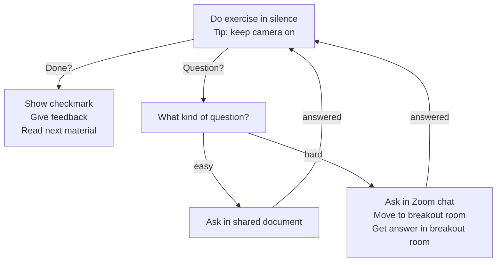

# Reflection Richel

## Until afternoon

I taught these sessions, according to the lesson plan I made:

When  | Who  | What
------|------|-----------------------------
9:00  | R    | Introduction and logging in
10:00 | .    | Break
10:15 | R    | Command line
11:00 | .    | Break
11:15 | R    | Modules
12:00 | .    | Lunch

I general, I am quite happy with the results.
This is also thanks to the learners that kept their
camera on and were sharing openly and volunteered
for the harder demonstrations!

One learner put in the chat:

> Super nice dynamics Richél! Thanks 👌

Where I replied:

> Thanks you for being an awesome learner! Great to see a volunteer for those things!
> P.S. if you'd share that feedback in the shared document (or the anonymous evaluation at the end, you can indirectly encourage my colleagues to do the same :-)

To which I got the reply:

> OF COURSE! Count with that =)

Again, such is an awesome learner to have around!

I missed having the exercise procedure available as a picture. Here I created it:



This was what I want to try out:

- More time for feedback. I met a colleague in the hallways and stated that
  I had 5 minutes for feedback. She said that was too short. I agreed.
  In hindsight, I am unsure. So I try it out in this course

I think 10 minutes feedback is a nice duration: 
it is just long enough and we finished on time give or take a few seconds.
Maybe 5 more minutes would be even better, to go into a bit more detail,
but now seems to fit good enough

- Fewer Zoom rooms: I want the learners to remain in the main Zoom room
  and work in silence. Learners can ask questions in the chat or in the shared
  document and if needed, can go to a Zoom room with a TA

I think this worked out nicely!
My colleagues helped out beautifully on the shared document
and/or talking in a breakout room.

Other choices:

- Do tell about myself at the start

Felt OK, even though I still do not like it.

- Do ask random learners

Felt OK. I again shared why I do this and I think I created
a nice atmosphere in which it was OK to be wrong.

- Share with learners to use the videos as a reminder in the future

Felt OK. Judging from the changing facial expression in some learners' camera's, 
I do think they used the documentation; it did not look passive at all :-)

Rounding up for now: I think this is a effective setup for learning.


## After break


## Evaluation results


# Evaluation 2024-04-19

## Text on shared document

```
## Evaluation

This is an anonymous evaluation
and will ideally be published in raw form at 
https://github.com/UPPMAX/bianca_workshop/tree/main/evaluations/20240419 .
To do so, please do not share sensitive data here!

Below are tallies, i.e. add one character behind each
to answer a question. This helps us
assess how well we as teachers did.

I am confident that I can now login:
- yes:
- no:

I am confident that I can now create executable bash scripts:
- yes:
- no:

I am confident that I can now use modules:
- yes:
- no:

I am confident that I can now do file tranfer using a GUI:
- yes:
- no:

I am confident that I can now do file tranfer using transit:
- yes:
- no:

I am confident that I can now do file tranfer using rsync:
- yes:
- no:

I am confident that I can now start an interactive session:
- yes:
- no:

I am confident that I can now submit jobs to the scheduler:
- yes:
- no:

I am confident that I now know the legal aspects of sensitive data:
- yes:
- no:

Below are the question. If needed, specify your ideas per session.

### What should we keep doing? 

- ...
- ...
- ...
- ...
- ...
- ...
- ...
- ...
- ...
- ...
- ...
- ...
- ...
- ...


### Which section(s) scheduled enough time for exercises?

- ...
- ...
- ...
- ...
- ...
- ...
- ...
- ...
- ...
- ...
- ...
- ...
- ...
- ...

### What should we improve?

- ...
- ...
- ...
- ...
- ...
- ...
- ...
- ...
- ...
- ...
- ...
- ...
- ...
- ...

### Other comments?

- ...
- ...
- ...
- ...
- ...
- ...
- ...
- ...
- ...
- ...
- ...
- ...
- ...
- ...

```


## Results

This is an anonymous evaluation and will ideally be published in raw form at 
https://github.com/UPPMAX/bianca_workshop/tree/main/evaluations/20240419 . To do so, please do not share sensitive data here!

Below are tallies, i.e. add one character behind each to answer a question. This helps us assess how well we as teachers did expressed in a quantity. After that, there is the option for more qualitative feedback. 

Thanks already for filling this in!

I am confident that I can now login:
- yes: 1111qii*
- no: 

I am confident that I can now create executable bash scripts:
- yes:21q11i*
- no:i

I am confident that I can now use modules:
- yes:1q11ii*
- no:

I am confident that I can now do file tranfer using a GUI:
- yes:q111i
- no:1i*

I am confident that I can now do file tranfer using transit:
- yes:11i*
- no:q11i

I am confident that I can now do file tranfer using rsync:
- yes:11j
- no:q11i*

I am confident that I can now start an interactive session:
- yes:q11ji*
- no:11

I am confident that I can now submit jobs to the scheduler:
- yes:q1i*
- no:111i

I am confident that I now know the legal aspects of sensitive data:
- yes: q
- no:i

Below are the question. If needed, specify your ideas per session.

### What should we keep doing? 

- keep ther overall structure and input
- ...
- Good interactive sessions, especially in the morning. Maybe more interactive in the afternoon
- ...
- Very interactive and enjoyable course structure, logical flow of topics.
- Great with several teachers/helpers in the sessions to give individual help when needed
- Good with exercises so we get to try what we learn
- ...
- Good interactive sessions
- ...
- teacher/helper to student ration was really good
- ...
- ...
- Amazing dynamics to keep everyone on the same page. Other bioinfo workshops I have attended tend to be less "interactive" hence more difficult. Thanks!
- 


### Which section(s) scheduled enough time for exercises?

- The morning had too much time, while the others had too little time
- ...
- A bit too much time in the morning perhaps, maybe some more time could be put into the afternoon to be able to actually try the file transfer for example.
- could be less time for basic scripting and bash exercises and more time for file transfer and job sceduling. We had the sample data, but never did not have time to properly go through it, besides reviewing the example script.
- The morning session had enough time (perhaps optional extra exercises for the fast students)
- Logging in from Rackham to Bianca is unclear a bit! 
- ...
- It would have been good to spend more time on the second part, maybe to actually try a data transfer + use that data in a job scheduler
- ...
- ...
- ...
- ...
- ...
- ...

### What should we improve?

- more time for file transfer and exercises in that section
- agree with the comment above
- Maybe have some session about how to apply for an account, it is really hard to do if you've never worked on any cluster before ie estimations on compute space needed and nodes etc.
- More time for the sessions with Björn and Pavlin in the afternoon
- The afternoon sessions were too quick for a beginner in coding. Jargon, terminology, quickly using commands that I was unfamiliar with made me get lost pretty quickly.
- Perhaps more info on developing a script, what way can you scale up your project and estimate workload or test running time.
- ...
- Don't have a feedback/evaluation document where text can (accidentaly) be deleted and edited by others :)
- Perhaps to extend more time for the practical exercises. And go throught them together in some of the cases.  
- ...
- ...
- ...
- ...
- ...

### Other comments?

- file transfer from bianca would be nice to learn
- More time on transfer of files, to and from desktop and also to and from other secure environments such as Vesta
- Really great intro, it felt easy to ask questions even though it was on zoom. 
- Overall very nice course, thank you!
- Excellent course, thank you greatly to the organizers and teachers!  
- ...
- ...
- ...
- ...
- ...
- ...
- ...
- ...
- ...
