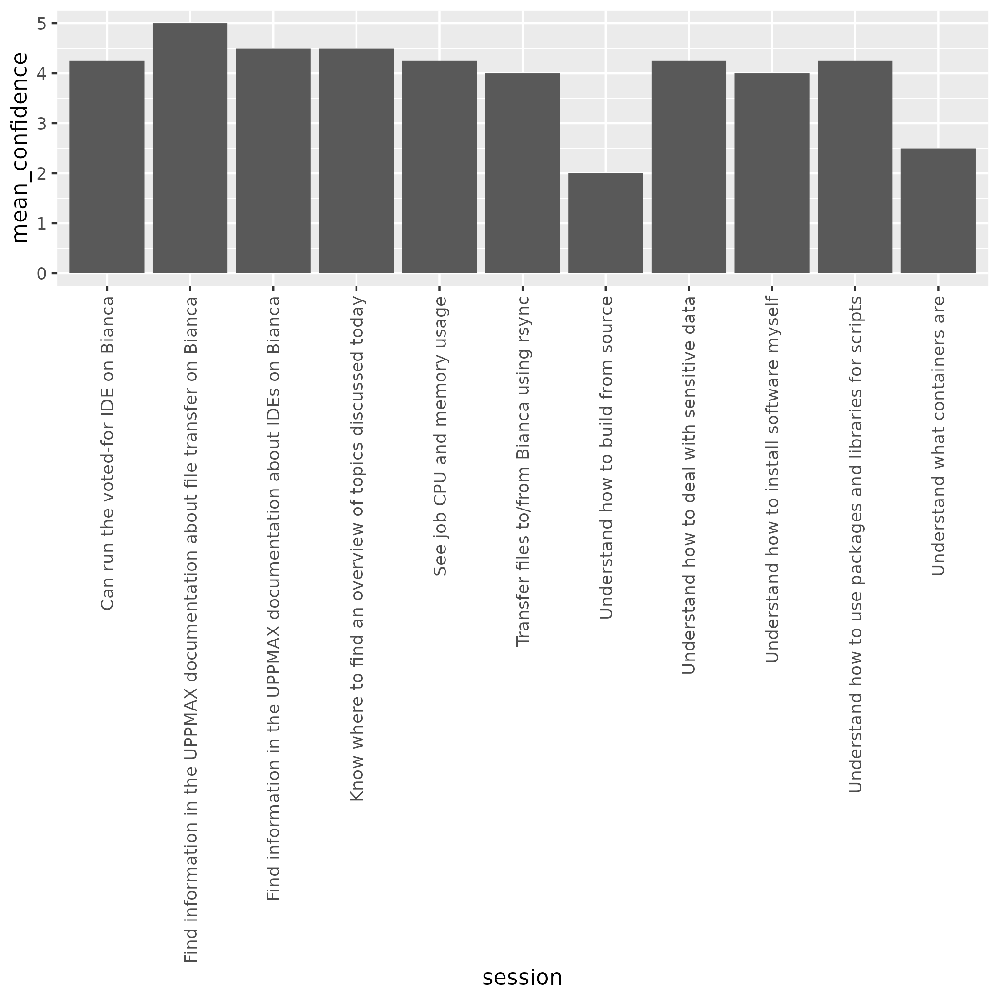
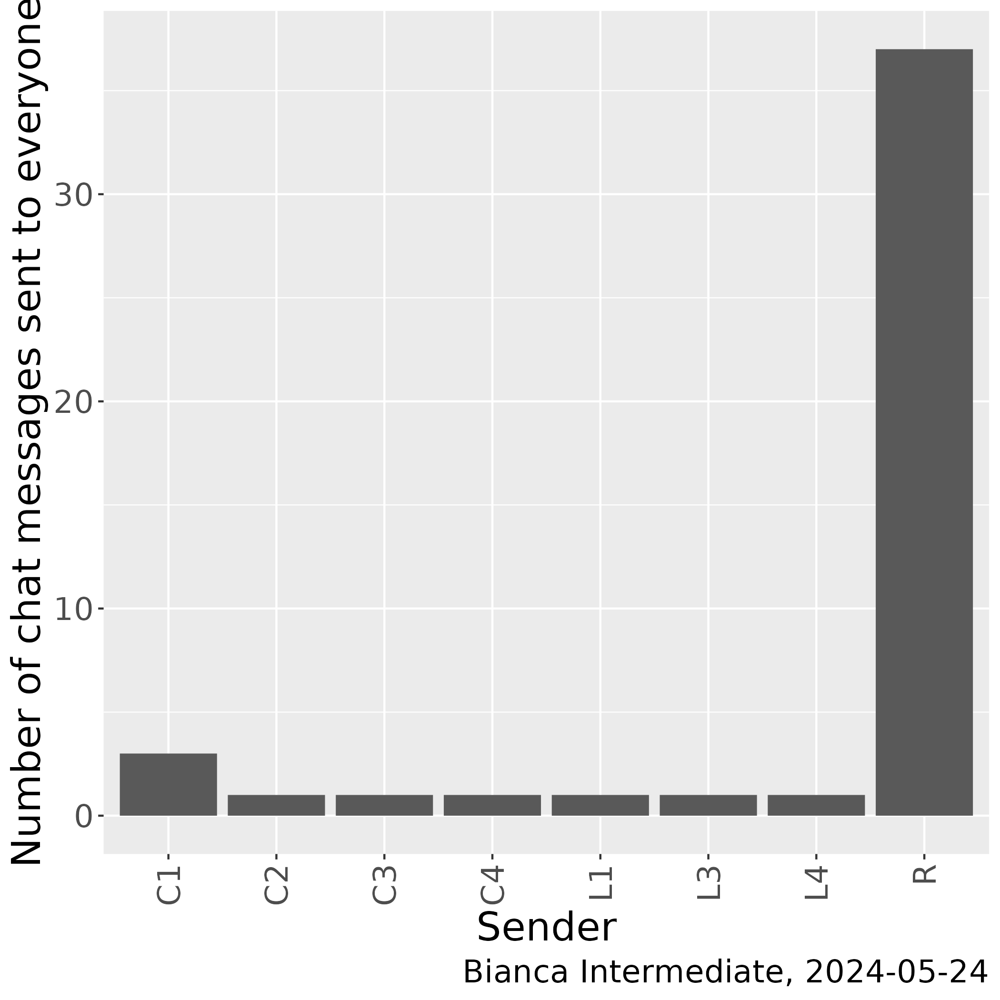

# Reflection

- Teacher: Richel
- Date: 2024-05-24
- Course: Intermediate Bianca course
- [Lesson plan](../../lesson_plans/20240524_richel.md)

This was the schedule of that day:

When | Who  | What
-----|------|-------------------------
9:00 | R    | Introduction
9:10 | R    | Transferring files to and from Bianca
10:00| .    | Break
10:15| R    | Transferring files p2
10:35| D    | Slurm jobs p1
11:00| .    | Break
11:15| D    | Slurm jobs p2
12:00| .    | Lunch
13:00| B    | Software and packages installation
13:45| .    | Break
14:00| BR   | IDEs on Bianca
14:45| .    | Break
15:00| L    | NAISS-SENS summary
15:30| R    | Summary
15:35| R    | Evaluation
15:45| All  | Optional Q/A and extra material
16:00| .    | END

* Who: `B`: Björn, `D`: Diana, `L`: Lars, `R`: Richèl

## First session: 9:00-10:35

Before the session, the three teachers discussed on a rule 
on when we teach: until 8:58 there was no learner at all!
One minute later, the first learner arrived.
From that moment on, every minute, a learner would trickle in,
until we'd be with six learners.

The start was messy, learners being late requires improvisation
and I did that, at the cost of following my lesson plan.
I forgot to do a Prior, as instead I felt a stronger need to set the learners
to work quickly. Only after talking about the shared document,
I did a quick Prior on file transfer.

Below is the amount of learners in time, at the times I measured 
it. Timepoint 70 means 10 minutes after the break after the
first session of 60 minutes.


> Number of learners in time, complete plot, created at the end of the day

I had all learners turn on their camera, including those that were late.
I shared the notes I prepared with every new learner coming in.
In around 3 minutes, the learners there were set to work on using the shared document,
while I welcomed the latecomers and set these to work too.

As I could see the number of answers, I saw that only 1 learner filled this
in. Something was wrong. I asked the learners and let one share his screen
and demonstrate. Now everyone saw what to do and the answers can in fast.
Below are the results, marked by 'Start of shared document' 
and 'End of shared document' headers:

## Start of shared document

## File transfer

Goal of this exercise is:

- to practice using HackMD
- getting to know your prior knowledge

Below are three tallies, such as this example:

```
What is X?

- [ ] A
- [ ] B
```

Pick one character for you, e.g. `*` or `R` or `?` or whatever (duplicates are fine!). Between the `[ ]` you agree on, write that character. In the end this may look like:

```
What is X?

- [s#k%vq*#6] A
- [q.vR] B
```

Now we know 9 people think A is the answer, where 4 people think it is B.

### 1. My favorite way to transfer files to/from Bianca now is using:

- [xjsr] FileZilla
- [ ] fuse-sshfs and mounting the wharf
- [ ] lftp
- [Z] rsync
- [ ] scp
- [sl] sftp
- [ ] sshfs and mounting the wharf
- [ ] Rclone
- [ ] WinSCP
- [ ] other

### 2. About rsync:

- [ r] I have never followed a lecture on rsync, I don't know what it is
- [sL] I have never heard a lecture on rsync, but I've never gotten it to work
- [j] I have never heard a lecture on rsync, I have gotten it to work, but don't use it in practice
- [Z] I have never heard a lecture on rsync, I have gotten it to work, and use it
- [x] I have heard a lecture on rsync, but I've never gotten it to work
- [] I have heard a lecture on rsync, I have gotten it to work, but don't use it in practice
- [ ] I have heard a lecture on rsync, I have gotten it to work, and use it

### 3. About FileZilla:

- [ ] I have never followed a lecture on FileZilla, I don't know what it is
- [ ] I have never heard a lecture on FileZilla, but I've never gotten it to work
- [] I have never heard a lecture on FileZilla, I have gotten it to work, but don't use it in practice
- [slj] I have never heard a lecture on FileZilla, I have gotten it to work, and use it
- [r] I have heard a lecture on FileZilla, but I've never gotten it to work
- [ ] I have heard a lecture on FileZilla, I have gotten it to work, but don't use it in practice
- [] I have heard a lecture on FileZilla, I have gotten it to work, and use it

## End of shared document

So, 4 learners use FileZilla, 1 rsync and 1 sftp. 
There has never been a lecture on rsync where (the one) learners got rsync to work.
As most learners used FileZilla as their main file transfer program, 
I ended this poll earlier.

During the poll, I announced I would probably ask the
person `Z` using mainly rsync to 
to show him/herself and consider to help teaching.
`Z` identified himself and stated he was rusty in it,
and we agreed he'd be treated like a regular learner.

After the Prior, I did the Present, mostly focusing on the 'Why', the terms
that they can read themselves and how to do the exercises.

The learners were set to work in groups at around 9:20, later then I planned.
Group sizes were 2x 3 learners, just what I prepared for. I was happy being
able to have two groups.

At around 9:22, I went through the two breakout rooms. 
I was inconsistent and only shared all info in both rooms:

- (both) Ignore me in the future + reason why
- (only in room 1) Start reading first
- (only in room 2) Try all to do it individually

I should have had a checklist of things to say here ...

I checked the breakout rooms regularily and
was commonly (as I encouraged them!) ignored:
they were busy reading. I was happy with that.

## 2025-05-27

OK, I make a rougher evaluation now:

- Our newest team member showed up in the Zoom. 
  I set him to work. I told him some ideas behind my teachings.
  There were other colleagues in the Zoom room too, but they had to teach
  after my session, so I let them prepare their sessions instead

Taking a look at the amount of learners in time looks like this:


- One learner was on time out of the 6 that would arrive in the first 6 minutes
- During the break, 4 left. As I can explain 2 of these (see below), 
  I'd say that a third of the learners left without an explanation.
    - One person just started using Bianca and was in the wrong course
    - One person came for the Slurm part only (although he'd come back at 13:18
      for a short while)


## Evaluation

We had 4 learners filling in an evaluation. 
These were all the learners that stayed around till the end, 
hence a bias for the persistent learners.
I announced the link to the evaluation at the start of the day,
in the hope of catching the complete set of learners.

We decided to do an evaluation by looking at the raw evaluation results.
I suggested to look at it later. The colleagues, however, wanted to take
a look together and immediately. 

We, including me, drew the wrong conclusions about which sessions scheduled
enough time for exercises. 
The Google Form image, that I just took a screenshot of, shows a trend I can understand:


Out of the 4 learners there was 1 that wrote 'more time' 
at 'In the course, what should we improve?'.

Also, the confidences that learners had were hard to interpret:


So, I used some R scripting to give a proper plot like this:



All my sessions have above 'I have good confidence I can do this', 
so I think that is good enough.
However, my aim is to have all to have 'I absolutely can do this!'.
And there is one person that has low confidence in using rsync.
This is because he is a Windows users, and he could not figure 
out how to install rsync. That should be fixed for next course iteration.

One evaluation result stated at 'Other':

> Excellent, thank you

This should be celebrated more I think.

Taking a look at [meeting_saved_chat.txt](meeting_saved_chat.txt) ...



> R = me. Names starting with L are learners, names starting with C are colleagues.

one can see I sent by far the most chat messages to everyone.
Weakness of this plot is that I can only see the messages to everyone
and my private ones. Maybe others use more private communication.

## Lessons for the future

- The timespan for the rsync lesson was OK
- [ ] [Add installing rsync for Windows to UPPMAX doc](https://github.com/UPPMAX/UPPMAX-documentation/issues/78)
- Using a Google Form for evaluations works fine. However, 
  analyzing a raw Google Form with colleagues has proven to be useless to me again
- Using the confidence learners have on sessions in the evaluation seems to be useful
- Asking the learners if sessions scheduled enough time for exercises seems to be useful
- We maintained having all learners in the morning session.
  Is this a common pattern?
- We lost a third of the learners in the 12:00-13:00 break without explanation. 
  Is this a common pattern?

 

