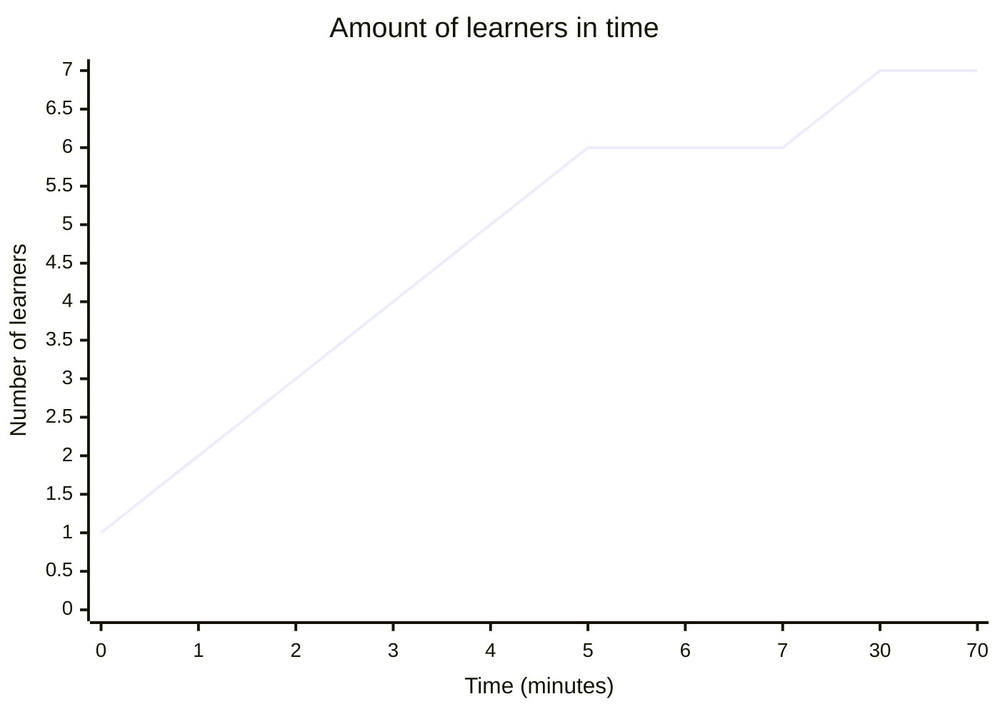

# Reflection

- Teacher: Richel
- Date: 2024-05-24
- Course: Intermediate Bianca course

This was the schedule of that day:

When | Who  | What
-----|------|-------------------------
9:00 | R    | Introduction
9:10 | R    | Transferring files to and from Bianca
10:00| .    | Break
10:15| R    | Transferring files p2
10:35| D    | Slurm jobs p1
11:00| .    | Break
11:15| D    | Slurm jobs p2
12:00| .    | Lunch
13:00| B    | Software and packages installation
13:45| .    | Break
14:00| BR   | IDEs on Bianca
14:45| .    | Break
15:00| L    | NAISS-SENS summary
15:30| R    | Summary
15:35| R    | Evaluation
15:45| All  | Optional Q/A and extra material
16:00| .    | END

* Who: `B`: Björn, `D`: Diana, `L`: Lars, `R`: Richèl

## First session: 9:00-10:35

Before the session, the three teachers discussed on a rule 
on when we teach: until 8:58 there was no learner at all!
One minute later, the first learner arrived.
From that moment on, every minute, a learner would trickle in,
until we'd be with six learners.

The start was messy, learners being late requires improvisation
and I did that, at the cost of following my lesson plan.
I forgot to do a Prior, as instead I felt a stronger need to set the learners
to work quickly. Only after talking about the shared document,
I did a quick Prior on file transfer.

Below is the amount of learners in time, at the times I measured 
it. Timepoint 70 means 10 minutes after the break after the
first session of 60 minutes.




I had all learners turn on their camera, including those that were late.
I shared the notes I prepared with every new learner coming in.
In around 3 minutes, the learners there were set to work on using the shared document,
while I welcomed the latecomers and set these to work too.

As I could see the number of answers, I saw that only 1 learner filled this
in. Something was wrong. I asked the learners and let one share his screen
and demonstrate. Now everyone saw what to do and the answers can in fast.
Below are the results, marked by 'Start of shared document' 
and 'End of shared document' headers:

## Start of shared document

## File transfer

Goal of this exercise is:

- to practice using HackMD
- getting to know your prior knowledge

Below are three tallies, such as this example:

```
What is X?

- [ ] A
- [ ] B
```

Pick one character for you, e.g. `*` or `R` or `?` or whatever (duplicates are fine!). Between the `[ ]` you agree on, write that character. In the end this may look like:

```
What is X?

- [s#k%vq*#6] A
- [q.vR] B
```

Now we know 9 people think A is the answer, where 4 people think it is B.

### 1. My favorite way to transfer files to/from Bianca now is using:

- [xjsr] FileZilla
- [ ] fuse-sshfs and mounting the wharf
- [ ] lftp
- [Z] rsync
- [ ] scp
- [sl] sftp
- [ ] sshfs and mounting the wharf
- [ ] Rclone
- [ ] WinSCP
- [ ] other

### 2. About rsync:

- [ r] I have never followed a lecture on rsync, I don't know what it is
- [sL] I have never heard a lecture on rsync, but I've never gotten it to work
- [j] I have never heard a lecture on rsync, I have gotten it to work, but don't use it in practice
- [Z] I have never heard a lecture on rsync, I have gotten it to work, and use it
- [x] I have heard a lecture on rsync, but I've never gotten it to work
- [] I have heard a lecture on rsync, I have gotten it to work, but don't use it in practice
- [ ] I have heard a lecture on rsync, I have gotten it to work, and use it

### 3. About FileZilla:

- [ ] I have never followed a lecture on FileZilla, I don't know what it is
- [ ] I have never heard a lecture on FileZilla, but I've never gotten it to work
- [] I have never heard a lecture on FileZilla, I have gotten it to work, but don't use it in practice
- [slj] I have never heard a lecture on FileZilla, I have gotten it to work, and use it
- [r] I have heard a lecture on FileZilla, but I've never gotten it to work
- [ ] I have heard a lecture on FileZilla, I have gotten it to work, but don't use it in practice
- [] I have heard a lecture on FileZilla, I have gotten it to work, and use it

## End of shared document

So, 4 learners use FileZilla, 1 rsync and 1 sftp. 
There has never been a lecture on rsync where (the one) learners got rsync to work.
As most learners used FileZilla as their main file transfer program, 
I ended this poll earlier.

After the Prior, I did the Present, mostly focusing on the 'Why', the terms
that they can read themselves and how to do the exercises.

The learners were set to work in groups at around 9:20, later then I planned.
Group sizes were 2x 3 learners, just what I prepared for. I was happy being
able to have two groups.

At around 9:22, I went through the two breakout rooms. 
I was inconsistent and only shared all info in both rooms:

- (in room 1) Start reading first
- (in room 2) Try all to do it individually

I should have had a checklist of things to say here ...


