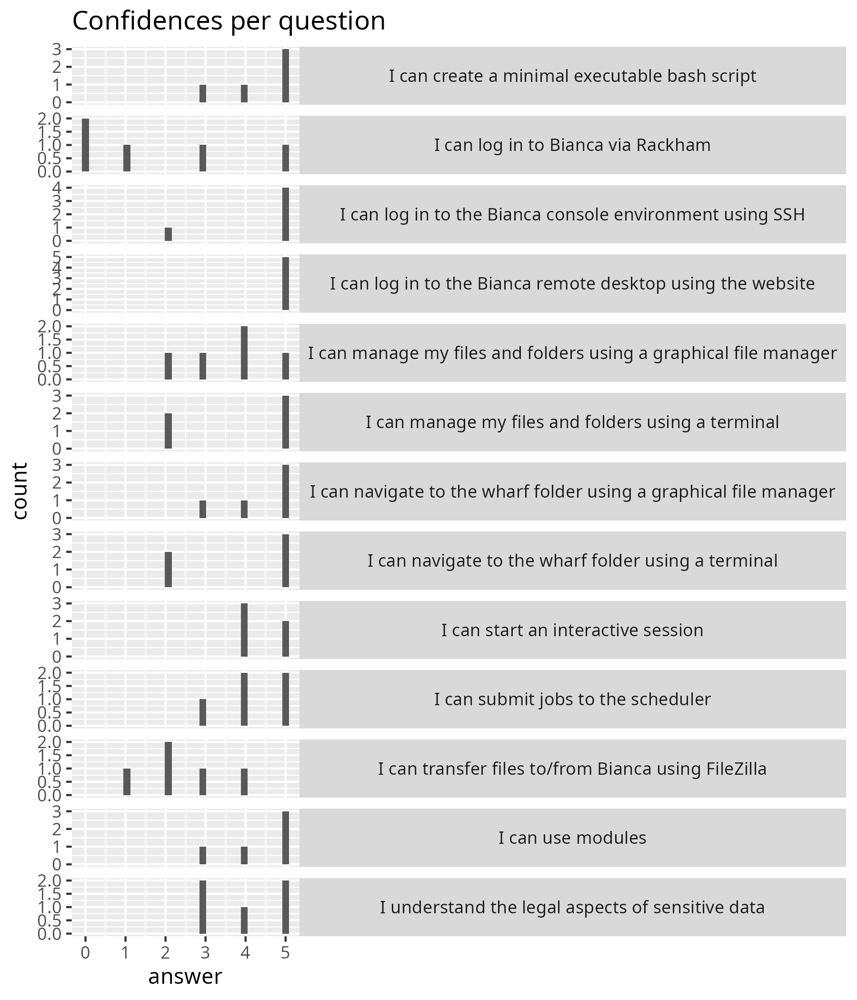
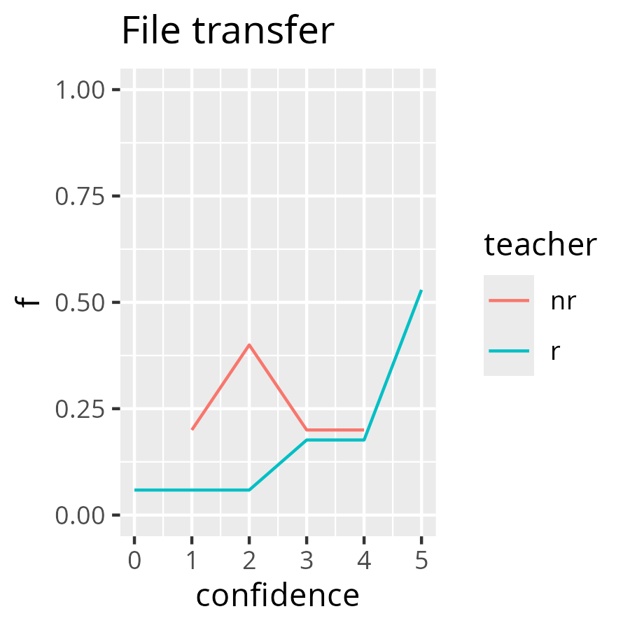
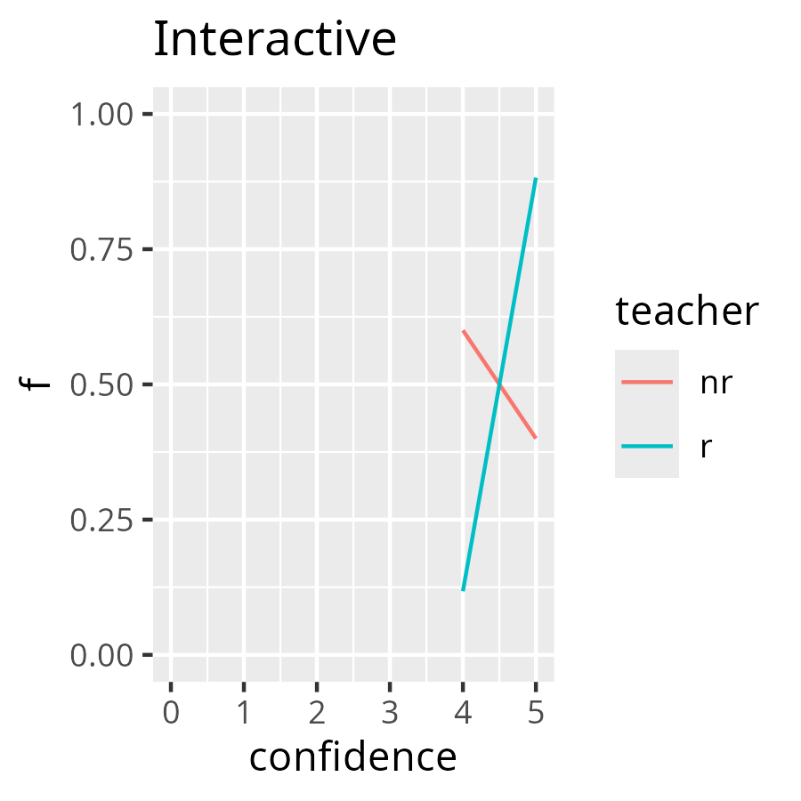
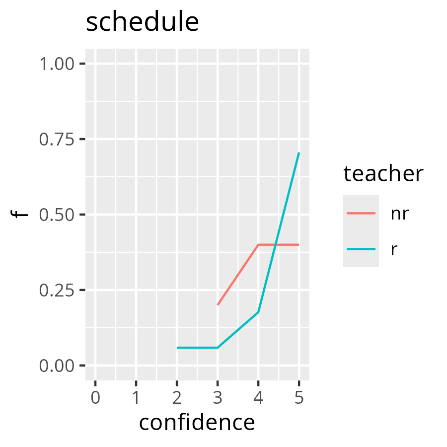

# Reflection

- Author: Richel
- Course: Intro to Bianca
- Date: 2024-09-25

## Course schedule

When  | Who  | What
------|------|-----------------------------
9:00  | R    | Introduction, login, log in to remote desktop, use the remote desktop
10:00 | .    | Break
10:15 | R    | Log in to console environment, command line
11:00 | .    | Break
11:15 | R    | Create an executable script, use modules
12:00 | .    | Lunch
13:00 | P    | Transferring files to and from Bianca
13:55 | .    | Break
14:05 | B    | Compute nodes and SLURM, including interactive nodes
14:55 | .    | Break
15:10 | L    | Legal aspects of sensitive data
15:30 | R    | Summary and anonymous evaluation
15:45 | All  | Optional Q&A

* Who: `B`: Björn, `L`: Lars, `P`: Pavlin, `R`: Richèl

## Until lunch

In practice, this was the schedule

When  | Who  | What
------|------|-----------------------------
9:00  | R    | Introduction 15 mins, login 30 mins, log in to remote desktop 15 mins
10:00 | .    | Break
10:15 | R    | log in to remote desktop another 15 mins, use the remote desktop 20 mins, then 10 mins for 'Log in to console environment', then 0 minutes for 'command line'
11:00 | .    | Break
11:15 | R    | Create an executable script, use modules

At the start, there were 9 learners.
During the course, 1 learner left as she already knew eveything.
Another 1 learner left probably due to the same reasons: I met her
at the 'Intro to UPPMAX Day 1' course, where we teach the same
content, yet for Rackham.

The Zoom rooms worked reasonably well. Instead of closing and re-creating the
rooms, learners moved themselves. This was a slowdown, but I felt not too
much of a hassle. 
There was 1 room that had a learner with dozens of questions and another
room with 2 experts. I moved the learner with questions to the room with the
experts and I think that that was a win-win situation.

Due to learner-centered teaching, it was made clear that the login via
SSH had too little time. I would need a 45 minutes session to be able to
go through that.

- [ ] Discuss either moving SSH login to the Intermediate course,
  or request 45 minutes more time

I felt there were too many too short sessions, next time I will merge these.

- [ ] Merge sessions to bigger ones

There was one learner that could not hear me well. I felt I could correct
this by speaking slower. In general, I think that is a great idea!

- [ ] Speak slower

Points from the lesson plan:

- Use 10 minutes for feedback: not needed plenarily, due to group rooms
- Do tell about myself at the start: done, felt OK
- Do ask random learners: done, I think I made the learners comfortable
  with saying 'I don't know'
- Share with learners to use the videos as a reminder in the future:
  I did not, as the exercises did not all have vides
  - I did get a compliment on the YouTube videos made as part of the documentation
- Add time to get a 2FA: all 9 learners had done this
- Use Zoom rooms, without changes: done, used group size of 3,
  worked well
- Add answers to the questions: done, seems to work well
- Add finding wharf as a teaching goal: this seems to work well
- Mention the feedback and evaluation forms at the start: done

## After lunch

When  | Who  | What
------|------|-----------------------------
13:00 | P    | Transferring files to and from Bianca, 55 -> 60 mins
13:55 -> 14:00| .    | Break
14:05 -> 14:10 | B    | Compute nodes and SLURM, including interactive nodes
14:55 -> 15:00 | .    | Break
15:10 | L    | Legal aspects of sensitive data
15:30 | R    | Summary and anonymous evaluation
15:45 | All  | Optional Q&A

- 13:00-13:55 'Transferring files to and from Bianca' turned from 55 to 60 mins,
  unil interrupted by other teacher to take a break directly.
  These 60 minutes consisted of 20 mins monologue, 7 mins answering question(s),
  15 mins of monologue, 1 mins answering question(s), 7 minutes working
  on exercises in silence, then 10 mins answering question(s)

Here is the activity diagram:

```mermaid
gantt
  title File transfer
  dateFormat X
  axisFormat %s
  Monologue: 0, 20s
  Answer questions: 7s
  Monologue: 15s
  Answer questions: 1s
  Work on exercise: crit, 7s
  Answer questions: 10s
```



The goal of this session was to transfer files using FileZilla.
There were 7 minutes to work on the exercise.
I predicted that the learners have had a hard time to follow this,
because all ways to do file transfer were discussed.
When FileZilla came up, the learners were redirected to WinSCP or CyberDuck.
My prediction was right.
Comparing the confidences to a session of mine (see analysis below),
a [Kolmogorov–Smirnov test](https://en.wikipedia.org/wiki/Kolmogorov%E2%80%93Smirnov_test)
cannot rule out that the confidence distribution is different between this
session and a similar session of mine.

- 14:05-14:55 'Compute nodes and SLURM, including interactive nodes' was moved
  5 mins later, turned to 14:10-15:06 

```mermaid
gantt
  title Interactive and scheduler
  dateFormat X
  axisFormat %s
  Monologue: 0, 8s
  Answer questions: 3s
  Monologue: 2s
  Answer questions: 2s
  Monologue: 4s
  Answer questions: 1s
  Monologue: 3s
  Type along: 6s
  Answer questions: 1s
  Monologue: 9s
  Answer questions: 1s
  Monologue: 1s
  Exercise: crit, 11s
  Answer questions: 15s
  Check progress: 1s
```



The goal of this session was to start an interactive job and to submit
a job to the scheduler.
There were 10 minutes to work on the exercises.
I predicted that the learners have had a hard time to follow this,
because (1) the teaching material has more content than just those teaching
goals, (2) type-alongs require learners to do two things at the same time.
My prediction was too pessimistic, as most learners had good confidence
they could do it.
Comparing the confidences to a session of mine (see analysis below),
a [Kolmogorov–Smirnov test](https://en.wikipedia.org/wiki/Kolmogorov%E2%80%93Smirnov_test)
cannot rule out that the confidence distribution is different between this
session and a similar session of mine.



```mermaid
gantt
  title Legal aspects of sensitive data
  dateFormat X
  axisFormat %s
  Monologue: 0, 2s
  Poll: crit, 1s
  Monologue: 8s
  Poll: crit, 1s
  Monologue: 4s
```

The goal of this session is to 'understand the legal aspects of sensitive data'.
Up until now, I do not understand what is new here.

- [x] prepare the summary by adding other courses: yup, worked fine
- [x] Indicate two routes: a beginner and an experienced:
  was there, I feel visible enough
- [ ] create more breakout rooms for the evaluation. Do do
  the evaluation in room 1. Let questions be answered in
  other breakout rooms.
  - I did not do this: I wanted all the learners to be in a room quickly,
    and creating 1 room is the best way. Also this time, there was a learner
    coming back that we could not send to a breakout room

The optional Q&A resulted in two questions:

- File transfer: how to do it using SFTP?
- Slurm jobs: where is the output?

Evaluation results:



> Confidences per question

I still have no idea what 'I understand the legal aspects of sensitive data'
means...

We got this feedback from the learner.

- Learner: Instead of using graphical interface, I tried to use scp for file transfer, though it didn't work for some reason.

Using `scp` was no learning objective. We do not teach it, not in the advanced
course either. The UPPMAX documentation is maybe to shy in communicating that
rsync is preffered.

- Learner: A suggestion is to put a survey in the beginning or before course start to evaluate how a students confidence changes after having done the intro course.

I think this is an interesting idea!

- [ ] Do the same survey in the beginning and end of the course

- Learner: Great pedagogical methods used by the teachers!

This is nice to hear, is this aimed at all teachers?

- Learner: Start with an overview: What is the goal with using Bianca (store and work with sensitive data) For example show a basic statistical analysis in R studio, in graphical interface)
- Learner: Hands-on, how to work with Bianca for users that are not so advanced: For example show a basic statistical analysis in R studio, in graphical interface.

I like these ideas a lot too.

- [ ] Start with a general overview of how to use Bianca.
  Add this to the UPPMAX documentation first, then see how this feels

- Learner: The sensitive data part in the end was too short

I wonder what is missing here ...?

- Learner: I missed some info about applying for projects etc

Agreed, it was not in.

- [ ] Consider adding how to apply for projects

- Learner: Having cameras on was good but the pinpointing of participants with questions was a bit too much. 

I understand this can be scary, I will follow the literature over a learner
here: it is about learning, not feeling super comfortable.

From all of this, this, I'd enjoy the following changes:

- Add an overview of how to use Bianca, +30 mins
- Remove console login, -10 mins
- Remove command line, -0 mins
- Less time for file transfer (to help talk less and increase focus), -30 mins
- Interactive and Slurm (however, more focussed, no type-along, add more silent time): +10 mins

However, considering the course as a whole, most is already discussed
in 'Intro to UPPMAX'. Maybe this course should build upon that one
and focus on Bianca-only aspects?

- [ ] Discuss in a meeting: what about adding 'Intro to UPPMAX'
  (at least Day 1) as a prerequisite?

All in all, I think my teaching went moderately okay. Mostly, I was
uncomfortable with the schedule: I predicted the console part would not fit.
I was right.

## Analysis

I decided to compare confidences for sessions that were present in
this course and another course ('Intro to UPPMAX, Day 1')

```
# I can transfer files to/from Rackham using FileZilla,0,1
# I can transfer files to/from Rackham using FileZilla,2,1
# I can transfer files to/from Rackham using FileZilla,3,3
# I can transfer files to/from Rackham using FileZilla,4,3
# I can transfer files to/from Rackham using FileZilla,5,9
confidences_transfer_r <- c(rep(0, 1), rep(2, 1), rep(3, 3), rep(4,3), rep(5, 9))
testthat::expect_equal(length(confidences_transfer_r), 17)
testthat::expect_equal(mean(confidences_transfer_r), 4.0)

# I can start an interactive session,4,2
# I can start an interactive session,5,15
# I can start an interactive session,4,2
# I can start an interactive session,5,15
# Average = ((4 * 2) + (5 * 15)) / 17 = 4.88
confidences_interactive_r <- c(rep(4, 2), rep(5, 15))
testthat::expect_equal(length(confidences_interactive_r), 17)
testthat::expect_equal(mean(confidences_interactive_r), 4.88, tolerance = 0.01)

# I can schedule a job,2,1
# I can schedule a job,3,1
# I can schedule a job,4,3
# I can schedule a job,5,12
# Average = ((2 * 1) + (3 * 1) + (4 * 3) + (5 * 12) ) / 17 = 4.53
confidences_schedule_r <- c(rep(2, 1), rep(3, 1), rep(4, 3), rep(5, 12))
testthat::expect_equal(length(confidences_schedule_r), 17)
testthat::expect_equal(mean(confidences_schedule_r), 4.53, tolerance = 0.01)

## 2024-09-25: Bianca Intro

# I can transfer files to/from Bianca using FileZilla,1,1
# I can transfer files to/from Bianca using FileZilla,2,2
# I can transfer files to/from Bianca using FileZilla,3,1
# I can transfer files to/from Bianca using FileZilla,4,1
# Average = ((1 * 1) + (2 * 2) + (3 * 1) + (4 * 1)) / 5 = 2.4
confidences_transfer_nr <- c(rep(1, 1), rep(2, 2), rep(3, 1), rep(4,1))
testthat::expect_equal(length(confidences_transfer_nr), 5)
testthat::expect_equal(mean(confidences_transfer_nr), 2.4)

# I can start an interactive session,4,3
# I can start an interactive session,5,2
# Average = ((4 * 3) + (5 * 2)) / 5 = 4.4
confidences_interactive_nr <- c(rep(4, 3), rep(5, 2))
testthat::expect_equal(length(confidences_interactive_nr), 5)
testthat::expect_equal(mean(confidences_interactive_nr), 4.4, tolerance = 0.01)

# I can submit jobs to the scheduler,3,1
# I can submit jobs to the scheduler,4,2
# I can submit jobs to the scheduler,5,2
# Average = ((3 * 1) + (4 * 2) + (5 * 2)) / 5 = 4.2
confidences_schedule_nr <- c(rep(3, 1), rep(4, 2), rep(5, 2))
testthat::expect_equal(length(confidences_schedule_nr), 5)
testthat::expect_equal(mean(confidences_schedule_nr), 4.2, tolerance = 0.01)
```

The distributions seem to differ, between me (`r`) and someone
else (`nr`, not-Richel). However, the statistics do not reject these confidences
are from a same distribution.



> File transfer confidences compared between me (`r`, for 'Richel') 
> and not-me (`nr`). Note that the `nr` values will be influenced by the fact
> that that teacher did not only discuss FileZilla.



> Interactive session confidences compared between me (`r`, for 'Richel') 
> and not-me (`nr`)



> Job scheduler confidences compared between me (`r`, for 'Richel') 
> and not-me (`nr`)
